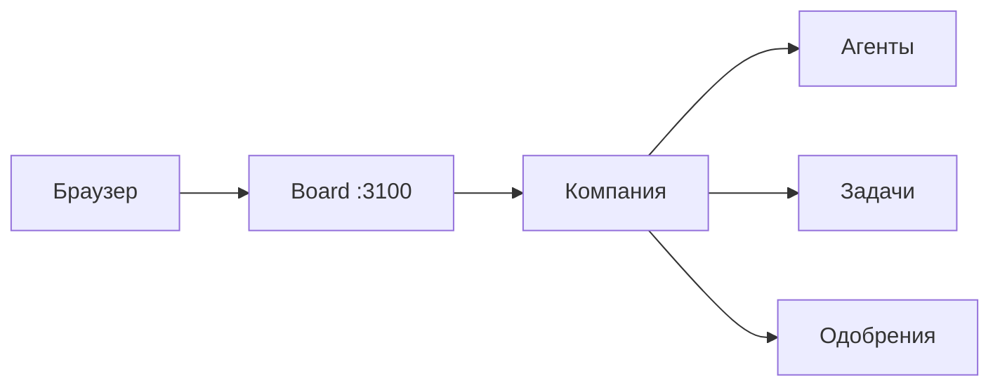

Board — веб-интерфейс Datagent на том же адресе, что и API (по умолчанию **http://localhost:3100**). Здесь вы видите компанию, агентов, задачи и журнал run.

## Первый вход

1. После [установки](../getting-started/installation) и [быстрого старта](../getting-started/quickstart) откройте Board в браузере.
2. Если компании ещё нет — пройдите **онбординг** (`/onboarding`).
3. Выберите **компанию** — дальше маршруты идут с префиксом компании (`issuePrefix`), например `/TES/agents`.

## Главные разделы

| Раздел | Зачем оператору |
| --- | --- |
| **Агенты** | Список AI-агентов, настройка, кнопка запуска run |
| **Задачи (Issues)** | Диалог с агентом по конкретной теме, комментарии, вложения |
| **Одобрения** | Очередь решений, которые агент не может принять сам |
| **Офис** | Обзор «поля» — кто работает, кто ждёт одобрения (эксперимент) |

:::info Пространство «Офис»
Подробнее — в [обзоре «Офис»](../office/overview). Раздел включается администратором (`enableOffice`). Это не замена списка задач, а панель для руководителя.
:::

## Кто что делает

| Действие | Обычно кто |
| --- | --- |
| Создать агента, выбрать модель и tools | Менеджер / инженер |
| Запустить run по задаче | Оператор или менеджер |
| Одобрить рискованное действие | Оператор с правами board |
| Включить «Офис», плагины, секреты | Администратор instance |

## Типичный день оператора

1. Открыть **Одобрения** — есть ли запросы от агентов.
2. Зайти в **Задачи** — активные диалоги (в т.ч. из Bitrix24 или Телеграм).
3. При необходимости — **Офис** или список агентов: кто в статусе `running`.
4. Запустить **wakeup** или ответить в issue — агент продолжит run через heartbeat.

## Дальше

- [Агенты](./agents) — настройка и запуск
- [Задачи и диалоги](./issues-and-dialogs)
- [Одобрения](./approvals)
