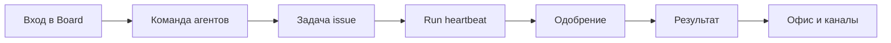

За один вечер вы поймёте, **зачем** Datagent в компании: не «ещё один чат», а **control plane** — кто работает, что запущено и где ждёт ваше решение. Board и API на одном адресе (по умолчанию **http://localhost:3100**); каждый запуск агента — **heartbeat run** с журналом. Self-hosted: данные остаются у вас.

Ниже — **учебник из историй**, не справочник API. Читайте, как сценарии коллег, которые завтра откроют Board как рабочий инструмент.

## Для кого

| Читатель | Что получите |
| --- | --- |
| **Оператор** | Ведёте задачи, отвечаете агентам, принимаете одобрения без хаоса в чатах |
| **Руководитель / владелец процесса** | Видите команду на «поле», не погружаясь в код |
| **CDTO-light** | Понимаете governance без отдельного «порта 3200» и без LangGraph |

## Не для кого

| Читатель | Куда идти |
| --- | --- |
| Разработчик плагина | [Создание плагина](../tutorials/build-plugin), [архитектура](../concepts/agent-architecture) |
| DevOps установки | [Установка](../getting-started/installation), [быстрый старт](../getting-started/quickstart) |
| Интегратор API | [Обзор API](../api-reference/overview) |

:::tip Первый раз в продукте?
[Быстрый старт](../getting-started/quickstart) и [первый агент](../getting-started/first-agent) — 15–20 минут. Затем [первый день в Board](./01-first-day).
:::

## Путь читателя

## Что вы получите по времени

| Время | Результат |
| --- | --- |
| **~30 мин** | Ориентируетесь в Board: агент, задача (issue), wakeup; знаете, где очередь одобрений |
| **~60 мин** | Проходите одну задачу от формулировки до ответа; читаете журнал run |
| **~90 мин** | Связываете Офис, Bitrix24, Телеграм и файлы на задаче — без дубля техдоков |

## Главы учебника

| № | История | О чём | ~мин |
| --- | --- | --- | --- |
| 1 | [Первый день в Board](./01-first-day) | Мария не теряется в интерфейсе | 12 |
| 2 | [Команда без срывов сроков](./02-your-team) | Алексей собирает агентов как роли | 15 |
| 3 | [Одна задача — один результат](./03-one-task) | От задачи до ответа с журналом | 15 |
| 4 | [Контроль без микроменеджмента](./04-trust-and-approval) | Одобрения как сила, не помеха | 15 |
| 5 | [Поле для руководителя](./05-office-field) | Пространство «Офис» (`enableOffice`) | 12 |
| 6 | [Пульт в мессенджерах](./06-channels) | Bitrix24 и Телеграм → задачи | 12 |
| 7 | [Документы на задаче](./07-documents) | Excel и PPTX через Office Plugin | 15 |
| 8 | [1С в контуре](./08-1c-bridge) | Коннектор для MCP, не кнопка в Board | 12 |
| — | [Шпаргалка](./playbook-index) | Ситуация X → откройте Y | 5 |

## Техническая глубина — рядом

| Вопрос | Документ |
| --- | --- |
| Как устроен heartbeat? | [Как это работает](../concepts/how-it-works) |
| Как настроить GigaChat? | [GigaChat](../integrations/gigachat) |
| Как устроен Офис? | [Обзор «Офис»](../office/overview) |

Мы не обещаем то, чего нет в продукте. Экспериментальные возможности помечены в главах.

**Следующая глава:** [Первый день в Board](./01-first-day)
