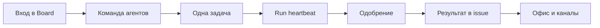

Datagent — **control plane** для AI-агентов в вашей компании: вы видите, кто работает, что запущено и где нужно ваше решение. Board и API живут на одном адресе (по умолчанию **http://localhost:3100**); каждый запуск агента — **heartbeat run** с журналом, а не «чат без памяти». Self-hosted: данные остаются у вас.

Этот раздел — **учебник**, а не справочник API. Здесь — истории людей, которые уже завтра хотят открывать Board как рабочий инструмент, а не как эксперимент.

## Для кого этот учебник

| Читатель | Зачем |
| --- | --- |
| **Оператор** | Вести задачи, отвечать агентам, принимать одобрения |
| **Руководитель / владелец процесса** | Видеть команду на «поле», не погружаясь в код |
| **CDTO-light** | Понять governance без LangGraph и без отдельного «порта 3200» |

## Не для кого

| Читатель | Куда идти |
| --- | --- |
| Разработчик плагина | [Создание плагина](../tutorials/build-plugin), [архитектура](../concepts/agent-architecture) |
| DevOps установки | [Установка](../getting-started/installation), [быстрый старт](../getting-started/quickstart) |
| Интегратор API | [Обзор API](../api-reference/overview) |

:::tip Первый раз в продукте?
Сначала [быстрый старт](../getting-started/quickstart) и [первый агент](../getting-started/first-agent) — 15–20 минут. Затем глава [Первый день в Board](./01-first-day) этого учебника.
:::

## Путь читателя

## Что вы получите по времени

| Время | Результат |
| --- | --- |
| **~30 мин** | Понимаете Board, агента, issue, wakeup; знаете, где очередь одобрений |
| **~60 мин** | Проходите одну задачу «от формулировки до ответа»; видите журнал run |
| **~90 мин** | Связываете Офис, Телеграм/Bitrix24, документы на задаче — без дублирования техдоков |

## Главы учебника

| № | История | О чём |
| --- | --- | --- |
| 1 | [Первый день в Board](./01-first-day) | Мария открывает платформу и не теряется |
| 2 | [Команда, которая не срывает сроки](./02-your-team) | Алексей собирает агентов как роли, не как «ещё один чат» |
| 3 | [Одна задача — один результат](./03-one-task) | От issue до готового ответа с журналом |
| 4 | [Контроль без микроменеджмента](./04-trust-and-approval) | Одобрения как сила, а не помеха |
| 5 | [Поле для руководителя](./05-office-field) | Пространство «Офис» (`enableOffice`) |
| 6 | [Пульт в мессенджерах](./06-channels) | Bitrix24 и Телеграм как вход в задачи |
| 7 | [Документы на задаче](./07-documents) | Excel и PPTX через Office Plugin |
| 8 | [1С в контуре](./08-1c-bridge) | Коннектор для MCP, не «магия в Board» |
| — | [Шпаргалка](./playbook-index) | «Если ситуация X → откройте Y» |

## Техническая глубина — рядом, не здесь

| Вопрос | Документ |
| --- | --- |
| Как устроен heartbeat? | [Как это работает](../concepts/how-it-works) |
| Как настроить GigaChat? | [GigaChat](../integrations/gigachat) |
| Как устроен Офис? | [Обзор «Офис»](../office/overview) |

Мы не обещаем функции, которых нет в продукте. Экспериментальные возможности помечены в главах.
