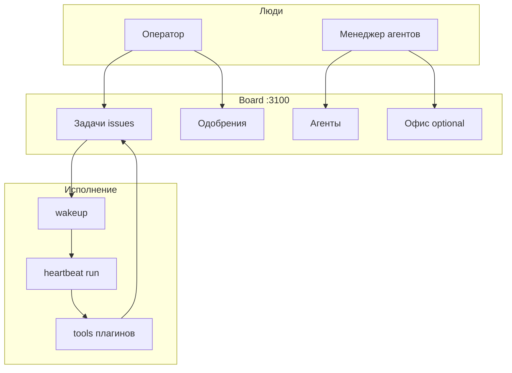

Этот раздел — **практический путь** по Datagent для тех, кто работает в Board каждый день. Здесь меньше кода и больше сценариев: как завести агента, запустить задачу, принять решение и понять, что агент может и не может.

## Кому что читать

| Роль | С чего начать | Дальше |
| --- | --- | --- |
| **Оператор** | [Основы Board](./board-basics) | [Задачи и диалоги](./issues-and-dialogs), [Одобрения](./approvals) |
| **Менеджер агентов** | [Агенты](./agents) | [Что могут агенты](./what-agents-can-do), [Одобрения](./approvals) |
| **Инженер** | [Быстрый старт](../getting-started/quickstart) | [Архитектура](../concepts/agent-architecture), [API](../api-reference/overview) |

:::tip Первый раз в Datagent?
Пройдите [быстрый старт](../getting-started/quickstart) и [первого агента](../getting-started/first-agent), затем вернитесь сюда — шаги станут привычными.
:::

## Как устроена работа

Datagent — **control plane**: вы управляете агентами и задачами; исполнение идёт через **heartbeat** на server, а не через отдельный «чат с моделью» в обход журнала run.

## Разделы руководства

| Документ | О чём |
| --- | --- |
| [Основы Board](./board-basics) | Вход, компания, навигация, пространство «Офис» |
| [Агенты](./agents) | Создание, настройка, запуск, статусы run |
| [Задачи и диалоги](./issues-and-dialogs) | Issues, комментарии, каналы Bitrix24 и Телеграм |
| [Одобрения](./approvals) | Когда агент ждёт человека, inbox, Телеграм |
| [Что могут агенты](./what-agents-can-do) | Tools, плагины, границы возможностей |

## Связанные разделы

- [Что такое Datagent](../concepts/what-is-datagent) — термины и роли
- [Как это работает](../concepts/how-it-works) — технический цикл heartbeat
- [Пространство «Офис»](../office/overview) — обзор поля для руководителя
