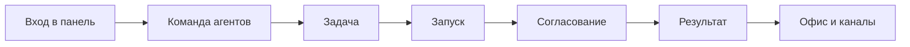

import DocNextSteps from '@site/src/components/DocNextSteps';
import {guidesIndexNextSteps} from '@site/src/components/DocNextSteps/presets';

За один вечер вы поймёте, **зачем** Datagent нужен в компании. Это не «ещё один чат с нейросетью», а **единый центр**, где видно: кто из агентов работает, что выполняется и где ждёт вашего решения. Всё открывается в браузере на [app.datagent.ru](https://app.datagent.ru). Каждый запуск сохраняется в **журнале** — по шагам, без догадок.

Ниже — **учебник из жизненных ситуаций**, а не сухой справочник для программистов. Читайте как рассказы коллег, которые завтра начнут пользоваться панелью каждый день.

*Задачи, агенты и согласования в одном месте.*

*Команда агентов: модели и доступные действия.*

*Раздел «Офис» для руководителя — если он включён в настройках.*

## Для кого этот учебник

| Кто вы | Что получите |
| --- | --- |
| **Оператор** | Ведёте задачи, отвечаете агентам и принимаете согласования — без хаоса в личных чатах |
| **Руководитель** | Видите команду «с высоты» и в списках, без погружения в код |
| **Ответственный за внедрение** | Понимаете, кто что может делать и где стоят правила «спросить человека» |

## Кому лучше в другие разделы

| Кто вы | Куда перейти |
| --- | --- |
| Разработчик плагина | [Создание плагина](../tutorials/build-plugin), [архитектура](../concepts/agent-architecture) |
| Нужен свой сервер | [Установка на свой сервер](../cloud/on-premise) — sales@datagent.ru |
| Интеграция через код | [Программный интерфейс](../api-reference/overview) |

:::tip Впервые в Datagent?
Сначала [Быстрый старт в облаке](../cloud/getting-started) и [первый агент](../cloud/first-agent) — обычно 15–20 минут. Затем откройте [первый день в панели](./01-first-day): те же экраны, но пошагово для оператора.
:::

## Поиск и вход

Перед главами полезно запомнить: в панели есть **поиск** и **выбор компании**, если их несколько.

*Быстрый переход к задаче или агенту.*

*Несколько компаний — сначала выберите рабочую область.*

*Пустой список на новой компании — нормально.*

## Как устроен путь по главам

Сначала — ориентация в панели, потом команда агентов, одна задача до результата, согласования, затем «Офис», мессенджеры и файлы. Идите по порядку или откройте [шпаргалку](./playbook-index) под свою ситуацию.

## Сколько времени заложить

| Время | Результат |
| --- | --- |
| **~30 мин** | Уверенно находите агента, задачу и очередь согласований |
| **~60 мин** | Проводите одну задачу от формулировки до ответа; читаете журнал запуска |
| **~90 мин** | Связываете «Офис», Битрикс24, Телеграм и файлы в одном процессе |

## Главы

| № | История | О чём | ~мин |
| --- | --- | --- | --- |
| 1 | [Первый день в панели](./01-first-day) | Мария находит задачи, агентов и согласования за один вечер | 12 |
| 2 | [Собрать команду агентов под роли](./02-your-team) | Алексей приглашает коллегу и настраивает первого агента для команды | 15 |
| 3 | [Поставить агенту первую настоящую задачу](./03-one-task) | От поручения до ответа, который можно показать руководителю | 15 |
| 4 | [Доверять агенту, но проверять риск](./04-trust-and-approval) | Одобрения в браузере и при найме — без микроменеджмента | 15 |
| 5 | [Поле для руководителя](./05-office-field) | Раздел «Офис» — обзор команды на одном экране | 12 |
| 6 | [Задачи из Telegram и Bitrix24](./06-channels) | Клиент пишет в мессенджер — агент отвечает без ручного копирования | 12 |
| 7 | [Когда результат — файл Excel или презентация](./07-documents) | Таблицы, слайды и пометки в документе | 15 |
| 8 | [Отчёт из 1С без ручной выгрузки](./08-1c-bridge) | Финдиректор просит сводку — данные из учёта через контролируемый мост | 12 |
| — | [Шпаргалка](./playbook-index) | Ситуация → куда открыть | 5 |

## Если нужны технические детали

| Вопрос | Документ |
| --- | --- |
| Как устроен запуск агента? | [Как это работает](../concepts/how-it-works) |
| Как подключить GigaChat? | [GigaChat](../integrations/gigachat) |
| Как устроен «Офис»? | [Обзор «Офис»](../office/overview) |

Мы не описываем то, чего нет в продукте. Экспериментальные разделы (например, «Офис») помечены в главах.

## С чего начать

1. [Быстрый старт в облаке](../cloud/getting-started) — если ещё не регистрировались.
2. [Первый день в панели](./01-first-day) — маршрут оператора.
3. Дальше — главы 2–8 по порядку или [шпаргалка](./playbook-index) под вашу ситуацию.

**Следующая глава:** [Первый день в панели](./01-first-day)

<DocNextSteps heading="Дальше по документации" items={guidesIndexNextSteps} />
