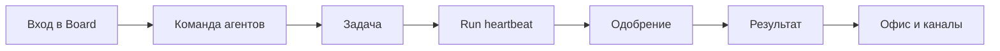

import DocNextSteps from '@site/src/components/DocNextSteps';
import {guidesIndexNextSteps} from '@site/src/components/DocNextSteps/presets';

За один вечер вы поймёте, **зачем** Datagent нужен в компании: это не «ещё один чат с моделью», а **control plane** — единое место, где видно, кто из агентов работает, какие запуски идут сейчас и где ждёт ваше решение. Board и API живут на одном адресе (по умолчанию **http://localhost:3100**); каждый запуск агента оформляется как **run** с журналом шагов. При self-hosted развёртывании данные остаются в вашем контуре.

Ниже — **учебник из рабочих историй**, а не справочник по API. Читайте его как сценарии коллег, которые завтра откроют Board как ежедневный инструмент, а не как разовую демонстрацию.

*Обложка: control plane на `:3100` — задачи, агенты, согласования.*

*Команда агентов с моделями и tools.*

*Operator View при `enableOffice` — поле и KPI.*

## Для кого

| Читатель | Что получите |
| --- | --- |
| **Оператор** | Ведёте задачи, отвечаете агентам и принимаете одобрения без хаоса в личных чатах и мессенджерах |
| **Руководитель / владелец процесса** | Видите команду на «поле» и в списках, не погружаясь в код и настройки плагинов |
| **CDTO-light** | Понимаете governance: кто что может делать, где стоят одобрения, без отдельного «порта 3200» и без LangGraph |

## Не для кого

| Читатель | Куда идти |
| --- | --- |
| Разработчик плагина | [Создание плагина](../tutorials/build-plugin), [архитектура](../concepts/agent-architecture) |
| DevOps установки | [Установка](../getting-started/installation), [быстрый старт](../getting-started/quickstart) |
| Интегратор API | [Обзор API](../api-reference/overview) |

:::tip Первый раз в продукте?
Сначала [быстрый старт](../getting-started/quickstart) и [первый агент](../getting-started/first-agent) — обычно 15–20 минут. Затем откройте [первый день в Board](./01-first-day): там те же экраны, но с пошаговым маршрутом оператора.
:::

## Поиск и вход

Перед тем как идти по главам, полезно знать, как быстро попасть в нужную задачу или агента — это сэкономит время в первый рабочий день.

*Быстрый переход к задаче или агенту.*

*Если компаний несколько — выбор рабочей области перед входом в префикс URL.*

*Пример пустого состояния: вкладка без агентов — нормальная ситуация для новой компании.*

## Путь читателя

Логика учебника повторяет реальный рабочий цикл: сначала ориентируетесь в Board, затем собираете команду агентов, ведёте одну задачу до результата, учитесь одобрениям и только потом подключаете Офис, каналы и файлы.

## Что вы получите по времени

| Время | Результат |
| --- | --- |
| **~30 мин** | Уверенно ориентируетесь в Board: агент, задача, wakeup; знаете, где очередь одобрений |
| **~60 мин** | Проходите одну задачу от формулировки до ответа; читаете журнал run и понимаете, что делал агент |
| **~90 мин** | Связываете Офис, Bitrix24, Телеграм и файлы на задаче — без дублирования техдоков |

## Главы учебника

| № | История | О чём | ~мин |
| --- | --- | --- | --- |
| 1 | [Первый день в Board](./01-first-day) | Мария не теряется в интерфейсе | 12 |
| 2 | [Команда без срывов сроков](./02-your-team) | Алексей собирает агентов как роли | 15 |
| 3 | [Одна задача — один результат](./03-one-task) | От задачи до ответа с журналом | 15 |
| 4 | [Контроль без микроменеджмента](./04-trust-and-approval) | Одобрения как сила, не помеха | 15 |
| 5 | [Поле для руководителя](./05-office-field) | Пространство «Офис» (`enableOffice`) | 12 |
| 6 | [Пульт в мессенджерах](./06-channels) | Bitrix24 и Телеграм → задачи | 12 |
| 7 | [Документы на задаче](./07-documents) | Excel и PPTX через Office Plugin | 15 |
| 8 | [1С в контуре](./08-1c-bridge) | Коннектор для MCP, не кнопка в Board | 12 |
| — | [Шпаргалка](./playbook-index) | Ситуация X → откройте Y | 5 |

## Техническая глубина — рядом

Когда в истории нужна точность по API, адаптерам или плагинам — переходите в техдоки. Учебник намеренно не дублирует их целиком.

| Вопрос | Документ |
| --- | --- |
| Как устроен heartbeat? | [Как это работает](../concepts/how-it-works) |
| Как настроить GigaChat? | [GigaChat](../integrations/gigachat) |
| Как устроен Офис? | [Обзор «Офис»](../office/overview) |

Мы не обещаем возможности, которых нет в продукте. Экспериментальные разделы (например, «Офис») помечены в соответствующих главах.

## С чего начать учебник

1. [Быстрый старт](../getting-started/quickstart) — если Board ещё не открывали.
2. [Первый день в Board](./01-first-day) — оператор: одобрения, задачи, wakeup.
3. Дальше — главы 2–8 по порядку или [шпаргалка](./playbook-index) под вашу роль и ситуацию.

**Следующая глава:** [Первый день в Board](./01-first-day)

<DocNextSteps heading="Дальше по документации" items={guidesIndexNextSteps} />
