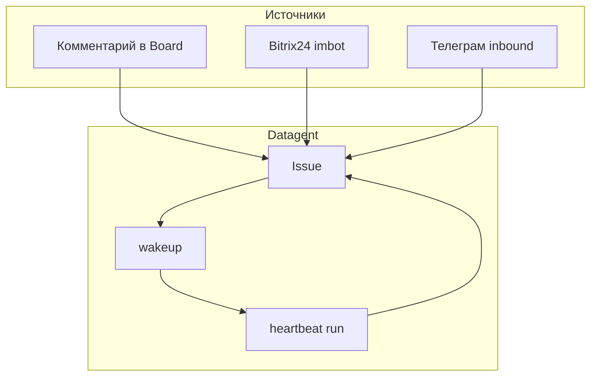

**Issue** (задача) — место, где собран контекст для агента: описание, комментарии, вложения, история run. Для оператора это основной «диалог» с агентом по конкретной теме.

## Зачем issues, а не только карточка агента

| Подход | Когда уместно |
| --- | --- |
| Run с карточки **агента** | Быстрая проверка, разовый запрос |
| Работа в **issue** | Длительная тема, несколько итераций, файлы, каналы Bitrix24/Телеграм |

Один issue может получать сообщения из внешних каналов — агент отвечает в том же потоке после wakeup.

## Как вести диалог

1. **Сформулируйте цель** — что должно быть на выходе (текст, таблица, черновик письма).
2. **Добавьте контекст** — вложения, ссылки, данные из переписки.
3. **Запустите run** — кнопка Wakeup / Run в issue.
4. **Уточняйте** комментарием — каждый новый запуск создаёт новый run с обновлённым контекстом.

:::tip Язык и тон
Задайте в system prompt агента «отвечай на русском, кратко». В issue можно повторить ограничения для одной задачи.
:::

## Вложения и документы

Для Excel, Word, PowerPoint на задаче используется [Office Plugin](../office/excel-pptx): агент работает через plugin tools на **копии** файла, опасные изменения — через [одобрения](./approvals).

## Входящие из интеграций

| Канал | Поведение (кратко) |
| --- | --- |
| [Bitrix24](../integrations/bitrix24) | Сообщения в imbot → issue, ответ агента в чат |
| [Телеграм](../integrations/telegram) | Inbound в issues; исходящие уведомления и кнопки апрува |

CRM-tools вида `bitrix24_list_leads` в Datagent **нет** — интеграция идёт через диалог и bridge, не через выдуманные API-инструменты в manifest.

## Что видит оператор в списке задач

- Заголовок и статус issue
- Последний run и его результат
- Назначенный агент (assignee)
- Признаки «ждёт одобрения» — см. [одобрения](./approvals)

## Дальше

- [Одобрения](./approvals)
- [Агенты](./agents)
- [Туториал Bitrix24 → Телеграм](../tutorials/automate-crm)
