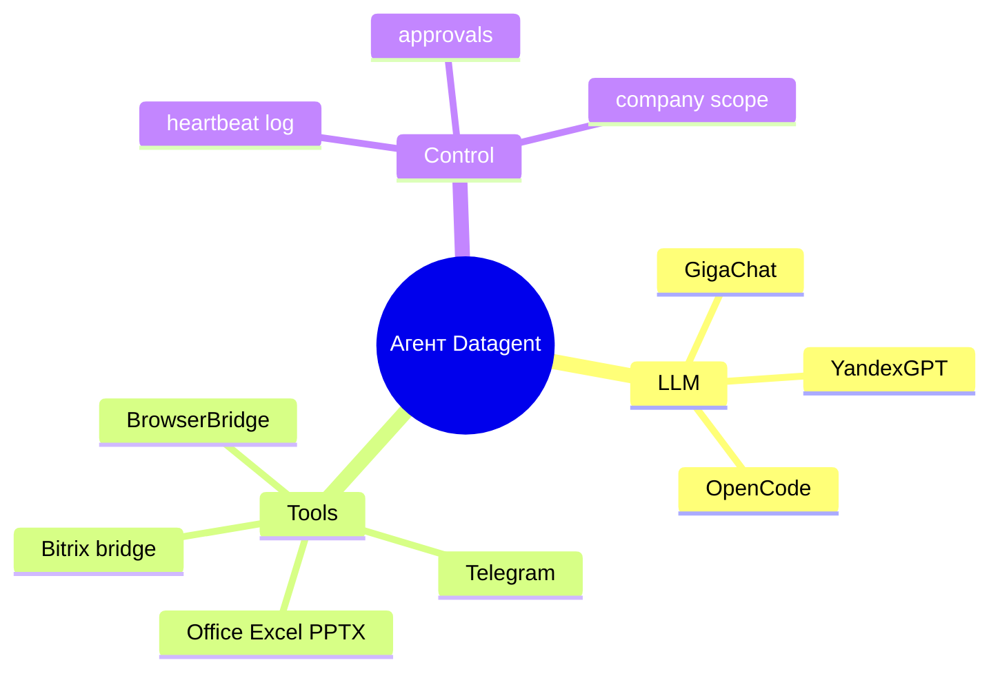

Агент в Datagent — это **настроенный исполнитель** внутри вашей компании: модель + разрешённые **tools** + правила в промпте. Ниже — что реально доступно и где заканчиваются возможности.

## Что агент делает хорошо

| Возможность | Как это устроено |
| --- | --- |
| Текст и рассуждения | LLM через адаптер (`gigachat_local`, `yandexgpt_local`, …) |
| Действия по инструкции | **Tools** плагинов: браузер, Office, свои интеграции |
| Работа в контексте задачи | Issue + память компании (политики memory) |
| Пауза на решение человека | [Одобрения](./approvals) |
| Повторяемые run | Wakeup и heartbeat с журналом шагов |

## Что нужно включить заранее

Агент видит **только** tools из плагинов, которые:

1. Установлены в instance (Plugin Manager / CLI).
2. Включены в конфигурации **этого** агента в Board.

Без tool агент не «вызовет Bitrix API сам» — только то, что описано в manifest плагина.

## Примеры по плагинам

| Область | Документация |
| --- | --- |
| Браузер | [BrowserBridge](../tutorials/browserbridge-setup) |
| Excel / PPTX | [Office Plugin](../office/excel-pptx) |
| Чат Bitrix24 | [Bitrix24](../integrations/bitrix24) — через issues, не CRM tools |
| Уведомления | [Телеграм](../integrations/telegram) |
| 1С (MCP) | [1С Коннектор](../office/1c-connector) — через внешний MCP, не «магия» в Board |

## Чего агенты не делают

| Миф | Факт |
| --- | --- |
| «Любой REST нашей системы» | Только явные tools плагинов и documented API; нет публичного `POST /api/runs` |
| «Замена 1С / Bitrix / Excel» | Интеграции и сценарии; учётная система остаётся источником правды |
| «Без журнала» | Каждый run в heartbeat — статусы, лог, события |
| «Все CRM-операции Bitrix» | Imbot bridge и диалог; вымышленных `bitrix24_list_*` tools нет |
| «Отдельный порт Board :3200» | Board и API на **:3100** |

:::info Control plane, не «ещё один чат»
Datagent управляет **запусками и правами**, а не подменяет вашу оркестрацию кода. Сравнение с фреймворками — [что такое Datagent](../concepts/what-is-datagent).
:::

## Как расширить возможности

| Кто | Действие |
| --- | --- |
| Инженер | Установить плагин, выдать секреты, добавить tools агенту |
| Инженер | Написать свой плагин — [создание плагина](../tutorials/build-plugin) |
| Оператор | Формулировать задачи и одобрять рискованные шаги |

## Дальше

- [Агенты](./agents)
- [Как это работает](../concepts/how-it-works)
- [Обзор API](../api-reference/overview)
