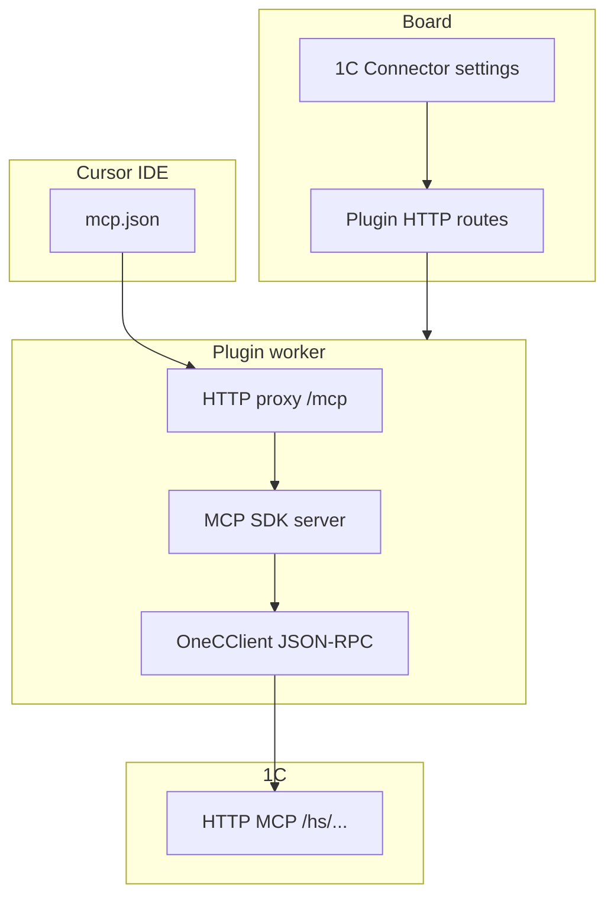

# Как подключить 1С к разработке с AI — Datagent

> **Зачем:** Чтобы **разработчики** в Cursor (или другой IDE с MCP) запрашивали **опубликованную базу 1С** — справочники, отчёты, метаданные — не копируя выгрузки в чат. **Datagent** даёт мост **1С ↔ IDE**; это **не** кнопка «провести документ» в карточке задачи для оператора.

**1С Коннектор** помогает **команде разработки и автоматизации** — не заменяет 1С или CRM. Операторы работают в задачах; запросы к учёту из IDE идут через MCP.

## Это работает так

1. В **1С** устанавливаете расширение **MCP_Server** и публикуете HTTP-сервис.
2. В **Datagent** включаете плагин **1С Коннектор** и указываете URL базы.
3. Плагин поднимает **прокси** и выдаёт фрагмент настроек для **Cursor** (`mcp.json`).
4. Разработчик в IDE вызывает **tools 1С** — список приходит с вашей публикации.
5. Агент в **задаче Datagent** эту 1С **напрямую не дергает** без отдельной доработки.

Для руководителя контекст «зачем компании» — [учебник, 1С](../guides/08-1c-bridge).

:::info Кому подходит
**CDTO, 1С-разработчик, интегратор** — да.  
**Оператор поддержки «нажал и провёл накладную»** — нет, это другой класс задач.
:::

## Подключение по шагам

### Шаг 1. Расширение в 1С

1. Скачайте `MCP_Server.cfe` со страницы плагина в Datagent (или из `assets` пакета).
2. Установите расширение в **конфигураторе**.
3. Включите HTTP-сервис MCP в расширении.
4. **Опубликуйте** базу на IIS или другом веб-сервере.
5. Запомните URL, например `https://host/app` или путь к `/hs/.../`.

### Шаг 2. Плагин в Datagent

1. [app.datagent.ru](https://app.datagent.ru) → **Менеджер плагинов** → **1С Коннектор**.
2. Откройте настройки компании → страница **1С**.
3. Укажите **URL публикации 1С** (upstream, не адрес proxy Datagent).
4. Нажмите **Проверить соединение** — логин/пароль пользователя 1С.
5. При успехе — **Скопировать настройки для Cursor** (`mcp.json`).

### Шаг 3. Cursor (или другая IDE)

1. Вставьте выданный фрагмент в конфиг MCP клиента.
2. Перезапустите IDE / MCP.
3. Вызовите tool из списка 1С на тестовом запросе.

Локальная разработка плагина:

```bash
pnpm --filter @datagent/plugin-1c-connector build
pnpm datagent plugin install packages/plugins/plugin-1c-connector
```

## Что можно и нельзя

| Можно | Нельзя из коробки |
| --- | --- |
| Запросы к опубликованной базе из **IDE** | Провести документ кнопкой в **задаче** агента |
| Health-check после публикации | Заменить администрирование прав 1С |
| Динамический список MCP tools с 1С | COM, OData, файловый обмен в этом плагине |

Связка **Битрикс24 + GigaChat** — отдельный плагин: [Битрикс24](./bitrix24). **1С Коннектор** — про **разработку и MCP**, не про чат с клиентом.

## Частые вопросы

**Нужен ли Datagent Cloud?**  
Плагин работает в облаке на [app.datagent.ru](https://app.datagent.ru); on-premise — по [Enterprise](../cloud/on-premise).

**Агент в задаче увидит остатки на складе?**  
**Нет** без отдельной интеграции. Коннектор — для **IDE**, не для heartbeat tools агента.

**Безопасно ли?**  
Ограничьте права пользователя 1С, firewall для proxy (порт по умолчанию **8010**), не храните пароли в тексте задач.

**Что если `upstreamReachable: false`?**  
Проверьте URL, IIS, HTTPS, Basic auth, что POST при редиректе не ломается.

## Что дальше?

- [1С в учебнике →](../guides/08-1c-bridge)
- [Битрикс24 для операторов →](./bitrix24)
- [Создание своего плагина →](../tutorials/build-plugin)
- [Старт в облаке →](../cloud/getting-started)

:::note Для инженеров

| Поле | Значение |
| --- | --- |
| Plugin id | `datagent.1c-connector` |
| UI route | `1c-connector` |
| Default proxy port | `8010` |
| Agent tools в manifest | **Нет** |

### Архитектура



### HTTP API плагина (board auth)

| Method | Path | Назначение |
| --- | --- | --- |
| GET | `/status` | Статус proxy, upstream |
| POST | `/test-connection` | Проверка credentials |
| GET | `/cursor-config` | Фрагмент `mcp.json` |
| GET | `/extension-file` | Скачать `.cfe` |

### Диагностика

| Симптом | Проверить |
| --- | --- |
| `lastListToolsError` | JSON-RPC, версия расширения, права 1С |
| Proxy не стартует | Порт 8010, `restart-proxy`, логи worker |
| WSL / Docker | `DATAGENT_1C_CONNECTOR_PUBLIC_HOST` |

См. [Обзор API](../api-reference/overview.md).

:::
