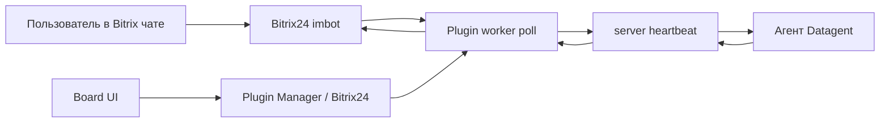

# Как подключить Битрикс24 к AI-агентам — Datagent

Агент **читает переписку в чатах Битрикс24**, **готовит ответ клиенту**, **фиксирует итог в задаче Datagent** и **отправляет сообщение обратно в CRM** — без копирования в личный чат с нейросетью.

Если менеджеры тратят час в день на перенос переписки из CRM в ChatGPT и обратно — агент ведёт диалог в одной задаче, с журналом каждого шага.

**Начните так:** [app.datagent.ru](https://app.datagent.ru) → **Менеджер плагинов** → **Битрикс24** → вставьте **вебхук** из портала (**Приложения → Вебхуки → входящий**). Нужен тариф **Studio** или выше.

> **Доступно на тарифе Studio и выше.**  
> На **Free** и **Solo** плагин Битрикс24 недоступен. [Тарифы →](../cloud/pricing)

⏱ Займёт: около 10 минут

**Честно:** плагин работает с **чатами и ботами**, не выгружает всю воронку сделок без доработки. Для сценариев со сделками вне чата — [браузер](../browser/overview) (**Studio+**) или свой плагин.

## Как подключить — пошагово

### Шаг 1. Вебхук в Битрикс24

1. В портале: **Приложения → Вебхуки → входящий**.
2. Создайте вебхук с адресом вида  
   `https://ваш-портал.bitrix24.ru/rest/USER_ID/TOKEN/`
3. Разрешения минимум: **imbot**. Для файлов — **disk**. Для списков сотрудников — **user**, **department**.

### Шаг 2. Плагин в Datagent

1. Войдите на [app.datagent.ru](https://app.datagent.ru).
2. **Менеджер плагинов** → установите плагин **Битрикс24**.
3. **Настройки компании → Битрикс24**.

### Шаг 3. Бот и агент

1. Укажите **адрес портала** и **вебхук**.
2. **Зарегистрируйте бота** в интерфейсе плагина.
3. Сохраните **ключ приложения** бота.
4. Выберите **агента** (рекомендуем **GigaChat** — [подключение](./gigachat)).
5. Нажмите **Запустить мост**.
6. **Проверить соединение** → тестовое сообщение в чат Битрикс24.

### Шаг 4. Первый диалог

1. Напишите боту тестовый вопрос из Битрикс24.
2. В Datagent откройте **входящие** или новую **задачу**.
3. Запустите агента при необходимости.
4. Убедитесь, что ответ вернулся в чат CRM.

Подробнее: [учебник, каналы](../guides/06-channels) · [практическое руководство](../tutorials/automate-crm).

## Что нужно для старта

- Аккаунт Datagent с тарифом **Studio** или **Business** — [тарифы](../cloud/pricing)
- Входящий **вебхук** в Битрикс24
- **10 минут** и **собственные ключи** GigaChat или YandexGPT (на любом тарифе Datagent)

## Пример инструкции агенту

```text
Ты ассистент в чате Битрикс24. Контекст — в задаче и комментариях.
Отвечай кратко по-русски. Не выдумывай вызовы API CRM — отдельных действий bitrix24_* нет.
```

## Частые вопросы

**Нужен ли программист?**  
Первую связку часто делает администратор Битрикс24 и ответственный за Datagent. Сложные воронки — с разработчиком.

**Агент сам выгружает все лиды?**  
**Нет.** Плагин — **чаты**, не полная выгрузка CRM.

**Почему нет ответа в чате?**  
Проверьте: мост включён, запуск завершился, нет зависшего [согласования](../concepts/approvals).

**Нужен ли тариф Studio?**  
**Да.** Плагин Битрикс24 — с **Studio** и выше.

## Что дальше

→ [Подключить GigaChat](./gigachat)

:::note Для инженеров

Плагин `datagent.bitrix24`, polling `imbot.v2.Event.get`, issues + wakeup + heartbeat. **Нет** agent tools `bitrix24_*` в manifest.

### Схема



### Установка (on-premise / dev)

```bash
pnpm --filter @datagent/plugin-bitrix24 build
pnpm datagent plugin install packages/plugins/bitrix24
```

В Cloud — через **Plugin Manager** на app.datagent.ru.

### Внутренние вызовы REST (worker)

| Операция | Метод |
| --- | --- |
| Опрос входящих | `imbot.v2.Event.get` |
| Ответ в чат | `imbot.v2.Chat.Message.send` |
| Боты | `imbot.v2.Bot.list`, `Bot.register` |
| Вложения | `imbot.v2.File.upload`, `File.download` |
| ACL | `user.get`, `department.get`, `sonet_group.*` |

CRM (`crm.lead.*`, `crm.deal.*`) **не** вызывается.

### Поля конфигурации

| Поле | Назначение |
| --- | --- |
| `portal_url` | Адрес портала |
| `webhook_base_url` | База REST вебхука |
| `bot_token_secret_ref` | APPLICATION TOKEN imbot |

Вход — **polling** (`bitrix-poll`), не push на API Datagent.

### Типичные ошибки

| Симптом | Что сделать |
| --- | --- |
| 401 вебхук | Пересоздать входящий вебхук |
| Нет APPLICATION TOKEN | Сохранить после `Bot.register` |
| `BITRIX_DISK_SCOPE_REQUIRED` | Добавить scope disk |
| Опрос не идёт | Включить **Запустить мост** |

См. [Архитектура](../concepts/agent-architecture.md), [API](../api-reference/overview.md).

:::
