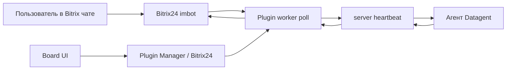

# Как подключить Битрикс24 к AI-агентам — Datagent

> **Зачем:** Агент сам работает в Bitrix24 — читает переписку, готовит ответы, ставит задачи. Вы контролируете риск через [согласования](../concepts/approvals).

⏱ Займёт: 10 минут

## Что агент делает в Bitrix24

Не список API — **реальные сценарии:**

- **Каждое утро** смотрит просроченные диалоги и пишет менеджерам напоминания в задачах Datagent
- **После звонка клиента** — фиксирует итог в задаче и готовит ответ в чат CRM
- **Раз в неделю** собирает сводку по активным диалогам и отправляет руководителю в [Telegram](./telegram)

**Раньше:** копировали переписку из Битрикс24 в ChatGPT. Ответ терялся в личном чате.  
**Теперь:** одна **задача** на диалог, **журнал** каждого шага, ответ уходит **обратно в CRM**.

**Честно:** плагин работает с **чатами и ботами** (imbot), не выгружает всю воронку `crm.deal.*` без отдельной доработки.

:::tip Доступно бесплатно
Связку **Битрикс24 + агент** можно проверить на **Free** — 3 агента, 100 запусков.
[Начать бесплатно →](https://app.datagent.ru/signup)
:::

## Как подключить — пошагово

### Шаг 1. Webhook в Битрикс24

1. В портале: **Приложения → Вебхуки → входящий**.
2. Создайте webhook с URL вида  
   `https://ваш-портал.bitrix24.ru/rest/USER_ID/TOKEN/`
3. Права минимум: **imbot**. Для файлов — **disk**. Для ACL — **user**, **department**.

### Шаг 2. Плагин в Datagent

1. Войдите на [app.datagent.ru](https://app.datagent.ru).
2. **Менеджер плагинов** → установите плагин **Битрикс24**.
3. **Настройки компании → Битрикс24**.

### Шаг 3. Бот и агент

1. Укажите **URL портала** и **webhook**.
2. **Зарегистрируйте бота** в интерфейсе плагина.
3. Сохраните **APPLICATION TOKEN** бота.
4. Выберите **агента** (рекомендуем **GigaChat** — [подключение](./gigachat)).
5. Нажмите **Запустить bridge**.
6. **Проверить соединение** → тестовое сообщение в чат Bitrix.

### Шаг 4. Первый диалог

1. Напишите боту тестовый вопрос из Bitrix24.
2. В Datagent откройте **входящие** / новую **задачу**.
3. Запустите агента при необходимости.
4. Убедитесь, что ответ вернулся в чат CRM.

Подробнее с картинками: [учебник, каналы](../guides/06-channels) · [практическое руководство](../tutorials/automate-crm).

## Что нужно для старта

- Аккаунт Datagent (**Free** или выше) — [регистрация](https://app.datagent.ru/signup)
- Входящий **webhook** в Bitrix24 (показали выше)
- **10 минут** и ключи **GigaChat** или **YandexGPT**

:::info Тариф
Интеграция с Bitrix24 доступна на **всех тарифах**, включая **Free**.
[Начать бесплатно →](https://app.datagent.ru/signup)
:::

## Системная инструкция агента (пример)

```text
Ты ассистент в чате Битрикс24. Контекст — в задаче и комментариях.
Отвечай кратко по-русски. Не выдумывай вызовы CRM API — отдельных bitrix24_* tools нет.
```

## Частые вопросы

**Нужен ли программист?**  
Первую связку часто делает администратор Bitrix + ответственный за Datagent. Сложные воронки — с разработчиком.

**Агент сам выгружает все лиды?**  
**Нет.** Плагин — **чаты** (imbot), не полный CRM ETL.

**Почему нет ответа в чате?**  
Проверьте: bridge включён, run завершился, нет зависшего [согласования](../concepts/approvals).

**Это только на PRO?**  
**Нет.** Базовая связка на **Free**. **PRO** — больше агентов (10), запусков (2 000) и [BrowserBridge](../integrations/browserbridge).

## Что дальше?

- [Подключить GigaChat →](./gigachat)
- [Входящие и задачи →](../concepts/inbox)
- [Согласования →](../concepts/approvals)
- [Тарифы →](../cloud/pricing)
- [Зарегистрироваться →](https://app.datagent.ru/signup)

:::note Для инженеров

Плагин `datagent.bitrix24`, polling `imbot.v2.Event.get`, issues + wakeup + heartbeat. **Нет** agent tools `bitrix24_*` в manifest.

### Схема



### Установка (on-premise / dev)

```bash
pnpm --filter @datagent/plugin-bitrix24 build
pnpm datagent plugin install packages/plugins/bitrix24
```

В Cloud — через **Plugin Manager** на app.datagent.ru.

### Внутренние вызовы REST (worker)

| Операция | Метод |
| --- | --- |
| Опрос входящих | `imbot.v2.Event.get` |
| Ответ в чат | `imbot.v2.Chat.Message.send` |
| Боты | `imbot.v2.Bot.list`, `Bot.register` |
| Вложения | `imbot.v2.File.upload`, `File.download` |
| ACL | `user.get`, `department.get`, `sonet_group.*` |

CRM (`crm.lead.*`, `crm.deal.*`) **не** вызывается.

### Поля конфигурации

| Поле | Назначение |
| --- | --- |
| `portal_url` | Адрес портала |
| `webhook_base_url` | База REST webhook |
| `bot_token_secret_ref` | APPLICATION TOKEN imbot |

Вход — **polling** (`bitrix-poll`), не push webhook на Datagent API.

### Типичные ошибки

| Симптом | Что сделать |
| --- | --- |
| 401 webhook | Пересоздать входящий webhook |
| Нет APPLICATION TOKEN | Сохранить после `Bot.register` |
| `BITRIX_DISK_SCOPE_REQUIRED` | Добавить scope disk |
| Polling не идёт | Включить **Запустить bridge** |

См. [Архитектура](../concepts/agent-architecture.md), [API](../api-reference/overview.md).

:::
