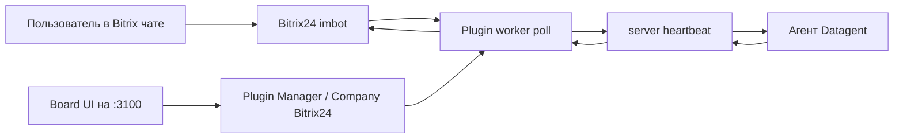

**Bitrix24** в Datagent — это **плагин** `datagent.bitrix24` (`packages/plugins/bitrix24`), а не LLM-адаптер. Worker-процесс (JSON-RPC через `PluginWorkerManager`) опрашивает события чат-ботов (`imbot.v2.Event.get`), создаёт или будит **issues** в компании и привязывает диалоги к **агентам** через `binding`. Ответы агента (после run в **heartbeat**) доставляются обратно в Bitrix (`imbot.v2.Chat.Message.send`). Отдельных agent tools вида `bitrix24_list_leads` в manifest **нет** — интеграция событийная, не CRM REST из Board.

## Схема



## Входящий webhook в Bitrix24 (портал)

1. В портале Bitrix24 создайте **входящий webhook** (Приложения → Вебхуки → входящий), URL вида:

   `https://ваш-портал.bitrix24.ru/rest/USER_ID/TOKEN/`

2. Права webhook (по тому, что реально вызывает плагин):
   - **imbot** — регистрация ботов, опрос событий, отправка сообщений (`imbot.v2.*`);
   - **user**, **department** — синхронизация справочника для ACL (`user.get`, `department.get`, `sonet_group.*`);
   - **disk** — скачивание вложений из чата (без scope плагин сообщает об ошибке `BITRIX_DISK_SCOPE_REQUIRED`).

3. CRM-методы (`crm.lead.*`, `crm.deal.*`) плагин **не** вызывает — лиды/сделки через этот bridge не читаются.

OAuth-приложение Bitrix24 для bridge **не** требуется: авторизация REST — **токен в URL webhook** + **APPLICATION TOKEN** бота imbot (выдаётся при `imbot.v2.Bot.register`).

## Подключение в Datagent

### Установка плагина

Из корня монорепозитория (см. [Быстрый старт](../getting-started/quickstart)):

```bash
pnpm --filter @datagent/plugin-bitrix24 build
pnpm datagent plugin install packages/plugins/bitrix24
```

В Board: **Plugin Manager** → включить плагин для instance. Локальный путь: `packages/plugins/bitrix24` (см. подсказки UI `pluginManager.install`).

Перезапуск **server** на `PORT=3100` нужен после обновления `dist/` worker/UI плагина.

### Настройка компании

1. Откройте **Company → Bitrix24** (страница плагина, route `bitrix24`) или settings slot **Bitrix24 Bridge**.
2. **Портал:** URL портала, опционально база ERP (веб-публикация 1С для `@@erp-links` в ответах), STT для голосовых, кнопка **Запустить bridge** (`poll_enabled`).
3. **Боты:** укажите **Webhook URL** (тот же входящий REST webhook портала), зарегистрируйте бота через UI (`imbot.v2.Bot.register`) или привяжите существующего (`imbot.v2.Bot.list`). Сохраните **APPLICATION TOKEN** imbot (в БД плагина или `bot_token_secret_ref` в company secrets).
4. **Связка (binding):** выберите **Datagent agent**, опционально project, ACL по пользователям/отделам/группам (из directory sync).
5. **Проверить соединение** — `profile` + `imbot.v2.Event.get` на первом боте; **Проверить Datagent** — тест issue/comment/wakeup (в UI плагина кнопка может иметь legacy-подпись).

Секреты **не** в корневом `.env` (в `.env.example` нет `BITRIX*`): webhook и токены — в конфиге плагина на компанию и в **company secrets** (`secret_ref`), см. `resolveSecret` в `packages/plugins/bitrix24/src/db/helpers.ts`.

| Поле / secret | Где задаётся | Назначение |
| --- | --- | --- |
| `portal_url` | UI портала | Адрес портала Bitrix |
| `webhook_base_url` / `inbound_webhook_url` | UI бота | База REST webhook (`…/rest/USER/TOKEN`) |
| `webhook_secret_ref` | опционально `savePortal` | Альтернатива хранения webhook через secret ref |
| `bot_token_secret_ref` / `imbot_application_token` | UI бота | APPLICATION TOKEN для imbot API |
| `folderId` | — | **Не используется** (это поле YandexGPT, не Bitrix) |

## Agent tools (manifest)

В `src/manifest.ts` **нет** секции `tools` для агентов. Плагин не регистрирует вызовы `bitrix24_*` в tool dispatcher.

Вместо этого — **внутренние** вызовы Bitrix REST из worker:

| Операция bridge | Метод Bitrix REST | Назначение |
| --- | --- | --- |
| Опрос входящих | `imbot.v2.Event.get` | Сообщения пользователей в чат бота |
| Список/регистрация ботов | `imbot.v2.Bot.list`, `imbot.v2.Bot.register`, `imbot.v2.Bot.unregister` | Управление ботами |
| Ответ в чат | `imbot.v2.Chat.Message.send` | Текст/клавиатура агента пользователю |
| Вложения | `imbot.v2.File.upload`, `imbot.v2.File.download` | Файлы и голосовые |
| Индикатор набора | `imbot.v2.Chat.InputAction.notify` | Typing |
| Проверка webhook | `profile` | Test connection |
| Справочник ACL | `user.get`, `department.get`, `sonet_group.get`, `sonet_group.user.get` | Directory sync (job `bitrix-directory-sync`) |

Доступ к CRM-сущностям (lead/deal/contact/company) этим плагином **не реализован**.

## Проверка

| Способ | Действие |
| --- | --- |
| Bitrix REST | `curl -s "${WEBHOOK_BASE}profile"` — должен вернуть профиль |
| Board | **Проверить соединение** на странице Bitrix24 компании |
| Board | **Проверить Datagent** — issue + comment + wakeup |
| CLI | `pnpm datagent doctor` — instance/БД (см. [quickstart](../getting-started/quickstart)) |
| Плагин | `cd packages/plugins/bitrix24 && pnpm test` |

Plugin API (board auth): маршруты вида `/api/plugins/datagent.bitrix24/api/...` (например `POST .../test-connection` с `companyId` в body) — см. `server/src/routes/plugins.ts`.

## Пример сценария с агентом

1. Binding: бот «ERP Агент» → агент с `gigachat_local` / `yandexgpt_local` (см. [LLM-адаптеры](../concepts/llm-adapters.md)).
2. Пользователь пишет в открытую линию Bitrix боту: «Какой статус заказа 12345?».
3. Плагин создаёт issue (или продолжает сессию диалога), добавляет комментарий, вызывает **`issues.wakeup`** для привязанного агента.
4. **heartbeat** запускает run агента; ответ попадает в комментарии issue.
5. **Outbound delivery** отправляет текст в Bitrix через `imbot.v2.Chat.Message.send`.

System prompt агента (пример — без несуществующих tools):

```text
Ты ассистент в чате Bitrix24. Контекст приходит в issue и комментариях.
Отвечай кратко по-русски. Не выдумывай вызовы CRM API — у тебя нет bitrix24_* tools.
```

Пользовательский ввод приходит **из Bitrix**, не из Playground Board (для теста — **Проверить Datagent** в UI или сообщение в чат после включённого polling).

## Исходящий webhook Datagent

Маршрута `POST /integrations/bitrix24/events`, переменных `BITRIX24_OUTBOUND_SECRET` и агента `crm-inbound-handler` в репозитории **нет**. Вход — **polling** (`jobs`: `bitrix-poll`, cron `* * * * *`), не push от Bitrix на Datagent API.

## Типичные ошибки

| Симптом | Причина | Что сделать |
| --- | --- | --- |
| 401 / invalid token | Неверный webhook URL или TOKEN | Пересоздать входящий webhook, обновить URL в UI бота |
| 403 CRM / method not found | Вызов метода без прав | Для bridge нужен **imbot**, не только `crm` |
| `Не указан APPLICATION TOKEN` | Нет imbot token у бота | Сохранить token после `Bot.register` |
| `BITRIX_DISK_SCOPE_REQUIRED` | Нет `disk` на webhook | Добавить право disk в Bitrix |
| Polling не идёт | `poll_enabled = false` | **Запустить bridge** в UI |
| Ответа нет в чате | Run ещё идёт / outbound pending | Смотреть issue и логи worker; **Догнать ответы в Bitrix** |
| Старый код плагина | UI обновлён, worker старый | `pnpm --filter @datagent/plugin-bitrix24 build`, restart server |

## Связанные разделы

- [Архитектура платформы](../concepts/agent-architecture.md) — plugins, heartbeat, worker manager.
- [Быстрый старт](../getting-started/quickstart.md) — `:3100`, установка из монорепо.
- [Автоматизация CRM](../tutorials/automate-crm.md) — туториал (содержит устаревшие `bitrix24_*` tools; см. отчёт ниже при синхронизации docs).
- [Telegram](./telegram.md) — апрувы и уведомления (отдельный плагин).
