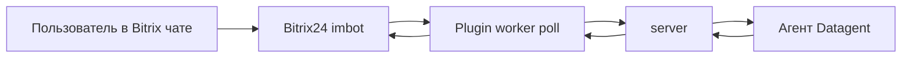

# Битрикс24

:::info Studio и выше
Интеграция с **Битрикс24** доступна начиная с тарифа **Studio** (3 900 ₽/мес). На **Free** и **Solo** плагин недоступен. [Тарифы →](../cloud/pricing)
:::

Агент подключается к вашему **Битрикс24** и работает прямо там: принимает сообщения из **чатов CRM и открытых линий**, готовит ответы клиентам, фиксирует итог в **задаче Datagent** и отправляет ответ обратно в CRM. Сотрудники пишут боту как коллеге в привычном интерфейсе.

**Первый шаг:** [app.datagent.ru](https://app.datagent.ru) → **Менеджер плагинов** → **Битрикс24** → установить плагин.

:::tip Честно о возможностях
Плагин рассчитан на **чаты и ботов**, не на полную выгрузку воронки сделок одной кнопкой. Сценарии со сделками вне чата — через [браузер](../browser/overview) (**Studio+**) или доработку под ваш процесс.
:::

## Что умеет агент в Битрикс24

- Принимать сообщения из чатов CRM и **открытых линий**
- Готовить ответы клиентам в задаче Datagent — с журналом каждого шага
- Отправлять одобренный ответ обратно в чат Битрикс24
- Работать с вложениями в переписке (при настройке прав вебхука)

## Как подключить

1. Установите плагин **Битрикс24** в **Менеджере плагинов**.
2. В **Настройках компании → Битрикс24** укажите **адрес портала** и **вебхук** из Битрикс24 (*Приложения → Вебхуки → входящий*, права минимум **imbot**).
3. **Зарегистрируйте бота**, выберите **агента** (рекомендуем [GigaChat](./gigachat)) и нажмите **Запустить мост** → **Проверить соединение**.

Пошагово с картинками — [учебник: каналы](../guides/06-channels) · [практический сценарий](../tutorials/automate-crm).

## Пример инструкции агенту

```text
Ты ассистент в чате Битрикс24. Контекст — в задаче и комментариях.
Отвечай кратко по-русски. Не выдумывай вызовы API CRM.
```

## Частые вопросы

**Нужен ли программист?**  
Первую связку часто делает администратор Битрикс24 и ответственный за Datagent. Сложные воронки — с разработчиком.

**Агент сам выгружает все лиды?**  
**Нет.** Плагин — **чаты**, не полная выгрузка CRM.

**Почему нет ответа в чате?**  
Проверьте: мост включён, запуск завершился, нет зависшего [согласования](../concepts/approvals).

**Какой тариф нужен?**  
**Studio** и выше — как в [таблице каналов](../concepts/channels).

## Что дальше

→ [Каналы](../concepts/channels)

:::note Для инженеров

Плагин `datagent.bitrix24`, polling `imbot.v2.Event.get`, issues + wakeup. **Нет** agent tools `bitrix24_*` в manifest. CRM (`crm.lead.*`, `crm.deal.*`) **не** вызывается.



Установка (on-premise / dev):

```bash
pnpm --filter @datagent/plugin-bitrix24 build
pnpm datagent plugin install packages/plugins/bitrix24
```

См. [Архитектура](../concepts/agent-architecture.md), [API](../api-reference/overview.md).

:::
