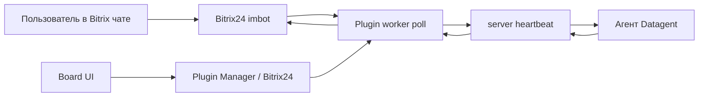

# Как подключить Битрикс24 к AI-агентам — Datagent

> **Зачем:** Чтобы клиент писал в привычный **чат Битрикс24**, а **AI-агент на GigaChat** готовил ответ — с журналом, [согласованиями](../concepts/approvals) и единой задачей в **Datagent**. Не копировать переписку вручную и не терять контроль, как в «боте без истории».

**Datagent** — одна из немногих платформ с **нативной** связкой **Битрикс24 + российские модели** (GigaChat, YandexGPT) в облаке на [app.datagent.ru](https://app.datagent.ru).

## Это работает так

1. Клиент пишет **боту в Битрикс24** (открытая линия или чат).
2. **Datagent** создаёт или обновляет **задачу** — переписка видна в [входящих](../concepts/inbox).
3. По правилам компании запускается **агент** (часто на **GigaChat**).
4. Агент готовит ответ; рискованные шаги — через **согласование**.
5. Текст уходит **обратно в чат Битрикс24** — клиент остаётся в CRM.

Всё занимает минуты, без программиста на каждое сообщение.

:::tip Доступно бесплатно
Проверить связку **Битрикс24 + агент** можно на **Free** (3 агента, 100 запусков). Нужны ключи GigaChat/YandexGPT и настройка портала.
[Начать →](https://app.datagent.ru/signup)
:::

## Что вы получаете (конкретно)

| Было | Стало с Datagent |
| --- | --- |
| Копипаст из CRM в ChatGPT | Одна **задача** на диалог |
| «Бот ответил — непонятно как» | **Журнал запуска** по шагам |
| Рисковые действия без контроля | **Согласования** в панели |
| Ответ только в голове менеджера | Команда видит ту же **задачу** |

**Честно:** это **диалоги и задачи**, не автоматическая выгрузка всей воронки CRM. Агент **не** заменяет отчёты «все сделки за квартал» без отдельной разработки.

## Подключение по шагам

### Шаг 1. Webhook в Битрикс24

1. В портале: **Приложения → Вебхуки → входящий**.
2. Создайте webhook с URL вида  
   `https://ваш-портал.bitrix24.ru/rest/USER_ID/TOKEN/`
3. Права минимум: **imbot** (боты и сообщения). Для файлов из чата — **disk**. Для справочника ACL — **user**, **department**.

OAuth-приложение Bitrix для этого сценария **не** нужно.

### Шаг 2. Плагин в Datagent

1. Войдите на [app.datagent.ru](https://app.datagent.ru).
2. **Менеджер плагинов** → установите плагин **Битрикс24** для компании.
3. Откройте **Настройки компании → Битрикс24**.

### Шаг 3. Бот и агент

1. Укажите **URL портала** и **webhook** из шага 1.
2. **Зарегистрируйте бота** в интерфейсе плагина (или привяжите существующего).
3. Сохраните **APPLICATION TOKEN** бота.
4. **Связка:** выберите **агента Datagent** (рекомендуем **GigaChat** или YandexGPT).
5. Нажмите **Запустить bridge** (включить опрос сообщений).
6. **Проверить соединение** — затем тестовое сообщение в чат Bitrix.

### Шаг 4. Первый диалог

1. Напишите боту из Bitrix24 тестовый вопрос.
2. В Datagent откройте **входящие** / новую **задачу**.
3. Запустите агента при необходимости.
4. Убедитесь, что ответ вернулся в чат CRM.

Полный сценарий с картинками: [учебник, каналы](../guides/06-channels) и [практическое руководство](../tutorials/automate-crm).

## Системная инструкция агента (пример)

```text
Ты ассистент в чате Битрикс24. Контекст — в задаче и комментариях.
Отвечай кратко по-русски. Не выдумывай вызовы CRM API — отдельных bitrix24_* tools нет.
```

## Частые вопросы

**Нужен ли программист?**  
Первую связку часто делает администратор Bitrix + ответственный за Datagent. Сложные воронки CRM — с разработчиком.

**Агент сам выгружает лиды?**  
**Нет.** Плагин работает с **imbot** (чаты), не с `crm.lead.*`.

**Какая модель лучше?**  
Для РФ чаще **GigaChat** — см. [подключение](./gigachat). YandexGPT — [здесь](./yandexgpt).

**Почему нет ответа в чате?**  
Проверьте: bridge включён, run завершился, нет зависшего [согласования](../concepts/approvals).

**Это на PRO?**  
Базовая связка доступна на **Free**; лимиты — по [тарифу](../cloud/pricing). **PRO** — больше агентов и запусков.

## Что дальше?

- [Подключить GigaChat →](./gigachat)
- [Тарифы →](../cloud/pricing)
- [Входящие и задачи →](../concepts/inbox)
- [Согласования →](../concepts/approvals)
- [Зарегистрироваться →](https://app.datagent.ru/signup)

:::note Для инженеров

Плагин `datagent.bitrix24`, polling `imbot.v2.Event.get`, issues + wakeup + heartbeat. **Нет** agent tools `bitrix24_*` в manifest.

### Схема



### Установка (on-premise / dev)

```bash
pnpm --filter @datagent/plugin-bitrix24 build
pnpm datagent plugin install packages/plugins/bitrix24
```

В Cloud — через **Plugin Manager** на app.datagent.ru.

### Внутренние вызовы REST (worker)

| Операция | Метод |
| --- | --- |
| Опрос входящих | `imbot.v2.Event.get` |
| Ответ в чат | `imbot.v2.Chat.Message.send` |
| Боты | `imbot.v2.Bot.list`, `Bot.register` |
| Вложения | `imbot.v2.File.upload`, `File.download` |
| ACL | `user.get`, `department.get`, `sonet_group.*` |

CRM (`crm.lead.*`, `crm.deal.*`) **не** вызывается.

### Поля конфигурации

| Поле | Назначение |
| --- | --- |
| `portal_url` | Адрес портала |
| `webhook_base_url` | База REST webhook |
| `bot_token_secret_ref` | APPLICATION TOKEN imbot |

Вход — **polling** (`bitrix-poll`), не push webhook на Datagent API.

### Типичные ошибки

| Симптом | Что сделать |
| --- | --- |
| 401 webhook | Пересоздать входящий webhook |
| Нет APPLICATION TOKEN | Сохранить после `Bot.register` |
| `BITRIX_DISK_SCOPE_REQUIRED` | Добавить scope disk |
| Polling не идёт | Включить **Запустить bridge** |

См. [Архитектура](../concepts/agent-architecture.md), [API](../api-reference/overview.md).

:::
