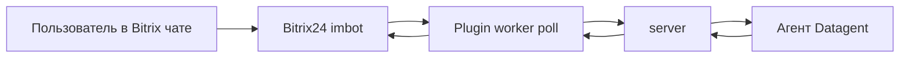

{/* TODO: когда https://datagent.ru/ii-agenty-v-bitrix24 отдаёт HTTP 200, добавить spoke «ИИ-агенты в Битрикс24». Сейчас 404 — ссылку не публикуем. */}

# Битрикс24 рядом с Datagent: ответы клиентам с вашим «да»

Клиент пишет в Битрикс24 — агент Datagent готовит черновик ответа и ждёт вашего «да», прежде чем текст уйдёт обратно в чат. Сотрудники продолжают работать в привычном интерфейсе Битрикс24; подготовка ответа и журнал шагов — рядом, в Datagent. Подключается к чатам CRM и Открытым линиям.

**Первый шаг:** [app.datagent.ru](https://app.datagent.ru) → Менеджер плагинов → Битрикс24 → установить плагин. Нужен тариф **Studio** и выше (3 900 ₽/мес) — см. [тарифы](https://datagent.ru/#pricing) и [таблицу каналов](../concepts/channels).

## Это не приложения Маркетплейса

| | Чат-мост агентов (эта страница) | Приложения Маркетплейса |
| --- | --- | --- |
| Что это | Плагин Datagent Cloud: сообщения CRM → задача агента → ответ после «да» | EDPortal, Заявки PRO, Datagent Connector |
| Где ставится | Менеджер плагинов в Datagent + вебхук портала | 1С-Битрикс24.Маркетплейс |
| Оплата | Тариф Datagent Cloud (Studio+) | Подписка Маркетплейса, без отдельной платы вендору |
| ИИ на пути | Да: агент готовит ответ | Нет (Connector — только транспорт в Открытые линии) |
| Документация | Эта страница | [Приложения](/docs/apps), обзор [решений Битрикс24](https://datagent.ru/solutions/bitrix24) |

**Datagent Connector** (Маркет) ведёт Telegram, VK и MAX в Открытые линии: оператор отвечает в штатном чате линий. Это **не** чат-мост агента и **не** задачи Datagent.

## Что делает чат-мост {#что-умеет}

- Принимает сообщения из чатов CRM и Открытых линий Битрикс24.
- Создаёт (или продолжает) задачу агента в Datagent с текстом переписки и контекстом.
- Готовит черновик ответа клиенту — с **журналом** каждого шага агента.
- Отправляет одобренный текст обратно в тот же чат Битрикс24.
- Работает с вложениями в переписке, если администратор CRM выдал нужные права вебхуку.

Коротко: **Битрикс остаётся местом общения с клиентом. Datagent — место, где агент думает и ждёт вашего «да».**


## Как устроен поток

1. Клиент пишет в чат CRM или в Открытую линию.
2. Мост забирает событие (бот / polling) и кладёт сообщение в задачу агента Datagent.
3. Агент читает контекст задачи и комментарии, готовит черновик ответа по-русски.
4. Вы (или ответственный) смотрите черновик в Datagent и даёте **«да»** — или правите / отклоняете.
5. После согласия текст уходит обратно в чат Битрикс24.
6. Шаги агента остаются в журнале задачи: что прочитал, что предложил, когда отправил.

Сотрудник может параллельно писать боту в привычном интерфейсе Битрикс24; ход работы агента виден в панели Datagent.

Пошагово с картинками — [учебник: каналы](../guides/06-channels) · [практический сценарий](../tutorials/automate-crm).

## Согласование: наружу — только после «да»

Ответ клиенту — действие «наружу». Мост **не** публикует текст в чат Битрикс24, пока человек не подтвердил отправку в задаче Datagent.

- Черновик можно править перед отправкой.
- Отклонённый черновик не уходит клиенту.
- Если ответ «завис» — чаще всего ждёт [согласования](../concepts/approvals), а не «сломался мост».

Внутренняя подготовка (чтение переписки, черновик, журнал) идёт в задаче. Публикация в CRM — только после явного согласия.

## Честно о границах

Плагин заточен под **чаты и ботов**, а не под «выгрузить всю воронку сделок одной кнопкой».

- Нет полной выгрузки лидов, сделок и воронки через этот плагин.
- Сценарии со сделками **вне** чата — через [браузер](../browser/overview) (Studio+), доработку под ваш процесс или отдельный [preview amoCRM](./amocrm) (чтение API), если CRM — amoCRM.
- В manifest агента **нет** инструментов вида `bitrix24_*` для произвольных вызовов CRM API (`crm.lead.*`, `crm.deal.*` мост сам не дергает).
- Технически: плагин `datagent.bitrix24`, polling `imbot.v2.Event.get`, задачи + wakeup — для инженеров, см. блок в конце.

Если нужна именно «агент спрашивает остатки / воронку обычным языком» — смотрите [каталог интеграций](./overview) (чтение данных сервисов). Битрикс24 в [таблице каналов](../concepts/channels) — про задачи из чатов, не про полный CRM-коннектор.

## Как подключить {#как-подключить}

1. В [app.datagent.ru](https://app.datagent.ru) откройте **Менеджер плагинов** → **Битрикс24** → установите плагин.
2. В **Настройках компании → Битрикс24** укажите адрес портала и ключ входящего вебхука (Битрикс24 → Приложения → Вебхуки → входящий; обычно выдаёт администратор CRM).
3. Зарегистрируйте бота, выберите агента (часто берут [GigaChat](./gigachat)), нажмите **Запустить мост** → **Проверить соединение**.
4. Напишите боту тестовое сообщение в Битрикс24 и убедитесь, что в Datagent появилась задача с черновиком.

Права вебхука должны покрывать чаты / бота и, при необходимости, вложения. Без прав администратора портала первую связку часто не собрать.

## Пример инструкции агенту

```text
Ты ассистент в чате Битрикс24. Контекст — в задаче и комментариях.

Отвечай кратко по-русски. Не выдумывай вызовы API CRM.
Не обещай клиенту то, чего нет в переписке и комментариях.
Черновик ответа готовь так, чтобы человек мог быстро нажать «да» или поправить одну фразу.
```

> Работа остаётся в Битрикс24. Datagent рядом: агент готовит ответ, вы жмёте «да», текст уходит клиенту.

> Чат-мост Datagent — это не EDPortal и не Connector из Маркетплейса. Маркет ставит приложения в меню портала; мост превращает сообщения CRM в задачи агента.

> Наружу в чат Битрикс24 уходит только согласованный текст. Черновик и журнал шагов — в задаче Datagent.

> Плагин про чаты и ботов, не про выгрузку всей воронки сделок одной кнопкой.

<span id="частые-вопросы" />

<FaqSchema
  heading="Частые вопросы"
  pageUrl="https://docs.datagent.ru/docs/integrations/bitrix24"
  items={[
    {
      question: 'Нужен ли программист?',
      answer:
        'Часто первую связку делают администратор Битрикс24 и человек, ответственный за Datagent. Сложные воронки и нестандартные права — с разработчиком или интегратором.',
    },
    {
      question: 'Это то же самое, что EDPortal / Заявки PRO / Connector из Маркетплейса?',
      answer:
        'Нет. Те три — приложения портала из 1С-Битрикс24.Маркетплейс (документация приложений: docs.datagent.ru/docs/apps). Эта страница — чат-мост ИИ-агента Datagent Cloud: сообщение из CRM становится задачей агента. Connector только ведёт мессенджеры в Открытые линии, без агента на пути доставки.',
    },
    {
      question: 'Агент сам выгружает все лиды и сделки?',
      answer: 'Нет. Плагин работает с чатами и ботом. Полной выгрузки CRM нет.',
    },
    {
      question: 'Почему клиент не видит ответ в чате?',
      answer:
        'Проверьте по порядку: мост включён; запуск завершился без ошибки; в задаче Datagent нет ожидания согласования; у вебхука есть права на отправку в нужный чат. Чаще всего ответ ждёт вашего «да».',
    },
    {
      question: 'Какой тариф нужен?',
      answer:
        'Studio и выше — как в таблице каналов на сайте тарифов. На бесплатном и Solo мост Битрикс24 в каталоге каналов не обещается.',
    },
    {
      question: 'Можно ли отвечать без согласования?',
      answer:
        'Сценарий продукта — черновик в задаче и отправка наружу после согласия человека. Так клиент не получает текст от модели без глаз сотрудника.',
    },
    {
      question: 'Где журнал и кто видит шаги?',
      answer:
        'В задаче Datagent: что агент прочитал, какой черновик предложил, когда ушло в Битрикс24 после согласия. Коллеги с доступом к компании и задаче видят тот же журнал.',
    },
  ]}
/>

## Что дальше

**Подключить чат-мост:** [app.datagent.ru](https://app.datagent.ru) → Менеджер плагинов → Битрикс24.

Нужна помощь с правами вебхука или сценарием линий — напишите на [sales@datagent.ru](mailto:sales@datagent.ru).

Приложения Маркетплейса (курсы, заявки, транспорт мессенджеров) — отдельно: [datagent.ru/solutions/bitrix24](https://datagent.ru/solutions/bitrix24) и [документация приложений](/docs/apps).

<CtaBanner
  title="Подключить чат-мост Битрикс24"
  description="Менеджер плагинов в Cloud, тариф Studio и выше. Ответ клиенту уходит только после вашего «да»."
  buttonText="Открыть Cloud"
  buttonUrl="https://app.datagent.ru"
/>

<details>
<summary>Для инженеров</summary>

Плагин `datagent.bitrix24`, polling `imbot.v2.Event.get`, issues + wakeup. В manifest агента нет инструментов `bitrix24_*`. Методы CRM (`crm.lead.*`, `crm.deal.*`) мостом не вызываются.



Установка (on-premise / dev):

```bash
pnpm --filter @datagent/plugin-bitrix24 build
pnpm datagent plugin install packages/plugins/bitrix24
```

См. [Архитектура](../concepts/agent-architecture), [API](../api-reference/overview).

</details>
