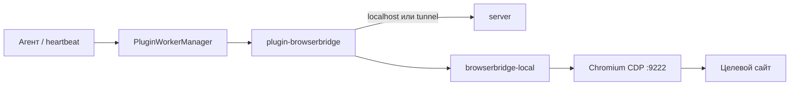

# Подключите BrowserBridge к агенту

Когда задаче нужен **реальный сайт** — форма, личный кабинет, портал без API — BrowserBridge даёт агенту **ваш браузер** на рабочем компьютере. Подключение — в [app.datagent.ru](https://app.datagent.ru), без своего сервера.

:::info Доступно на PRO и выше
Управление браузером — с тарифа **PRO**, **990 ₽/мес**. На Free BrowserBridge недоступен.
[Тарифы →](../cloud/pricing)
:::

## Как подключить

1. Убедитесь, что у компании тариф **PRO** (или Business).
2. **Менеджер плагинов** → установите и включите **BrowserBridge**.
3. **Настройки компании → BrowserBridge** → мастер **«Облако + ПК»**.
4. На рабочем ПК выполните скрипты **setup** и **pair** из мастера (Node.js 20+).
5. Дождитесь статуса **«В сети»**, задайте политику URL и включите `browser_*` у агента.

Пошагово с картинками сценария: [Подключение за 5 минут](../browser/setup). Краткий обзор: [Браузер и агент](../browser/overview).

## Что умеет браузер-агент

| Задача | Пример |
| --- | --- |
| Открыть страницу | Статус заказа на сайте перевозчика |
| Снять скриншот или текст | Отчёт в задаче с доказательством |
| Заполнить форму | Рутина на портале под вашим контролем |
| Работа в CRM | Раздел Битрикс24, куда нет отдельного API |

:::tip Подходит для
Заполнение форм, парсинг открытых данных, авторизованные сессии в CRM, внутренние порталы без API.
:::

:::warning Не подходит для
Банк-клиентов и сайтов с антибот-защитой; задач, где оператор должен непрерывно смотреть на экран.
:::

**Не нужен BrowserBridge**, если всё решается через [Битрикс24](./bitrix24), API или файлы на задаче.

## Согласования и безопасность

- Отправка формы, разрушительный клик, выполнение скрипта на странице — через [Согласования](../concepts/approvals).
- **Политика URL** компании ограничивает, куда агент может переходить.
- Не выдавайте BrowserBridge всем агентам «на всякий случай» — вырастет очередь одобрений.

## Частые вопросы

**Это облачный браузер?**  
**Нет.** Работает **ваш** Chromium на **вашем** ПК; облако командует через защищённое подключение к ПК.

**Нужен ли программист?**  
Нет для ежедневных задач. Первое подключение — по мастеру в настройках компании.

**Работает на Free?**  
**Нет** — нужен **PRO** (990 ₽/мес) или выше.

**Связано с «Офисом»?**  
Нет. «Офис» — визуальный обзор команды; BrowserBridge — инструмент агента на задаче.

**Можно автоматизировать любой сайт?**  
Соблюдайте **ToS** сайта и политику компании. Datagent не обходит защиты.

## Что дальше

- [Подключите браузер →](../browser/setup)
- [Согласования →](../concepts/approvals)
- [Тарифы PRO →](../cloud/pricing)
- [Задача с GigaChat →](./gigachat)

⚙️ Для self-hosted и разработчиков

Техническая справка: плагин `datagent.browserbridge`, Local Service, tunnel, API control plane.

### Схема

Плагин `datagent.browserbridge`, Local Service **9247**, CDP **9222**, tunnel `ws(s)://…/api/browserbridge/tunnels/connect`.

### Agent tools

| Tool | Action | Параметры (кратко) |
| --- | --- | --- |
| `browser_navigate` | `navigate` | `url`, `waitUntil` |
| `browser_screenshot` | `screenshot` | `fullPage?`, `selector?` |
| `browser_extract_text` | `extract_text` | `selector?`, `format` |
| `browser_click` | `click` | `selector`, `destructive?` |
| `browser_fill_form` | `fill_form` | `fields[]`, `submit?` |
| `browser_execute_js` | `execute_js` | `script` — approval |
| `browser_close_tab` | `close_tab` | `tabId?` |

Tool `browser_snapshot` **отсутствует**. Отладка: `POST /api/plugins/tools/execute`.

### API control plane

| Назначение | Маршрут |
| --- | --- |
| Статус | `GET /api/companies/:companyId/browserbridge/status` |
| Код сопряжения | `POST .../browserbridge/pairing-codes` |
| Политика URL | `GET/PUT .../browserbridge/policy` |
| Tunnel | `ws(s)://<host>/api/browserbridge/tunnels/connect` |
| Workstation kit | `GET /api/browserbridge/workstation-kit` |

Config: `localServicePort` (9247), `tunnelMode`, `requireApprovalForDestructive` (default true).

См. [Архитектура](../concepts/agent-architecture.md), [Создание плагина](../tutorials/build-plugin.md), as-built `doc/guides/browserbridge-setup-ru.md`.

