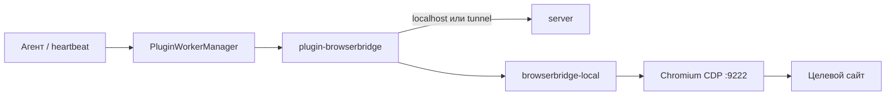

# Агент управляет браузером сам — BrowserBridge в Datagent

> **Зачем:** Когда задаче нужен **реальный сайт** — форма, личный кабинет, портал без API — а не только текст в чате. **BrowserBridge** даёт агенту **ваш браузер** на рабочем компьютере: открыть страницу, прочитать, кликнуть — с [согласованием](../concepts/approvals) перед опасными действиями.

В отличие от [1С](./1c-connector), BrowserBridge работает **в цикле агента на задаче** — через плагин и локальную службу.

:::info Доступно на PRO и выше
**Управление браузером** — с тарифа **PRO**, **990 ₽/мес**. На Free агенты без BrowserBridge.
[Тарифы →](../cloud/pricing)
:::

## Это работает так

1. Администратор включает плагин **BrowserBridge** в компании на [app.datagent.ru](https://app.datagent.ru).
2. На рабочей станции ставится **локальная служба** (и при необходимости Chromium с отладкой).
3. Служба **связывается** с облаком (pairing / tunnel).
4. Агент в задаче вызывает инструменты: открыть URL, скриншот, клик, форма.
5. Перед отправкой формы или опасным кликом — **согласование** в панели.

Агент не «ломает капчу» и не обходит правила сайтов — только то, что разрешила ваша политика URL.

## Когда это нужно

| Ситуация | Пример |
| --- | --- |
| Нет API у поставщика | Статус заказа на сайте перевозчика |
| Внутренний портал | Справка в веб-интерфейсе без интеграции |
| Проверка витрины | Скриншот и текст страницы в отчёт задачи |
| Рутина с формами | Заполнение полей с вашим **Одобрить** перед отправкой |

**Не нужен BrowserBridge**, если всё решается через **Битрикс24**, API или файлы на задаче.

## Подключение (кратко)

1. **PRO**-тариф (или тест по договору на Business).
2. **Менеджер плагинов** → BrowserBridge → настройки компании (политика URL: открытый / allowlist).
3. На ПК оператора: установить **workstation kit**, запустить **локальную службу** (порт по умолчанию **9247**).
4. **Связать** станцию с компанией (pairing code в облаке).
5. В агенте включить tools `browser_*` → тестовая задача с простым URL.

Пошагово с диагностикой: [Установка и настройка](../browser/setup). Обзор службы: [Управление браузером — обзор](../browser/overview).

## Что умеет агент

| Действие | Зачем |
| --- | --- |
| Откройте страницу | Переход по ссылке из задачи |
| Сделайте скриншот / снимите текст | Доказательство и разбор для человека |
| Кликните, заполните форму | Рутина на сайте под контролем |
| Выполните JavaScript | Только с **согласованием** — высокий риск |

Полный список tools и параметров — в блоке для инженеров ниже.

## Согласования и безопасность

- Отправка формы, разрушительный клик, `execute_js` — через [Согласования](../concepts/approvals).
- **Политика URL** компании ограничивает, куда можно ходить.
- Не выдавайте BrowserBridge всем агентам «на всякий случай» — вырастет очередь одобрений.

## Частые вопросы

**Это облачный браузер?**  
**Нет.** Работает **ваш** Chromium на **вашем** ПК; облако только командует через tunnel.

**Нужен ли программист?**  
Первую установку службы часто делает IT; дальше оператор запускает задачи как обычно.

**Работает на Free?**  
**Нет** — нужен **PRO** (990 ₽/мес) или выше.

**Связано с «Офисом»?**  
Нет. «Офис» — обзор команды агентов; BrowserBridge — инструмент на задаче.

**Юридически можно автоматизировать любой сайт?**  
Соблюдайте **ToS** сайта и политику компании. Datagent не обходит защиты.

## Что дальше?

- [Установка службы →](../browser/setup)
- [Согласования →](../concepts/approvals)
- [Тарифы PRO →](../cloud/pricing)
- [GigaChat + задачи →](./gigachat)

:::note Для инженеров

Плагин `datagent.browserbridge`, Local Service **9247**, CDP **9222**, tunnel `ws(s)://…/api/browserbridge/tunnels/connect`.

### Схема

### Agent tools

| Tool | Action | Параметры (кратко) |
| --- | --- | --- |
| `browser_navigate` | `navigate` | `url`, `waitUntil` |
| `browser_screenshot` | `screenshot` | `fullPage?`, `selector?` |
| `browser_extract_text` | `extract_text` | `selector?`, `format` |
| `browser_click` | `click` | `selector`, `destructive?` |
| `browser_fill_form` | `fill_form` | `fields[]`, `submit?` |
| `browser_execute_js` | `execute_js` | `script` — approval |
| `browser_close_tab` | `close_tab` | `tabId?` |

Tool `browser_snapshot` **отсутствует**. Отладка: `POST /api/plugins/tools/execute`.

### API control plane

| Назначение | Маршрут |
| --- | --- |
| Статус | `GET /api/companies/:companyId/browserbridge/status` |
| Pairing | `POST .../browserbridge/pairing-codes` |
| Политика URL | `GET/PUT .../browserbridge/policy` |
| Tunnel | `ws(s)://<host>/api/browserbridge/tunnels/connect` |
| Workstation kit | `GET /api/browserbridge/workstation-kit` |

Config: `localServicePort` (9247), `tunnelMode`, `requireApprovalForDestructive` (default true).

См. [Архитектура](../concepts/agent-architecture.md), [Создание плагина](../tutorials/build-plugin.md).

:::
