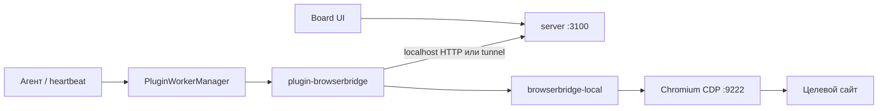

**BrowserBridge** в Datagent — плагин `datagent.browserbridge` (`packages/plugins/plugin-browserbridge`) плюс локальный демон `@datagent/browserbridge-local`. В отличие от [1С Коннектора](./1c-connector), интеграция регистрирует **agent tools** и вызывается во время **heartbeat**; plugin worker ходит в Local Service (`POST /execute`) или в tunnel WebSocket на server `:3100`. LLM-адаптеры сами по себе browser tools **не** добавляют.

Установка CDP, CLI `datagent-bridge`, curl-проверки и UI policy — в разделе [Управление браузером](../browser/setup).

## Схема

## Идентификаторы

| Поле | Значение |
| --- | --- |
| Plugin id | `datagent.browserbridge` |
| Legacy alias | `datagent-browserbridge` → `datagent.browserbridge` (`plugin-keys.ts`) |
| Local Service default port | `9247` |
| CDP default | `127.0.0.1:9222` |

## Agent tools `browser_*`

Регистрируются в `packages/plugins/plugin-browserbridge/src/manifest.ts`. Соответствие action в `POST /execute` Local Service:

| Tool | Action (execute) | Параметры (кратко) |
| --- | --- | --- |
| `browser_navigate` | `navigate` | `url` (обяз.), `waitUntil`: `load` \| `networkidle` |
| `browser_screenshot` | `screenshot` | `fullPage?`, `selector?` |
| `browser_extract_text` | `extract_text` | `selector?`, `structured?`, `format`: text/table/json |
| `browser_click` | `click` | `selector` (обяз.), `description?`, `destructive?` |
| `browser_fill_form` | `fill_form` | `fields[]` (`selector`, `value`), `submit?`, `submitSelector?` |
| `browser_wait_for_element` | `wait_for_element` | `selector`, `timeout?`, `state`: visible/hidden/attached |
| `browser_scroll` | `scroll` | `direction`: up/down, `pixels?`, `selector?` |
| `browser_get_cookies` | `get_cookies` | `domain?` |
| `browser_execute_js` | `execute_js` | `script`, `description` (обяз.) — Board approval |
| `browser_close_tab` | `close_tab` | `tabId?` |

Tool **`browser_snapshot`** в коде **отсутствует** (вместо него `browser_screenshot` / `browser_extract_text`). Дополнительных agent tools в manifest (например `escalate_to_human`) **нет**.

Вызов на run: heartbeat → `PluginWorkerManager` → worker → Local Service или tunnel. Отладка tool: `POST /api/plugins/tools/execute`. Эндпоинта `POST /internal/tools/invoke` на server **нет**.

## API control plane (server)

Server **не** читает `BROWSERBRIDGE_URL` из `.env`.

| Назначение | Маршрут / механизм |
| --- | --- |
| Статус bridge для компании | `GET /api/companies/:companyId/browserbridge/status` |
| Pairing (cloud) | `POST /api/companies/:companyId/browserbridge/pairing-codes` |
| Политика URL (`open` / `allowlist` / `denylist`) | `GET/PUT /api/companies/:companyId/browserbridge/policy` |
| Tunnel WebSocket | `ws(s)://<host>/api/browserbridge/tunnels/connect` |
| Workstation kit | `GET /api/browserbridge/workstation-kit` (tar.gz) |

Поля config плагина на компанию (UI **Company → Settings → BrowserBridge**):

| Поле | Default | Назначение |
| --- | --- | --- |
| `localServiceHost` | `127.0.0.1` | Host Local Service |
| `localServicePort` | `9247` | Порт Local Service |
| `autoStartLocalService` | `true` | Автозапуск демона в plugin worker |
| `tunnelMode` | `false` | Cloud tunnel вместо localhost |
| `requireApprovalForDestructive` | `true` | Одобрение для submit / destructive click / `execute_js` |
| `maxActionTimeoutMs` | `30000` | Таймаут HTTP к bridge |
| `screenshotOnEveryAction` | `false` | Скриншот после каждого action |
| `bridgeTokenSecretRef` | — | Secret ref вместо `~/.datagent/bridge.token` |

## Одобрения и политика

- Рискованные действия (`browser_action`, destructive click, `execute_js`) могут требовать решения в Board — см. [Одобрения](../guides/04-trust-and-approval).
- `browser_navigate` ограничивается **browser policy** компании (не env `BROWSERBRIDGE_ALLOWLIST`).

## Ограничения

- Не обходить CAPTCHA и не нарушать ToS сайтов.
- Не выдавать BrowserBridge всем агентам «на всякий случай» — растёт очередь одобрений.
- `pnpm dev` поднимает server + UI на `:3100`; bridge **не** в dev-runner (см. [Установка и настройка](../browser/setup)).

## Связанные разделы

- [Управление браузером — обзор](../browser/overview)
- [Установка и настройка](../browser/setup)
- [Архитектура платформы](../concepts/agent-architecture.md)
- [Создание плагина](../tutorials/build-plugin.md)
- [Обзор API](../api-reference/overview)
