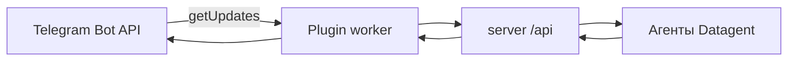

# Телеграм

:::tip Доступно на всех тарифах
✅ Интеграция с **Телеграм** доступна на всех тарифах, включая **Free**. Нужен только **токен** бота из [@BotFather](https://t.me/BotFather).
:::

Подключите **Телеграм-бота** — и сотрудники смогут ставить задачи агенту прямо из мессенджера, получать уведомления и **одобрять** рискованные действия кнопками. Агент отвечает через платформу; ответ можно получить в чате, не держа панель открытой весь день.

**Первый шаг:** создайте бота в [@BotFather](https://t.me/BotFather) → [app.datagent.ru](https://app.datagent.ru) → **Менеджер плагинов** → **Телеграм**.

## Как подключить

1. Создайте бота через [@BotFather](https://t.me/BotFather) (`/newbot`) и скопируйте **токен**.
2. В Datagent: **Менеджер плагинов** → установите и включите плагин **Телеграм**.
3. Откройте **Настройки компании → Телеграм** — сохраните токен как **секрет компании** (не в открытом тексте задачи).
4. Напишите боту `/help` — должен ответить списком команд.

## Что умеет агент в Телеграм

- Принимать сообщения в **личном чате** или **группе** — они попадают в **задачи** Datagent
- Отвечать **текстом и файлами** через платформу (при настроенном мосте)
- Присылать **уведомления** о статусе задачи и [согласованиях](../concepts/approvals)
- Работать с **несколькими пользователями** — при настройке списка разрешённых чатов

Это не отдельная нейросеть: бот связывает мессенджер с задачами и согласованиями. Сквозной сценарий с Битрикс24 — [практический сценарий](../tutorials/automate-crm).

## Частые вопросы

**Нужен ли отдельный агент «для Телеграма»?**  
Нет — бот связан с **задачами** существующих агентов. Модель настраивается как обычно ([GigaChat](./gigachat)).

**Работает ли вместе с Битрикс24?**  
Да — типичный сценарий: чат в CRM → агент → уведомление в Телеграм.

**Платный тариф нужен?**  
**Нет** — Телеграм на **всех** тарифах, как в [таблице каналов](../concepts/channels).

## Что дальше

→ [Каналы](../concepts/channels)

Для инженеров: схема, long polling, поля конфигурации

Пакет `datagent.plugin-telegram`, опрос `getUpdates` (long polling), worker и маршруты к задачам и согласованиям. Публичный URL инстанса **не обязателен** для приёма сообщений.

### Поля конфигурации (основные)

| Поле | Назначение |
| --- | --- |
| `telegramBotTokenRef` | UUID секрета с токеном бота |
| `defaultChatId` | Чат по умолчанию для уведомлений |
| `approvalsChatId` | Чат для согласований |
| `enableCommands` / `enableInbound` | Команды и входящие в задачи |
| `allowedTelegramUserIds` | Список разрешённых пользователей |

### Команды бота

`/help`, `/status`, `/issues`, `/agents`, `/approve <id>`, `/connect <company>` — полный список в worker плагина.

### Типичные ошибки

| Симптом | Что сделать |
| --- | --- |
| 401 от Telegram | Пересоздать секрет с токеном |
| Команды не работают | Проверить список разрешённых чатов |
| Кнопки «Одобрить» не срабатывают | Подключить доступ к панели в настройках плагина |

См. [Архитектура](../concepts/agent-architecture), [Битрикс24](./bitrix24).

