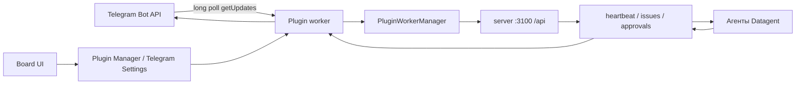

# Телеграм в Datagent — уведомления и согласования

> **Зачем:** **Datagent** на [app.datagent.ru](https://app.datagent.ru) присылает в **Телеграм** уведомления о задачах и запросы «разрешить или отклонить» действие агента — без постоянного мониторинга панели.

> **Интеграция с Telegram доступна на всех тарифах, включая Free.**

## Это работает так

1. Создайте бота в BotFather и подключите плагин в **менеджере плагинов**.
2. Направляйте сообщения и команды в **задачи** Datagent — агент отвечает через платформу.
3. Подтверждайте рискованные шаги кнопками прямо в чате (при настроенном доступе).

Это не отдельная нейросеть: бот передаёт сообщения в задачи и присылает запросы «разрешить или отклонить». Связка с Битрикс24 — в [практическом сценарии](../tutorials/automate-crm).

:::note Для инженеров
Пакет из npm, long polling `getUpdates`, worker и маршруты к задачам и согласованиям — см. разделы ниже.
:::

## Схема



## Создание бота

1. [@BotFather](https://t.me/BotFather) → `/newbot` → сохраните **bot token**.
2. Узнайте `chat.id`: напишите боту, затем `GET https://api.telegram.org/bot<TOKEN>/getUpdates` (или команда `/connect` в плагине после настройки).
3. Токен храните как **company secret** (UUID), не в корневом `.env` — в `.env.example` Datagent **нет** `TELEGRAM_*`.

## Установка в Datagent

1. **Plugin Manager** → установить плагин Telegram → включить для instance.
2. Либо из checkout monorepo (для разработки плагина; в Cloud — Plugin Manager в Board, см. [Старт в Cloud](../cloud/getting-started)):

```bash
pnpm datagent plugin install <npm-пакет из раздела «Технические идентификаторы»>
```

REST (Board на [app.datagent.ru](https://app.datagent.ru); для установки из UI используйте Plugin Manager):

```bash
curl -X POST https://app.datagent.ru/api/plugins/install \
  -H "Content-Type: application/json" \
  -d "{\"packageName\":\"<npm-пакет>\"}"
```

3. **Company → Telegram Settings** (страница настроек плагина). После обновления worker перезапустите **server** на `PORT=3100`.

Секрет бота: **Company / Agent → Environment variables** → создать secret → UUID в поле `telegramBotTokenRef` (см. тест `server/src/__tests__/plugin-secrets-handler.test.ts` и emergency UI в `ui/src/pages/PluginSettings.tsx`). Сырой токен в поле не принимается (ожидается UUID secret ref).

## Настройка (instance config)

Поля задаются в UI плагина Telegram Datagent (в монорепозитории проверено имя `telegramBotTokenRef`).

| Поле | Обязательность | Назначение |
| --- | --- | --- |
| `telegramBotTokenRef` | Да | UUID company secret с bot token |
| `defaultChatId` | Нет | Чат по умолчанию для уведомлений |
| `approvalsChatId` / `approvalsTopicId` | Нет | Отдельный чат/топик для апрувов |
| `errorsChatId` / `errorsTopicId` | Нет | Ошибки агентов |
| `digestChatId` / `digestTopicId` | Нет | Дайджесты (`digestMode`: off / daily / bidaily / tridaily) |
| `escalationChatId` | Нет | Канал HITL-эскалаций |
| Base URL API | Нет | URL Datagent (default `https://app.datagent.ru`)[^tg-fields] |
| Public URL инстанса | Нет | Публичный URL для ссылок на issues в сообщениях[^tg-fields] |
| Board API token ref | Нет | Secret ref board token (кнопки апрува); лучше **Board Access Connection** в UI[^tg-fields] |
| `enableCommands` | Нет | Команды бота (default true) |
| `enableInbound` | Нет | Ответы в Telegram → комментарии issue (default true) |
| `onlyNotifyBoardApprovals` | Нет | Только апрувы типа `request_board_approval` |
| `allowedTelegramUserIds` | Нет | Allowlist user id (пусто = без ограничения) |
| `allowedTelegramChatIds` | Нет | Allowlist chat id (пусто = без ограничения) |
| `escalationTimeoutMs` | Нет | Таймаут эскалации (default 900000 ms ≈ 15 мин) |
| `briefAgentId`, `briefAgentChatIds`, `transcriptionApiKeyRef` | Нет | Медиа-пайплайн / Whisper |

Переменная окружения **`TELEGRAM_ALLOWED_CHAT_IDS`** в коде Datagent **не** используется — только `allowedTelegramChatIds` в config плагина.

Исходящие запросы к `api.telegram.org` идут через capability `http.outbound`; для прокси на хосте: `DATAGENT_PLUGIN_HTTP_PROXY` / `ALL_PROXY` (`server/src/services/plugin-host-services.ts`).

## Входящие апдейты (long polling, не server webhook)

Плагин Telegram Datagent **не** объявляет `webhooks.receive` в manifest — маршрут хоста

`POST /api/plugins/:pluginId/webhooks/:endpointKey`

(`server/src/routes/plugins.ts`) для этого плагина **не** принимает входящие от Telegram.

Вместо этого worker опрашивает Bot API:

`https://api.telegram.org/bot<token>/getUpdates?offset=…&timeout=10&allowed_updates=…`

Хост увеличивает таймаут `http.fetch` плагина до **90 с** для URL с `api.telegram.org` и путём `/getUpdates` (`PLUGIN_FETCH_TELEGRAM_LONG_POLL_TIMEOUT_MS` в `plugin-host-services.ts`).

Следствия:

- Публичный URL инстанса Datagent **не обязателен** для приёма сообщений от Telegram (в отличие от входящего webhook Bitrix24).
- Старый путь `POST …/integrations/telegram/webhook` и корневые `TELEGRAM_WEBHOOK_*` в `.env` — **не** соответствуют реализации.
- `setWebhook` / `secret_token` Telegram — только при ручной настройке webhook **вне** штатного worker; штатный режим — **getUpdates**.

Для ссылок на issues в сообщениях задайте **публичный URL инстанса** в настройках плагина (при локальной разработке — туннель на Board, например ngrok на **3100**). Это не замена long poll.

## Команды бота

Команды реализованы в worker плагина Telegram Datagent. В монорепозитории Datagent handler-кода нет.

| Команда | Поведение |
| --- | --- |
| `/help` | Список команд |
| `/status` | Активные агенты и недавние завершения |
| `/issues` | Открытые issues |
| `/agents` | Список агентов со статусами |
| `/approve <id>` | Подтвердить pending approval (нужен board access) |
| `/connect <company>` | Привязать чат к компании |
| `/connect_topic [topic-id]` | Топик форума → project |
| `/topics list` / `remove` / `clear` | Управление маппингом топиков |
| `/acp spawn` / `status` / `cancel` / `close` | Сессии агентов в треде |
| `/commands import` / `list` / `run` / `delete` | Пользовательские workflow-команды |

Команды **`/run`**, **`/reject`** как в старой доке — **не** входят в список built-in команд (отклонение — inline-кнопка **Reject** на уведомлении апрува).

Отключение: `enableCommands: false`. Ограничение доступа: `allowedTelegramUserIds`, `allowedTelegramChatIds`.

## Agent tools (manifest плагина)

Имена в Board после установки — с namespace плагина (например `datagent.plugin-telegram:escalate_to_human`). **Нет** tool `telegram_send_message` в manifest.

| Tool | Назначение |
| --- | --- |
| `escalate_to_human` | Эскалация оператору (HITL) |
| `handoff_to_agent` | Передача другому агенту в треде |
| `discuss_with_agent` | Диалог двух агентов |
| `register_watch` | Проактивные watch / suggestions |

## Апрувы (human-in-the-loop)

Апрувы создаёт **Datagent** (`POST /api/companies/:companyId/approvals`, типы в `APPROVAL_TYPES`: `request_board_approval`, `browser_action`, `hire_agent`, `budget_override_required`, … — `packages/shared/src/constants.ts`). Плагин Telegram подписывается на события (issue/approval/agent) и шлёт уведомления с inline **Approve** / **Reject**.

- Фильтр только board-апрувов: `onlyNotifyBoardApprovals: true` → в основном `request_board_approval`.
- Решение в Telegram: inline-кнопки или `/approve <approval_id>`; для мутаций API нужен **Board Access Connection** (альтернатива — board token ref в config плагина[^tg-fields]).
- Таймаут **эскалаций** в Telegram: `escalationTimeoutMs` (default 15 мин), действие по умолчанию `escalationDefaultAction` (`defer` / `auto_reply` / `close`).

**Не документировать:** `requireApprovalFor: ["bitrix24_update_lead"]`, tool `bitrix24_update_lead` — таких типов и CRM tools в Datagent/Bitrix-плагине **нет** (см. [Bitrix24](./bitrix24.md)).

## Связь с Bitrix24

Плагины **независимы**: Bitrix24 bridge и плагин Telegram Datagent не делят общий issue-bridge в коде монорепозитория. Сквозной сценарий imbot → агент → Telegram — [Bitrix24 → Telegram](../tutorials/automate-crm.md) (без CRM tools).

## Проверка

1. **Plugin Manager** → **Plugin Settings** → worker status **running**; вкладка webhook deliveries (для Telegram обычно пусто — long poll).
2. `POST /api/plugins/{pluginId}/config/test` — если плагин реализует `validateConfig` (`server/src/routes/plugins.ts`).
3. `pnpm datagent doctor` — instance / DB / adapters (не специфичен для Telegram).
4. Отправьте боту `/help`; в логах worker — обработка `getUpdates`.
5. Создайте тестовый `request_board_approval` в Board — уведомление в `approvalsChatId` или `defaultChatId`.

## Типичные ошибки

| Симптом | Причина | Что сделать |
| --- | --- | --- |
| 401 от Telegram | Неверный token / не UUID в `telegramBotTokenRef` | Пересоздать company secret, вставить UUID |
| Команды не работают | Allowlist / `enableCommands: false` | Проверить `allowedTelegramChatIds`, `allowedTelegramUserIds` |
| Кнопки Approve 403 | Нет board token | **Connect board access** в UI плагина |
| Нет входящих | Worker stopped / неверный offset | Перезапуск плагина, проверить статус worker |
| Таймаут fetch | Сеть / прокси | `DATAGENT_PLUGIN_HTTP_PROXY`, firewall к `api.telegram.org` |
| Старый URL webhook | Ожидание `/integrations/telegram/webhook` | Использовать long poll; не настраивать фиктивный path |

## Частые вопросы

**Нужен ли отдельный агент «для Телеграма»?**  
Нет — бот связан с **задачами и согласованиями** существующих агентов. Нейросеть настраивается как обычно ([GigaChat](./gigachat.md)).

**Работает ли вместе с Битрикс24?**  
Да — типичный сценарий: чат в CRM → агент → уведомление в Телеграм. См. [практический сценарий](../tutorials/automate-crm.md).

**Где включить плагин?**  
**Менеджер плагинов** на [app.datagent.ru](https://app.datagent.ru) после регистрации компании.

## Что дальше

→ [Битрикс24](./bitrix24)

<details>
<summary>Связанные разделы</summary>

- [Согласования](../concepts/approvals) · [Старт в облаке](../cloud/getting-started)
- [Практический сценарий CRM](../tutorials/automate-crm) · [Архитектура](../concepts/agent-architecture)

</details>

[^tg-fields]: В schema npm-пакета эти три поля могут иметь legacy-имена; в Board UI — URL API Datagent, публичный URL и secret ref токена Board (см. manifest установленного пакета).

## Технические идентификаторы

| Идентификатор | Значение |
| --- | --- |
| Ключ в registry Datagent | `datagent.plugin-telegram` |
| npm / install | Предпочтительно `datagent.plugin-telegram`; устаревшие имена пакетов сопоставляются в `packages/shared/src/constants/plugin-keys.ts` |
| CLI / REST install | `pnpm datagent plugin install datagent.plugin-telegram` или `{"packageName":"datagent.plugin-telegram"}` |
| Слот UI настроек | `telegram-settings` |

Поля config в schema опубликованного npm-пакета могут использовать legacy-префикс в именах (см. manifest пакета в Plugin Manager); в Board UI — URL инстанса Datagent, публичный URL и ссылка на secret API-токена Board.
