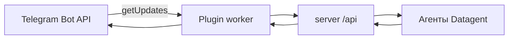

# Телеграм

:::tip[Доступно на всех тарифах]
Интеграция с **Телеграм** доступна на всех тарифах, включая **Free**. Нужен токен бота из [@BotFather](https://t.me/BotFather) — только как **секрет компании**, не в тексте задачи и не в git.
:::

:::warning[Не публикуйте токен]
Токен бота даёт полный доступ к API бота. **Не** вставляйте его в документацию, скриншоты, issues, `.env` в репозитории или примеры с «похожими на настоящие» значениями. В Datagent храните только через [Секреты компании](../concepts/secrets) и поле `telegramBotTokenRef`.
:::

Подключите **Телеграм-бота** — сотрудники смогут ставить задачи агенту из мессенджера, получать уведомления и **одобрять** рискованные действия кнопками. Агент работает через платформу; ответ можно получить в чате, не держа панель открытой весь день.

**Первый шаг:** [@BotFather](https://t.me/BotFather) → [app.datagent.ru](https://app.datagent.ru) → **Менеджер плагинов** → **Телеграм**.

## Если коротко

- Приём апдейтов — **long poll** (`getUpdates`), не webhook Datagent.
- Публичный URL инстанса **не нужен**, чтобы бот получал сообщения.
- Токен — только в **секрете компании**, в конфиге плагина — ссылка `telegramBotTokenRef`.
- Согласования в чате дублируют решение панели; итог фиксируется в Datagent.

## Пример

Менеджер пишет боту в группе: «Сводка по просроченным задачам за вчера». Сообщение попадает в **задачу** Datagent — агент готовит ответ, руководитель **одобряет** кнопкой в Телеграм, ответ возвращается в чат.

## Как подключить

1. Создайте бота в [@BotFather](https://t.me/BotFather) (`/newbot`) и скопируйте токен **только в буфер** — не сохраняйте его в чат или git.
2. В Datagent: **Настройки компании → Секреты** → создайте секрет с этим токеном ([секреты](../concepts/secrets)).
3. **Менеджер плагинов** → установите и включите плагин **Телеграм** (ключ registry: `datagent.plugin-telegram`).

4. **Настройки компании → Телеграм** — выберите секрет в поле токена бота (`telegramBotTokenRef`), задайте чаты уведомлений и согласований.
5. При необходимости включите **доступ панели** (board API token) — иначе кнопки «Одобрить» / «Отклонить» в мессенджере не смогут вызвать API.
6. Напишите боту `/help` — должен ответить списком команд.

Ротация: обновите значение секрета в панели (при компрометации — сначала `/revoke` у BotFather, затем новый секрет).

## Что умеет агент в Телеграм

- Принимать сообщения в **личном чате** или **группе** — они попадают в **задачи** Datagent (если включён inbound).
- Отвечать **текстом и файлами** через платформу (при настроенном мосте).
- Присылать **уведомления** о статусе задачи и [согласованиях](../concepts/approvals).
- Ограничивать доступ списком разрешённых пользователей и чатов.

Это не отдельная нейросеть: бот связывает мессенджер с задачами и согласованиями. Сквозной сценарий с Битрикс24 — [практический сценарий](../tutorials/automate-crm).

## Частые вопросы

**Нужен ли webhook и публичный URL?**  
**Нет** для приёма сообщений. Worker плагина опрашивает Telegram через `getUpdates`. Публичный URL нужен только если хотите кликабельные ссылки на задачи в панели из сообщений бота.

**Нужен ли отдельный агент «для Телеграма»?**  
Нет — бот связан с **задачами** существующих агентов. Модель настраивается как обычно ([GigaChat](./gigachat)).

**Работает ли вместе с Битрикс24?**  
Да — типичный сценарий: чат в CRM → агент → уведомление в Телеграм.

**Платный тариф нужен?**  
**Нет** — Телеграм на **всех** тарифах, как в [таблице каналов](../concepts/channels).

**Бот не отвечает — задача потеряется?**  
Пока плагин недоступен, новые сообщения из Telegram в Datagent не попадут. После восстановления отправьте снова или создайте задачу в панели. Очередь согласований ждёт, пока плагин в статусе «работает».

## Что дальше

→ [Каналы](../concepts/channels) · [Секреты](../concepts/secrets) · [Согласования](../concepts/approvals)

Для инженеров: схема, long polling, поля и команды

Пакет / ключ: `datagent.plugin-telegram` (операторский бот). Опрос `getUpdates` (long polling). **Webhook / `setWebhook` / `TELEGRAM_WEBHOOK_*` в этом плагине не используются.**

### Поля конфигурации (основные)

| Поле | Назначение |
| --- | --- |
| `telegramBotTokenRef` | UUID **секрета** с токеном бота (не plaintext) |
| `paperclipBoardApiTokenRef` | Секрет токена панели — для approve/reject из TG |
| `defaultChatId` | Чат по умолчанию для уведомлений |
| `approvalsChatId` | Чат для согласований |
| `enableCommands` / `enableInbound` | Команды и входящие → задачи |
| `allowedTelegramUserIds` / `allowedTelegramChatIds` | Allowlist; оба пустые — без ограничения по списку |

### Команды бота (встроенные)

`/help`, `/status`, `/issues`, `/agents`, `/create`, `/approve <id>`, `/connect`, `/connect_topic`, `/topics`, `/acp`, `/commands` — полный набор в worker плагина. Отдельной команды `/run <slug>` нет: кастомные сценарии — через `/commands`.

### Типичные ошибки

| Симптом | Что сделать |
| --- | --- |
| 401 от Telegram | Пересоздать секрет с новым токеном (после revoke в BotFather) |
| Команды не работают | Проверить `allowedTelegramUserIds` / `allowedTelegramChatIds` |
| Кнопки «Одобрить» не срабатывают | Задать board API token (`paperclipBoardApiTokenRef`) и доступ к панели |

См. [Архитектура](../concepts/agent-architecture), [Битрикс24](./bitrix24).

