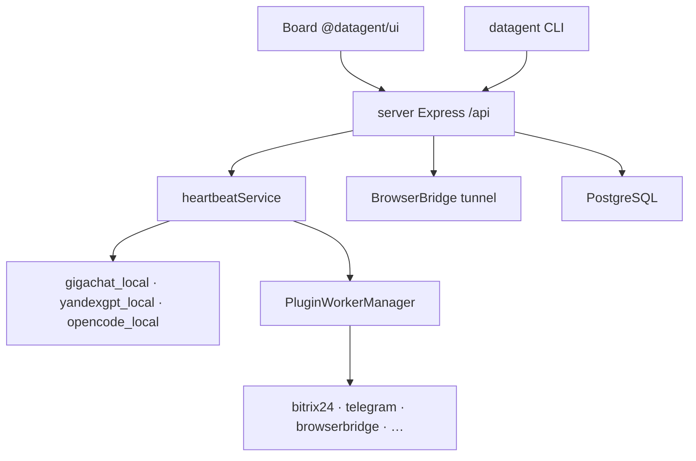

Datagent — **control plane** для AI-агентов в компаниях: Board UI, API на `server`, исполнение run через **heartbeat**, LLM-адаптеры и плагины в child-process. Монорепозиторий (pnpm): `server`, `ui`, `cli`, `packages/db`, `packages/adapters/*`, `packages/plugins/*`. Данные — **PostgreSQL** (embedded или `DATABASE_URL`); память агентов и OAuth токены адаптеров — в БД instance, не в отдельном Runner-сервисе.

Документация для инженеров (развёртывание, API, плагины) и для владельцев бизнеса (сценарии интеграций без кода).

## С чего начать

| Шаг | Раздел | Что получите |
| --- | --- | --- |
| 1 | [Быстрый старт](./getting-started/quickstart) | `pnpm dev`, Board и API на **http://localhost:3100** |
| 2 | [Первый агент](./getting-started/first-agent) | Агент `gigachat_local` / `yandexgpt_local`, wakeup, heartbeat run |
| 3 | [Работа с платформой](./guides) | Board, агенты, задачи, одобрения — для оператора |
| 4 | [Архитектура](./concepts/agent-architecture) | Слои server / ui / adapters / plugins |
| 5 | [Что такое Datagent](./concepts/what-is-datagent) | Термины и роль продукта |

## Ключевые возможности

- **Компании, агенты, issues** — задачи и диалоги в Board; run через `POST /api/agents/:id/wakeup` и `heartbeat-runs` (публичного `POST /api/runs` нет).
- **LLM** — [GigaChat](./integrations/gigachat) (`gigachat_local`, OpenCode + OAuth), [YandexGPT](./integrations/yandexgpt) (`yandexgpt_local`, IAM + `folderId`), универсальный [OpenCode](./concepts/llm-adapters) (`opencode_local`).
- **Плагины** — tools и jobs в отдельных worker-процессах (`PluginWorkerManager`); установка через Plugin Manager / `datagent plugin install`.
- **Bitrix24** — [imbot bridge](./integrations/bitrix24): polling `bitrix-poll`, binding агента, ответы в чат (без CRM tools `bitrix24_*` в manifest).
- **Телеграм** — [плагин Telegram Datagent](./integrations/telegram): long poll `getUpdates`, уведомления, апрувы Board, inbound в issues.
- **Руководство пользователя** — [работа с платформой](./guides): агенты, задачи, одобрения, возможности и границы.
- **BrowserBridge** — [локальный демон](./tutorials/browserbridge-setup) `datagent-bridge` и plugin tools `datagent.browserbridge:browser_*` (tunnel с server).
- **Офис и документы** — [пространство «Офис»](./office/overview) (Operator View), [1С Коннектор](./office/1c-connector) (MCP proxy), [Office Plugin](./office/excel-pptx) (Excel / Word / PPTX через OfficeCLI).

## Архитектура в двух словах

Один HTTP-процесс на **`PORT`** (по умолчанию **3100**): API ` /api/*` и Board на том же origin в dev (`SERVE_UI=false` + Vite middleware). Отдельного Board на `:3200`, Redis/BullMQ для run и пакета `packages/core` **нет**.

Подробнее: [Как это работает](./concepts/how-it-works), [Обзор API](./api-reference/overview).

## Интеграции, офис и туториалы

| Тема | Документ |
| --- | --- |
| REST API, wakeup, plugins | [Обзор API](./api-reference/overview) |
| Пространство «Офис» в Board | [Обзор «Офис»](./office/overview) |
| 1С MCP (Cursor, proxy) | [1С Коннектор](./office/1c-connector) |
| Excel / PPTX на задаче | [Office Plugin](./office/excel-pptx) |
| Чат Bitrix → Telegram | [Туториал](./tutorials/automate-crm) |
| BrowserBridge | [Настройка](./tutorials/browserbridge-setup) |
| Свой плагин | [Создание плагина](./tutorials/build-plugin) |

## Нужна помощь?

- [Сайт Datagent](https://datagent.ru)
- [История версий](./changelog)
