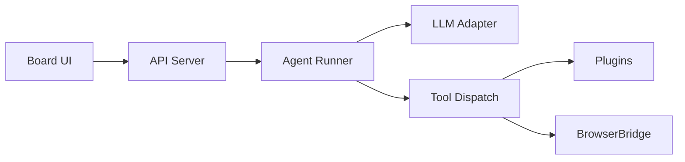

Datagent — это AI-агентный оркестратор для автоматизации рутинных бизнес-процессов в российских компаниях малого и среднего бизнеса. Платформа объединяет LLM (GigaChat, YandexGPT), CRM Bitrix24, мессенджер Telegram и управление браузером через BrowserBridge на базе Playwright и CDP. Технический стек: Node.js монорепозиторий, PostgreSQL и pgvector для памяти агентов.

Эта документация рассчитана на инженеров, которые разворачивают и настраивают систему, и на владельцев бизнеса, которым нужно понять возможности без погружения в код. Здесь вы найдёте установку, архитектуру, интеграции и пошаговые туториалы.

## С чего начать

| Шаг | Раздел | Что получите |
| --- | --- | --- |
| 1 | [Быстрый старт](./getting-started/quickstart) | Рабочий стенд за 15–20 минут |
| 2 | [Первый агент](./getting-started/first-agent) | Задача через Board UI |
| 3 | [Что такое Datagent](./concepts/what-is-datagent) | Термины и место продукта в стеке |

## Ключевые возможности

- **Оркестрация агентов** — цепочки шагов с вызовом tools и плагинов.
- **Российские LLM** — адаптеры GigaChat и YandexGPT с OAuth/IAM.
- **Интеграции** — Bitrix24 REST, Telegram Bot API, выгрузки 1С.
- **BrowserBridge** — безопасное управление браузером агентом (порт `9247`).

## Архитектура в двух словах

Подробнее: [Как это работает](./concepts/how-it-works) и [Архитектура агента](./concepts/agent-architecture).

## Нужна помощь?

- Репозиторий документации: [github.com/Dmitriion/datagent-docs](https://github.com/Dmitriion/datagent-docs)
- Changelog: [История версий](./changelog)
