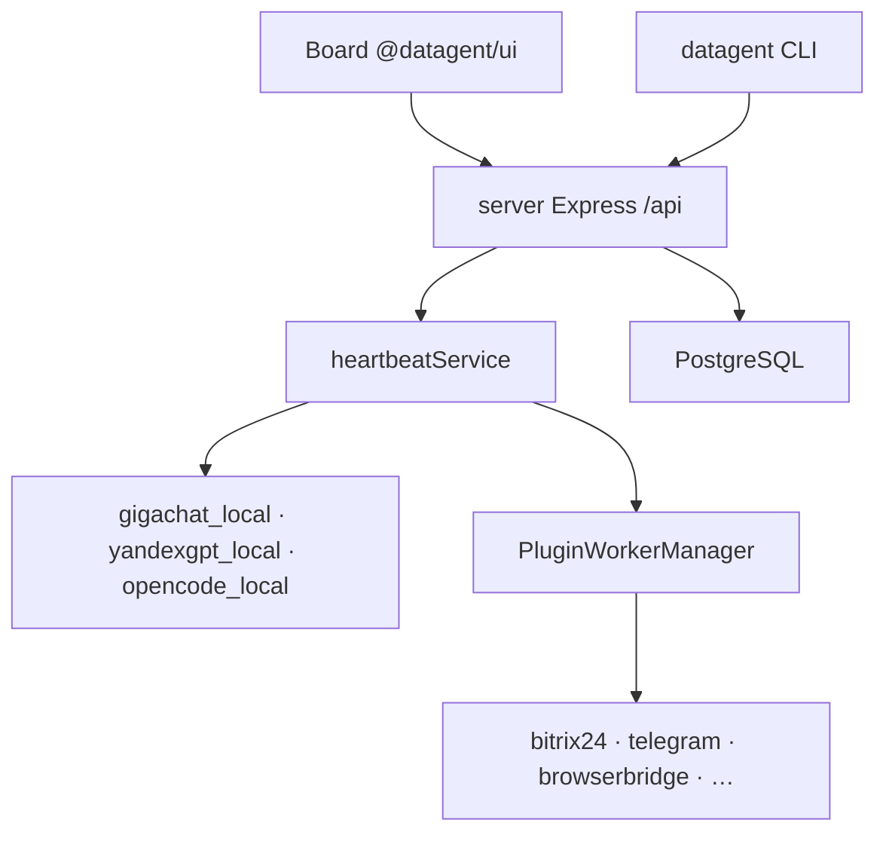

import DocNextSteps from '@site/src/components/DocNextSteps';
import {introNextSteps} from '@site/src/components/DocNextSteps/presets';

Datagent — **control plane** для AI-агентов в компании: Board, задачи (issues), одобрения и heartbeat run на одном origin (**http://localhost:3100** в dev). Документация помогает **поднять стенд**, **вести операции в Board** и **интегрировать** GigaChat, Bitrix24 и Телеграм.

Детали монорепо (`server`, `ui`, `cli`, PostgreSQL) — в [Что такое Datagent](./concepts/what-is-datagent) и [Как это работает](./concepts/how-it-works).

## Кто вы?

| Роль | С чего начать | Что получите |
| --- | --- | --- |
| **Оператор** | [Учебник → первый день](./guides/01-first-day) | Задачи, одобрения, wakeup без хаоса в чатах |
| **Инженер** | [Быстрый старт](./getting-started/quickstart) | `pnpm dev`, API, первый агент, обзор API |
| **Руководитель** | [Поле «Офис»](./guides/05-office-field) | Картина команды при `enableOffice` |

## С чего начать

| Шаг | Раздел | Что получите |
| --- | --- | --- |
| 1 | [Установка](./getting-started/installation) | Node 20+, pnpm, PostgreSQL (или embedded в dev) |
| 2 | [Быстрый старт](./getting-started/quickstart) | Board и API на **:3100** за ~10–15 минут |
| 3 | [Первый агент](./getting-started/first-agent) | Wakeup, heartbeat run, журнал в UI |
| 4 | [Учебник](./guides) | Восемь историй для оператора и руководителя |
| 5 | [Концепции](./concepts/what-is-datagent) | Термины и архитектура |
| 6 | [API](./api-reference/overview) | Wakeup, runs, issues, plugins |

## Ключевые возможности

- **Компании, агенты, issues** — run через `POST /api/agents/:id/wakeup` и `heartbeat-runs` (публичного `POST /api/runs` нет).
- **LLM** — [GigaChat](./integrations/gigachat), [YandexGPT](./integrations/yandexgpt), [адаптеры](./concepts/llm-adapters).
- **Плагины** — tools в worker-процессах; `datagent plugin install`.
- **Bitrix24** и **Телеграм** — входящие в issues, ответы агента в канал.
- **Офис** (experimental) — [Operator View](./office/overview) при `enableOffice`.
- **1С (MCP)** — [коннектор](./integrations/1c-connector); **Excel/PPTX** — [Office Plugin](./office/excel-pptx).

## Архитектура в двух словах

Подробнее: [Архитектура](./concepts/agent-architecture), [Обзор API](./api-reference/overview).

## Интеграции и туториалы

| Тема | Документ |
| --- | --- |
| REST API | [Обзор API](./api-reference/overview) |
| BrowserBridge | [Интеграция](./integrations/browserbridge) · [Установка](./browser/setup) |
| Свой плагин | [Создание плагина](./tutorials/build-plugin) |
| Bitrix24 → Телеграм | [Туториал](./tutorials/automate-crm) |

## Нужна помощь?

- [Решение проблем](./troubleshooting)
- [Сайт Datagent](https://datagent.ru)
- [История версий](./changelog)

<DocNextSteps items={introNextSteps} />
