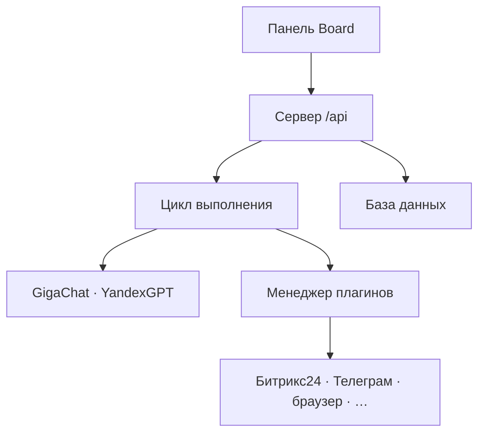

import DocNextSteps from '@site/src/components/DocNextSteps';
import {introNextSteps} from '@site/src/components/DocNextSteps/presets';

**Datagent** — это единый центр управления ИИ-агентами в компании. Здесь вы видите, кто из агентов работает, какие у них задачи, что требует вашего решения и как прошёл каждый запуск. Всё это — в одной панели (Board), без разрозненных чатов и «чёрных ящиков».

Самый простой способ начать — **облачная версия** на [app.datagent.ru](https://app.datagent.ru): регистрация, первичная настройка и работа в браузере. Пошагово: [Начало в облаке](./cloud/getting-started) → [Первый агент](./cloud/first-agent).

Если данные должны храниться только у вас — возможна установка **на своём сервере** по корпоративному тарифу. Оставьте заявку: [Установка на свой сервер](./cloud/on-premise) → [sales@datagent.ru](mailto:sales@datagent.ru?subject=Заявка%20на%20on-premise%20Datagent).

Как устроен продукт «под капотом» — в разделах [Что такое Datagent](./concepts/what-is-datagent) и [Как это работает](./concepts/how-it-works).

## Кто вы и с чего начать

| Кто вы | С чего начать |
| --- | --- |
| **Оператор** — ведёте задачи и отвечаете агентам | [Начало в облаке](./cloud/getting-started) → [Первый день в панели](./guides/01-first-day) |
| **Инженер** — настраиваете интеграции и автоматизацию | [app.datagent.ru](https://app.datagent.ru) + [Программный интерфейс](./api-reference/overview) + [интеграции](./integrations/gigachat) |
| **Руководитель** — смотрите на команду и процессы | [Учебник → «Офис»](./guides/05-office-field) (если включён раздел «Офис») |

## Пять шагов для новичка

| Шаг | Что сделать |
| --- | --- |
| 1 | [Зарегистрироваться и войти](./cloud/getting-started) |
| 2 | [Создать первого агента](./cloud/first-agent) |
| 3 | [Посмотреть тарифы](./cloud/pricing) |
| 4 | [Пройти учебник](./guides) по ролям |
| 5 | При необходимости — [программный интерфейс](./api-reference/overview) для скриптов |

## Что умеет Datagent

- **Компании и агенты** — у каждой компании свои агенты, задачи и права доступа.
- **Задачи** — переписка с агентом, файлы и история запусков в одном месте.
- **Согласования** — рискованные действия агента ждут вашего «да» или «нет».
- **Российские модели** — [GigaChat](./integrations/gigachat) и [YandexGPT](./integrations/yandexgpt) без обходных схем.
- **Плагины** — расширения: мессенджеры, браузер, документы и своё.
- **Битрикс24 и Телеграм** — сообщения из чатов превращаются в задачи; ответы уходят обратно в канал.
- **«Офис»** (эксперимент) — наглядный вид команды агентов для руководителя.
- **1С и документы** — [связь с 1С](./integrations/1c-connector), [Excel и презентации](./office/excel-pptx).

## Как связаны части системы

Подробнее для инженеров: [Архитектура](./concepts/agent-architecture), [Обзор API](./api-reference/overview).

## Полезные разделы

| Тема | Куда перейти |
| --- | --- |
| Программный интерфейс | [Обзор API](./api-reference/overview) |
| Управление браузером | [Интеграция](./integrations/browserbridge) · [Настройка](./browser/setup) |
| Свой плагин | [Создание плагина](./tutorials/build-plugin) |
| Битрикс24 → Телеграм | [Практический сценарий](./tutorials/automate-crm) |

## Нужна помощь?

- [Решение проблем](./troubleshooting)
- [Открыть приложение](https://app.datagent.ru)
- [Сайт Datagent](https://datagent.ru)
- [Установка на свой сервер](./cloud/on-premise)
- [История изменений](./changelog)

## Частые вопросы

**С чего начать, если я менеджер, а не разработчик?**  
[Регистрация в облаке](./cloud/getting-started) → [первый агент](./cloud/first-agent) → [первый день в панели](./guides/01-first-day).

**Поддерживает ли Datagent российские нейросети?**  
Да — [GigaChat](./integrations/gigachat) и [YandexGPT](./integrations/yandexgpt) в облаке на [app.datagent.ru](https://app.datagent.ru).

**Можно ли связать с Битрикс24?**  
Да — плагин и сценарий [Битрикс24](./integrations/bitrix24) и [автоматизация CRM](./tutorials/automate-crm).

<DocNextSteps items={introNextSteps} />
