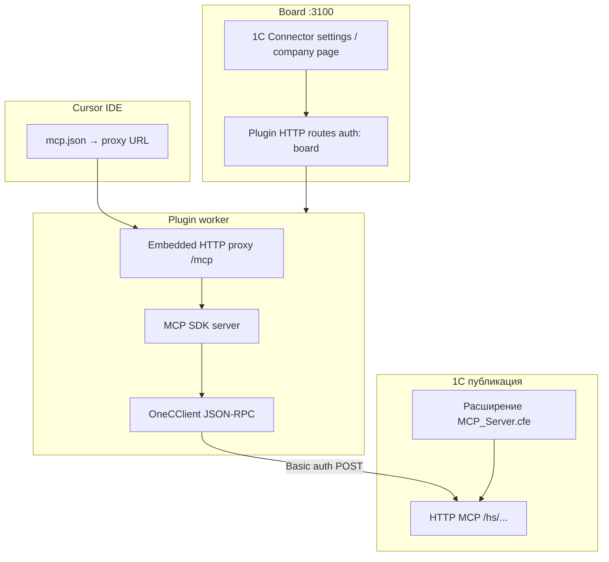
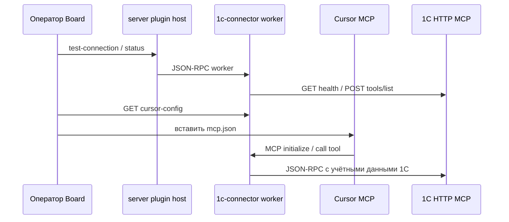

**1С Коннектор** (`datagent.1c-connector`) даёт управляемый мост между публикацией 1С (HTTP MCP) и клиентами MCP — в первую очередь **Cursor**. Плагин **не** регистрирует tools в Datagent heartbeat: агент Board **не** вызывает `datagent.1c-connector:*` через `POST /api/agents/me/plugin-tools/execute`.

## Зачем это в Datagent

Учётная система остаётся источником истины в 1С. Коннектор:

- помогает установить расширение и опубликовать HTTP-сервис MCP;
- поднимает **встроенный Node proxy** на хосте plugin worker;
- отдаёт готовый фрагмент `mcp.json` для Cursor;
- проверяет доступность upstream (health, list tools).

Связь с control plane: настройки instance/company, Board UI, API routes плагина на том же server `:3100`.

## Статус

| Компонент | Состояние |
| --- | --- |
| Пакет `@datagent/plugin-1c-connector` | В монорепо, v0.1.0 |
| Deploy instance | В `scripts/ci/deploy-plugin-packages.txt` |
| Agent tools в manifest | **Нет** (`agent.tools.register` не объявлен) |
| MCP tools 1С | Проксируются из 1С в MCP-клиент (динамический список) |

## Идентификаторы

| Поле | Значение |
| --- | --- |
| Plugin id | `datagent.1c-connector` |
| npm | `@datagent/plugin-1c-connector` |
| UI route (company page) | `1c-connector` |
| Default proxy port | `8010` (`proxyListenPort`) |
| Default `mcp.json` server name | `1c-server-http` |

## Архитектура





## Способ связи с 1С

По коду (`onec-http.ts`, `onec-client.ts`):

| Механизм | Использование |
| --- | --- |
| **HTTP + Basic auth** | Да — health и JSON-RPC к публикации 1С |
| **JSON-RPC** | `tools/list`, вызовы tools через MCP transport |
| **COM / OData / файловый обмен** | **Не** в этом плагине |
| **Расширение 1С** | `MCP_Server.cfe` (bundled `assets/` или `DATAGENT_1C_EXTENSION_FILE`) |

URL задаётся как **база infobase** или полный путь к MCP, например `https://host/app` или endpoint вида `http://host:port/mcp/`. Парсинг — `parseOneCEndpoint` в worker.

:::warning IIS и редиректы
При 301/302 POST не должен превращаться в GET (типичная ошибка IIS). Плагин следует редиректам вручную и сохраняет POST для JSON-RPC.
:::

## Установка и включение

### 1. Плагин в Datagent

```bash
pnpm --filter @datagent/plugin-1c-connector build
pnpm datagent plugin install packages/plugins/plugin-1c-connector
```

После `git pull` пересоберите `dist/worker.js` и `dist/ui`, перезапустите plugin worker (deploy script включает пакет).

### 2. Расширение и публикация 1С

1. Установите `MCP_Server.cfe` в конфигураторе.
2. Включите HTTP-сервис MCP в расширении.
3. Опубликуйте базу на веб-сервере (IIS и др.).
4. Проверьте endpoint (часто `http://<host>/.../hs/<service>/`).

Скачать `.cfe`: страница плагина в Board, `GET …/extension-file`, или `extensionDownloadUrl` в настройках.

### 3. Настройка в Board

Страницы плагина (slots `settingsPage`, company `page`):

| Поле | Назначение |
| --- | --- |
| `upstreamMcpUrl` | URL публикации 1С (не URL proxy Datagent) |
| `proxyListenHost` | Host встроенного proxy (default `0.0.0.0`) |
| `proxyListenPort` | Port proxy (default `8010`) |
| `cursorServerName` | Ключ сервера в `mcp.json` |
| `extensionDownloadUrl` | Опциональная HTTPS-ссылка на `.cfe` |

Действия UI: **test-connection**, **restart-proxy** (`ACTION_KEYS` в worker).

Секреты 1С (логин/пароль) проходят через OAuth-подобный flow proxy для MCP-сессий (in-memory maps в worker) — не храните пароли в markdown issue.

## HTTP API плагина (Board)

Маршруты из `manifest.ts` (auth: **board**, company из query/body):

| Method | Path | Назначение |
| --- | --- | --- |
| GET | `/status` | Статус proxy, upstream, count tools |
| POST | `/test-connection` | Проверка credentials / health |
| GET | `/cursor-config` | Фрагмент для `mcp.json` |
| GET | `/install-guide` | Текст гайда установки |
| GET | `/extension-file` | Скачивание `MCP_Server.cfe` |

Точный prefix URL зависит от plugin host (`/api/plugins/...`); вызывайте из UI плагина или через Plugin Manager.

## Tools и MCP

| Класс | Имена |
| --- | --- |
| Datagent agent tools | **Отсутствуют** |
| MCP tools (из 1С) | Динамический список после `tools/list` на upstream |

В статусе connector отображаются `lastListToolsCount`, `lastListToolsError` (диагностика).

:::info Для инженера
Публичный контракт MCP — transport Streamable HTTP и SSE (`mcp-transport-host.ts`). OAuth helper endpoints на proxy для сессий Cursor.
:::

## Типовые сценарии

- **Разработка в Cursor с 1С:** оператор настраивает upstream → копирует `mcp.json` → разработчик вызывает tools 1С из IDE.
- **Health-check перед продом:** `test-connection` в Board после публикации базы.
- **Обновление расширения:** новый `MCP_Server.cfe` в `assets/` или по `extensionDownloadUrl`.

## Ограничения и безопасность

- Proxy слушает сеть согласно `proxyListenHost` — в проде ограничьте firewall.
- Учётные данные 1С — только для сессий MCP; не логируйте в issues.
- Плагин **не** заменает администрирование прав 1С — разрешите только нужные операции в конфигурации 1С.
- Нет встроенного сценария «задача в Board → wakeup → tool 1С в heartbeat» без отдельной интеграции.

## Диагностика

| Симптом | Что проверить |
| --- | --- |
| `upstreamReachable: false` | URL, IIS, HTTPS, Basic auth |
| `lastListToolsError` | JSON-RPC, версия расширения, права пользователя 1С |
| Proxy не стартует | Порт занят, `restart-proxy`, логи plugin worker |
| WSL / Docker | `DATAGENT_1C_CONNECTOR_PUBLIC_HOST` для URL в `mcp.json` |

Логи — процесс **plugin worker** (`PluginWorkerManager`), не stdout адаптера heartbeat.

## Связанные разделы

- [Обзор «Офис»](./overview.md) — Operator View (другое пространство UI)
- [Создание плагина](../tutorials/build-plugin.md) — manifest, worker, capabilities
- [Обзор API](../api-reference/overview) — plugin host и heartbeat
- [Быстрый старт](../getting-started/quickstart)
