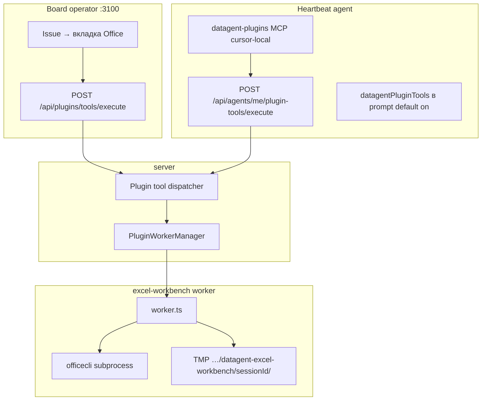
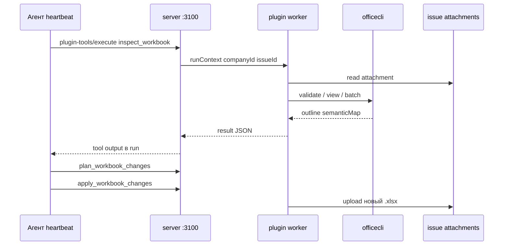

# Excel и PowerPoint на задаче

Агент **читает** прикреплённую таблицу или презентацию, **готовит правки** (для Excel — с планом и вашим согласованием) и **прикрепляет новый файл** к задаче. Готовый Excel или PowerPoint сохраняется как [артефакт](../artifacts/overview) — скачайте его из карточки задачи или из каталога компании.

Для работы с таблицами подключите навык из каталога (например сценарии для **Excel** / **xlsx** во вкладке **Сообщество**) — [навыки компании](/docs/cloud/skills). Плагин Office на задаче доступен с тарифа **Solo** и выше.

> **Экспериментальный контур Office.** Поведение плагина и интерфейс вкладки могут меняться — см. [обзор Office](./overview).

| Задача | Как решается |
| --- | --- |
| Агент читает структуру файла | Просмотр через OfficeCLI в плагине |
| Изменения под контролем | План правок → [согласование](/docs/concepts/approvals) → применение на **копии** |
| Результат в задаче | Новое вложение → [артефакт](../artifacts/overview) |
| Безопасность | Согласование, журнал действий |

Обзор тарифов Office Chat и аннотаций — [Office — обзор](./overview).

## Статус по форматам

| Формат | Inspect / validate / preview | Plan / apply |
| --- | --- | --- |
| `.xlsx` (и MIME spreadsheet) | Да | Да |
| `.docx` | Да | **Нет** в manifest |
| `.pptx` | Да | **Нет** в manifest |

:::info Версия manifest
`PLUGIN_VERSION` в коде — `0.2.0`; `package.json` может отставать. Ориентируйтесь на `src/manifest.ts` и `TOOL_NAMES` в репозитории.
:::

## Что дальше

→ [Каталог артефактов](../artifacts/overview)

<details>
<summary>Для разработчиков: архитектура, tools, API</summary>

### Идентификаторы

| Поле | Значение |
| --- | --- |
| Plugin id | `datagent.excel-workbench` |
| Display name | Office Plugin |
| npm | `@datagent/plugin-excel-workbench` |
| Namespace tools | `datagent.excel-workbench:<tool_name>` |
| UI tab on issue | «Office» (`excel-workbench-tab`) |

## Архитектура





## Установка

1. Панель → **Плагины** → install path `packages/plugins/plugin-excel-workbench` или `pnpm datagent plugin install …`.
2. Включить для **company** (или **Skills → Каталог → Сообщество** → установить `xlsx`/`pptx` → **Открыть** в библиотеке; host auto-enable при ready instance).
3. На хосте **plugin worker** установить `officecli` в `PATH` (или `officecliBinaryPath` в company config).

```bash
pnpm --filter @datagent/shared build
pnpm --filter @datagent/plugin-sdk build
pnpm --filter @datagent/plugin-excel-workbench build
```

Проверка: health/status worker (`officecliReady`, version). Интеграционные тесты: `OFFICECLI_INTEGRATION=1 pnpm --filter @datagent/plugin-excel-workbench test`.

:::warning Запрет для агентов
Не вызывайте `officecli` из shell агента. Только plugin tools — иначе обход approvals и sandbox.
:::

## Конфигурация (company)

| Поле | Default | Описание |
| --- | --- | --- |
| `officecliBinaryPath` | `officecli` | Бинарник на worker-хосте |
| `requireApprovalForDestructive` | `true` | Approval для рискованных планов |
| `viewTextMaxLines` | `200` | Лимит строк text view |
| `viewMaxColumns` | `40` | Лимит колонок в outline |
| `maxAttachmentBytes` | 50 MiB | Макс. размер вложения |
| `sessionTtlHours` | `24` | TTL сессий workbook (0 = без cleanup) |
| `memoryIngestEnabled` | `false` | Semantic map → memory (opt-in) |
| `postValidateComment` | `true` | Комментарий после validate |
| `autoRegisterWorkProduct` | `true` | Work product после apply+validate |

## Поддерживаемые MIME

Из `constants.ts`:

- **Spreadsheet:** `application/vnd.openxmlformats-officedocument.spreadsheetml.sheet`, `application/vnd.ms-excel`, macro-enabled variant.
- **Word:** `application/vnd.openxmlformats-officedocument.wordprocessingml.document`, `application/msword`.
- **Presentation:** `application/vnd.openxmlformats-officedocument.presentationml.presentation`, `application/vnd.ms-powerpoint`.

## Agent tools

Полные имена: `datagent.excel-workbench:<name>`.

### Excel (.xlsx)

| Tool | Назначение | Ключевые параметры |
| --- | --- | --- |
| `inspect_workbook` | Профиль книги: validate, issues, outline | `issueId`, `attachmentId?`, `sessionId?` |
| `summarize_workbook_semantics` | Краткое summary + semantic map | `issueId`, `focus?` |
| `plan_workbook_changes` | План batch-изменений, риски, approval | `issueId`, `intent?`, `operations?`, `dryRun?` |
| `apply_workbook_changes` | Выполнение плана на копии, upload | `issueId`, `planId`, `revision?`, `outputFileName?` |
| `render_workbook_preview` | Preview HTML/PNG | `issueId`, `format`: png \| html \| both |
| `validate_workbook_quality` | Финальная проверка | `issueId`, `attachmentId?` |

### Word (.docx)

| Tool | Назначение |
| --- | --- |
| `inspect_word_document` | Структура и issues |
| `validate_word_document` | Качество |
| `render_word_preview` | HTML/PNG preview |

### PowerPoint (.pptx)

| Tool | Назначение |
| --- | --- |
| `inspect_powerpoint_document` | Слайды, структура, issues |
| `validate_powerpoint_document` | Качество дека |
| `render_powerpoint_preview` | HTML/PNG preview |

## Вызов tools

### Board (оператор)

```http
POST /api/plugins/tools/execute
```

Полный `runContext`: `companyId`, `issueId`, `agentId`, `runId`, `projectId`.

### Агент (heartbeat)

```http
POST /api/agents/me/plugin-tools/execute
Authorization: Bearer <agent_api_key>
X-Datagent-Run-Id: <heartbeat_run_uuid>
```

```json
{
  "tool": "datagent.excel-workbench:inspect_workbook",
  "issueId": "<uuid>",
  "parameters": { "attachmentId": "<uuid>" }
}
```

По умолчанию descriptors в prompt (`datagentPluginTools`, migration 0114). Отключение: company setting или `DATAGENT_PLUGIN_TOOLS_IN_HEARTBEAT=0`.

**cursor-local:** virtual MCP `datagent-plugins` — native tool calls без REST URL в ответе агента (см. `doc/plans/plugin-tools-mcp-bridge-spike.md` в репозитории Datagent).

## Автономные host-gates

| Событие | Поведение |
| --- | --- |
| Install office skill из каталога | Auto-enable company plugin + activity `plugin.company_auto_enabled` |
| Heartbeat prepare run | Preflight readiness — run не стартует при blockers; remediation wakeup |
| Upload `.pptx` | `deliverable:pending_validation` + wakeup `validate_powerpoint_document` |
| Run без validate после pptx attach | Post-run continuation `pptx_deliverable_validation_retry` |

Подробнее: `doc/guides/excel-workbench.md` §Remediation в репозитории Datagent.

## Типовые сценарии

- **KPI-отчёт в Excel:** прикрепите шаблон → `inspect_workbook` → `plan_workbook_changes` → согласование → `apply` → `render_workbook_preview` → `validate_workbook_quality` → результат на задаче.
- **Сводка для задачи:** `summarize_workbook_semantics` после inspect — текст в комментарий агента.
- **Проверка презентации:** прикрепите `.pptx` → `inspect_powerpoint_document` → `validate_powerpoint_document` → `render_powerpoint_preview` (без изменения слайдов через plan/apply).
- **Паспорт .docx:** inspect + validate + preview по тому же паттерну, что инструменты Word.

## Ограничения и безопасность

| Риск | Митигация |
| --- | --- |
| Порча исходного файла | Apply на копии в `TMPDIR/datagent-excel-workbench/<sessionId>/` |
| Большие файлы | `maxAttachmentBytes` 50 MiB |
| Destructive ops | `requireApprovalForDestructive`, `approvals.request` |
| Утечка данных | Worker-хост изолирован; не монтируйте произвольные каталоги |
| Таймаут tool | Задаётся host/SDK (см. [build-plugin](../tutorials/build-plugin.md)); отдельного env в server config нет |

Файлы сессий — временный каталог worker; TTL — `sessionTtlHours`.

Managed skills (примеры): `office-plugin`, `excel-workbench`, `excel-workbench-operator`, `excel-board-report`, `excel-inventory-export`. В каталоге панели также **навыки сообщества** `xlsx`, `pptx`, `excel-analysis` и др. — они описывают runtime через `datagent.excel-workbench:*`, не shell `officecli`; см. `doc/community-skills-acceptance.md` в репозитории Datagent.

## Связанные разделы

- [Обзор «Офис»](./overview.md)
- [1С Коннектор](../integrations/1c-connector)
- [Создание плагина](../tutorials/build-plugin.md)
- [Обзор API](../api-reference/overview)
- [Архитектура агентов](../concepts/agent-architecture)

:::tip Оператору
Перед запуском прикрепите `.xlsx`/`.pptx` к задаче. Плагин для компании включается автоматически при установке office-навыка из каталога (если инстанс готов); иначе — в [менеджере плагинов](/docs/cloud/plugins). Процесс плагина должен быть в статусе **ready**.
:::

</details>
