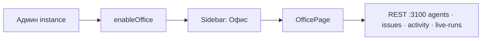
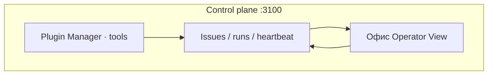

Пространство **«Офис»** — presentation layer control plane Datagent для операционного руководителя: команда AI-агентов на «поле», статусы run, очередь одобрений и лента событий. Это **не** замена Board Issues и **не** редактор Excel/PowerPoint — документы и tools Office Plugin живут на карточке задачи (см. [Excel и PowerPoint](./excel-pptx.md)).

## Зачем это в Datagent

| Роль | Что получает |
| --- | --- |
| Оператор / руководитель | За несколько секунд — картина «кто работает», кто ждёт одобрения, что происходит в компании |
| Инженер | Тот же API `:3100`, что и Board; Office **read-mostly**, мутации — через issues, agents, approvals |

Office переводит состояние heartbeat и board API на язык open-space, не добавляя отдельный порт или Runner.

## Статус

| Аспект | Состояние |
| --- | --- |
| Маршрут и UI | В коде `ui/src/pages/office/` на `master` |
| Доступ | **Экспериментально:** instance flag `experimentalSettings.enableOffice` |
| Living simulation | Опционально в браузере (`office:sim-enabled`), по умолчанию **выкл.** |
| Чат офиса | В UI; часть сценариев — preview / mock (см. баннер в панели чата) |

:::info Для инженера
Подробный as-built и roadmap — в монорепо `doc/office/OFFICE-ARCHITECTURE.md`, `OFFICE-USER-GUIDE.md` (read-only, не дублируются здесь полностью).
:::

## Как открыть

1. Разверните Datagent и войдите в Board (`http://localhost:3100` в dev).
2. Администратор instance включает **Офис** в экспериментальных настройках (`enableOffice`).
3. В sidebar появится пункт **«Офис»** (`nav.office`) → URL `/{префикс_компании}/office` (например `/TES/office`).

## Что видит пользователь

### Верхняя панель (toolbar)

- Подключение к control plane (огонёк).
- **Standup** — расписание и запуск ритуала на поле.
- **KPI-чипы** — агрегаты по компании (in_progress, активные run и т.д.).
- **Shield + N** — элементы, требующие внимания (например pending hire / approval).
- Переключатель **Зоны / Проекты** — план open-space или карта портфеля проектов.
- Быстрые действия: **+ Агент**, скриншот, полноэкран.

### Вкладки пола

| Режим | Назначение |
| --- | --- |
| **Офис** | План этажа 1800×1100, столы агентов, зоны, pan/zoom |
| **Проекты** | Комнаты = проекты; спрайт агента — только при `in_progress` + `assignee` + `projectId` |

### Боковые панели (edge tabs)

Подписи в UI (RU): **АКТИВНОСТЬ**, **АГЕНТЫ**, **АНАЛИТИКА**, **КАНБАН**, **ЧАТ**.

- **Активность** — лента событий control plane (создание задач, агентов, checkout и т.д.).
- **Агенты** — roster команды, в т.ч. «ждёт одобрения».
- **Аналитика** — сводные метрики офиса.
- **Канбан** — обзор задач в контексте офиса (не полная замена Issues).
- **Чат** — диалоги оператора с коллегами и подключёнными агентами (сегменты «Диалоги» / «Задачи» / «Агенты»).

### Индикаторы на поле

| Индикатор | Смысл |
| --- | --- |
| Пульс / кольцо | Активный run / idle |
| Amber | `pending_approval` — нужно решение в Board |
| Lv.N, mood | Игровая визуализация (не HR-метрика) |

:::tip Быстрый совет
Клик по столу или спрайту открывает карточку агента: оттуда же можно **одобрить** найм или перейти к задаче — без поиска в общем списке Issues.
:::

## Отличие от других разделов Board

| Раздел | Фокус |
| --- | --- |
| **Issues** | Инженерный контур: статусы, run log, вложения, plugin tools на issue |
| **Офис** | Операторский обзор команды и событий |
| **Интеграции** (Bitrix, Telegram) | Внешние каналы → issues / чаты |
| **Office Plugin** (на issue) | Excel / Word / PPTX через `datagent.excel-workbench:*` |

## Кто настраивает

| Действие | Кто |
| --- | --- |
| Включить `enableOffice` | Администратор instance |
| Назначать агентов, одобрять hire, создавать issues | Оператор / board roles |
| Симуляция, coachmark, localStorage prefs | Браузер пользователя (не сервер) |

## Источники данных

Office **не** хранит отдельную БД. Клиент (`OfficePage`, React Query) читает:

- `agents`, `org`, `live-runs`, `activity` компании;
- board live events (окно обновлений);
- при чате — API чата офиса (`chatApi`).

Мутации — через те же board API, что и в остальном UI (создание агента, issue, approve).

## Ограничения

- Без `enableOffice` маршрут недоступен.
- Масштаб 100+ агентов — частично оптимизирован (roster, perf overlay); полный NOC-режим в roadmap.
- Игровые XP/mood — **presentational**, не отчётность.
- Office Chat может показывать preview-баннер — не считайте все сценарии чата production-ready без проверки вашей сборки.

## Связанные разделы

- [Быстрый старт](../getting-started/quickstart) — Board на `:3100`
- [Архитектура агентов](../concepts/agent-architecture) — heartbeat и слои
- [1С Коннектор](./1c-connector.md) — MCP к учётной системе (отдельно от «Офиса»)
- [Excel и PowerPoint](./excel-pptx.md) — Office Plugin на задаче
- [Создание плагина](../tutorials/build-plugin.md) — Plugin SDK
