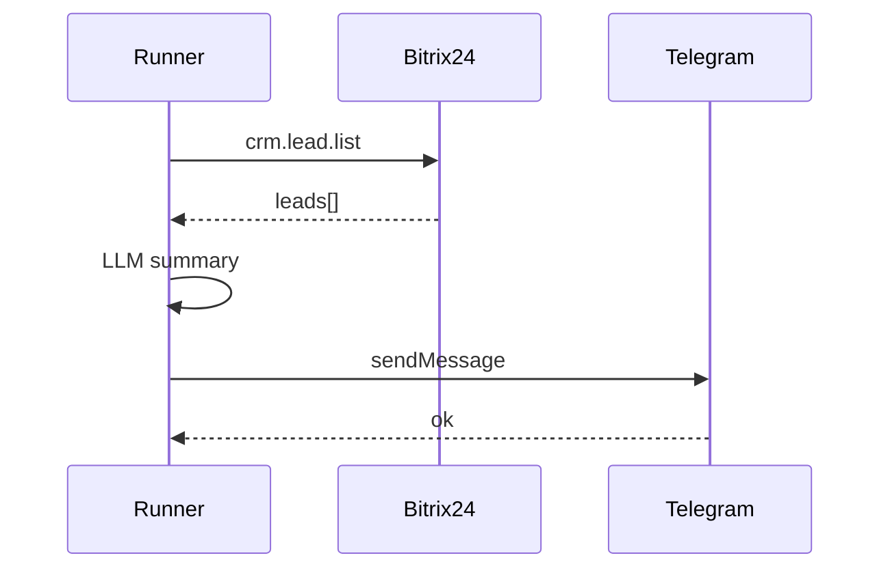

В этом сценарии агент каждые N минут (или по событию) забирает новые лиды из Bitrix24 и отправляет сводку в Telegram-чат отдела продаж. Вы настроите интеграции, агента и cron-trigger.

## Предварительные условия

- [Bitrix24](../integrations/bitrix24) — входящий вебхук настроен.
- [Telegram](../integrations/telegram) — бот и `TELEGRAM_ALLOWED_CHAT_IDS`.
- Агент с моделью GigaChat или YandexGPT.

## Шаг 1. Агент `crm-daily-digest`

Board → **New Agent**:

```yaml
slug: crm-daily-digest
model:
  provider: gigachat
  name: GigaChat-Pro
tools:
  - bitrix24_list_leads
  - telegram_send_message
policies:
  requireApprovalFor: []
```

System prompt:

```text
Ты помощник CRM. Получи лиды со статусом NEW за указанный период.
Сформируй сообщение до 400 символов: количество, топ-3 по TITLE, рекомендация менеджеру.
Отправь через telegram_send_message в chat_id из metadata.
```

## Шаг 2. Тестовый run

Playground input:

```text
Период: сегодня с 00:00 MSK. chat_id: -1002345678901
```

Ожидаемый trace:



## Шаг 3. Расписание

`config/triggers/crm-digest.yaml`:

```yaml
id: trig_crm_digest_09
cron: "0 9 * * 1-5"
timezone: Europe/Moscow
agentSlug: crm-daily-digest
inputTemplate: |
  Период: сегодня. chat_id: -1002345678901
```

Применить:

```bash
pnpm --filter @datagent/api triggers:apply
```

## Шаг 4. Мониторинг

Board → **Runs** → фильтр `agent:crm-daily-digest`. При `failed` проверьте:

```bash
grep bitrix24 /opt/datagent/apps/api/logs/run-*.log
```

## Расширение

- Добавьте `bitrix24_update_lead` с апрувом в Telegram для смены статуса.
- Подключите исходящий вебхук Bitrix24 для мгновенной реакции на `ONCRMLEADADD`.
