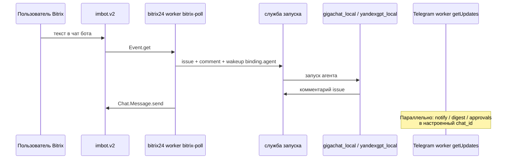

**Ситуация:** сотрудник пишет боту в **чате Битрикс24** — и ответ снова уходит в личку без журнала. После этого сценария в Datagent создаётся **задача**, агент отвечает, ответ возвращается в Битрикс. Параллельно **Телеграм** присылает дайджесты или запросы на согласование команде.

:::info[Тариф]
Мост **Bitrix24** — с тарифа **Studio** и выше. **Telegram** — на всех тарифах. См. [тарифы](/docs/cloud/pricing).
:::

Это **не** автоматическая выгрузка «новых лидов» из CRM и не набор кнопок «создать сделку» в панели. Справка: [Битрикс24](../integrations/bitrix24), [Телеграм](../integrations/telegram). Начните с [предварительных условий](#предварительные-условия) ниже.

## Предварительные условия

- [Старт в Cloud](../cloud/getting-started) — [app.datagent.ru](https://app.datagent.ru).
- Bitrix24: входящий REST webhook, scope **imbot** (+ user/department/disk по [инструкции Bitrix24](../integrations/bitrix24)).
- Плагины: `datagent.bitrix24` и **плагин Telegram Datagent**[^tg-npm].
- Агент: `gigachat_local` или `yandexgpt_local`, модель `gigachat/GigaChat-2-Pro` или `yandexgpt/rc`.

## Шаг 1. Агент для чата Битрикс24

В панели на [app.datagent.ru](https://app.datagent.ru) создайте агента (см. [Первый агент](../cloud/first-agent)):

| Поле | Значение |
| --- | --- |
| Name | `bitrix-chat-assistant` |
| Adapter | `gigachat_local` или `yandexgpt_local` |
| Model | `gigachat/GigaChat-2-Pro` или `yandexgpt/rc` (+ `folderId` для Yandex) |
| Инструменты | Только из **включённых** плагинов |

Системные инструкции агента:

```text
Ты ассистент в открытой линии Битрикс24. Контекст — задача и комментарии в Datagent.
Отвечай кратко по-русски. Не выдумывай действия в CRM, которых нет в инструментах.
```

Секреты LLM — env агента с `secret_ref` ([GigaChat](../integrations/gigachat), [YandexGPT](../integrations/yandexgpt)).

## Шаг 2. Портал, бот, привязка, опрос

По [Bitrix24](../integrations/bitrix24):

1. **Менеджер плагинов** — установить `datagent.bitrix24`, включить для компании.
2. **Компания → Битрикс24**:
   - URL портала, webhook REST (`…/rest/USER/TOKEN/`);
   - регистрация imbot (`imbot.v2.Bot.register`) или привязка существующего;
   - **APPLICATION TOKEN** imbot в UI бота / `bot_token_secret_ref`.
3. **Привязка** — выбрать агента `bitrix-chat-assistant` (поле agent в связке бота); опционально project и ACL.
4. **Запустить мост** — `poll_enabled`; job плагина **`bitrix-poll`** (cron `* * * * *`) вызывает `imbot.v2.Event.get`.
5. **Проверить соединение** — `profile` + `imbot.v2.Event.get`.

Тест: сообщение боту в Битрикс24 → задача в панели → запуск агента → ответ в чате Битрикс24.

## Шаг 3. Телеграм (уведомления и согласования)

[^tg-npm]: Ключ registry: `datagent.plugin-telegram`; npm-пакет и поля конфигурации — [Телеграм](../integrations/telegram).

1. BotFather → token → company secret → `telegramBotTokenRef`.
2. **Менеджер плагинов** → установить плагин Телеграм → **Компания → Настройки Телеграм**.
3. Укажите чаты команды для дайджестов и уведомлений.
4. Подключите **доступ панели** — для кнопок согласования в мессенджере.

Входящие сообщения: worker **`getUpdates`** (long poll), не webhook Datagent. Публичный URL инстанса нужен для **ссылок на issues** в TG, не для приёма апдейтов.

## Шаг 4. Сквозной поток



## Шаг 5. Где смотреть результат

- В панели: карточка агента → журнал запусков.
- Для инженеров: API журнала запуска (см. [Обзор API](../api-reference/overview)).

## Расширение

- Несколько ботов → отдельные связки и агенты.
- Согласования в Телеграм (запрос из плагина).
- Выгрузка лидов и сделок CRM — **вне** стандартного плагина Битрикс24; нужна отдельная доработка.

## Итог

Агент теперь **сам отвечает в чате Bitrix24** на входящие из открытой линии, а команда видит задачу и журнал в панели. Ручное копирование переписки из чата в панель больше не нужно; согласования остаются только для шагов за порогом риска.

## Связанные разделы

- [Bitrix24](../integrations/bitrix24)
- [Телеграм](../integrations/telegram)
- [Первый агент](../cloud/first-agent)
- [Как это работает](../concepts/how-it-works)
