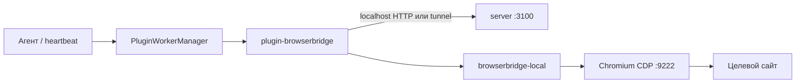

**BrowserBridge** даёт агентам Datagent доступ к **вашему** Chromium-браузеру через CDP: навигация, клики, скриншоты и извлечение текста выполняются на рабочей станции (или через cloud tunnel), а не в отдельном «облачном» headless-раннере. Агент вызывает tools `browser_*` из плагина **BrowserBridge** (`datagent.browserbridge`) во время **heartbeat**; plugin worker ходит в локальный HTTP-сервис `@datagent/browserbridge-local` (`POST /execute`) или в tunnel WebSocket на server `:3100`. LLM-адаптеры (GigaChat, OpenCode и т.д.) сами по себе browser tools **не** регистрируют.

## Что такое BrowserBridge в Datagent

BrowserBridge — два слоя: **локальный демон** (`packages/browserbridge-local`, CLI `datagent-bridge`) и **плагин** `packages/plugins/plugin-browserbridge`, который регистрирует agent tools и политику навигации по URL для компании. Server хранит tunnel, pairing codes и browser policy; исполнение страницы — в Playwright/CDP на машине с браузером. Общая карта слоёв: [Архитектура платформы](../concepts/agent-architecture.md).



## Системные требования

- **Node.js** ≥ 20 (`packages/browserbridge-local/package.json`, `engines`).
- **Chromium-браузер**: Chrome, Yandex Browser, Comet или Edge — с remote debugging (CDP). Datagent ищет исполняемый файл при `datagent-bridge install` и пишет пути в `~/.datagent/browserbridge/config.json`.
- **RAM**: для отладочного профиля браузера и Local Service закладывайте **2+ GB** на рабочей станции (рекомендация из внутренних гайдов; жёсткого лимита в коде нет).
- **Playwright**: пакет зависит от `playwright` — для fallback `launchNew` (если CDP ещё не поднят) нужны бинарники Chromium:

```bash
pnpm --filter @datagent/browserbridge-local exec playwright install chromium
```

На Linux для системных библиотек может понадобиться `playwright install-deps chromium` (как в e2e-тестах репозитория).

## Установка в монорепозитории

Из корня checkout Datagent (см. [Установку](../getting-started/installation.md) и [Быстрый старт](../getting-started/quickstart)):

```bash
pnpm install
pnpm --filter @datagent/browserbridge-local build
pnpm run datagent-bridge install
```

Установка плагина для instance:

```bash
pnpm --filter @datagent/plugin-browserbridge build
pnpm datagent plugin install ./packages/plugins/plugin-browserbridge
```

В Board: **Plugin Manager** → включить **BrowserBridge** для компании.

`pnpm dev` (через `scripts/dev-runner.ts`) поднимает **только server + UI** на `PORT=3100`; BrowserBridge **не** стартует автоматически в dev-runner. По умолчанию плагин может **встроенно** поднять Local Service в plugin worker (`autoStartLocalService: true` в `companyConfigSchema`).

## Запуск Local Service

**Вариант A — вручную (отдельный процесс):**

```bash
pnpm run datagent-bridge start
# или после build:
pnpm --filter @datagent/browserbridge-local run start
```

**Вариант B — автозапуск в plugin worker** (по умолчанию): отдельный `datagent-bridge start` не нужен, если на `127.0.0.1:9247` ещё никто не слушает.

Подключение к уже запущенному браузеру с CDP:

```bash
pnpm run datagent-bridge connect
# или connect-chrome / connect-yandex / connect-comet
```

Проверка статуса:

```bash
pnpm run datagent-bridge status
```

### Переменные окружения (Local Service / CLI)

В корневом `.env.example` Datagent **нет** `BROWSERBRIDGE_*` — настройка bridge в основном через `~/.datagent/` и config плагина на компанию.

| Переменная | Где | Default | Описание |
| --- | --- | --- | --- |
| `DATAGENT_BRIDGE_PORT` | процесс `browserbridge-local` (`src/index.ts`) | `9247` | Порт HTTP Local Service |
| `DATAGENT_BRIDGE_HOME` | CLI / config | `~/.datagent` | Корень данных bridge |
| `DATAGENT_BRIDGE_KIT_DIR` | CLI | — | Путь к kit (extension + dist) для cloud setup |
| `DATAGENT_BROWSER` | CLI launch/connect | auto-detect | `chrome` \| `yandex` \| `comet` |
| `DATAGENT_BROWSER_EXECUTABLE` | browser-discovery | — | Явный путь к `.exe` / binary |
| `DATAGENT_BROWSER_NATIVE_MESSAGING` | native host | — | Браузер для Native Messaging |
| `DATAGENT_BROWSER_HEADLESS` | executor fallback | `0` | `1` или `CI=true` → headless launch |
| `DATAGENT_BROWSER_PATCHRIGHT` / `USE_PATCHRIGHT` | `browser.ts` | off | Подключение через patchright вместо playwright |
| `BROWSERBRIDGE_FULL_RELAY_E2E` | server tests only | — | Включить полный E2E relay-тест |

Порт **9247** задан в `server.ts` (`options.port ?? 9247`), `DEFAULT_CONFIG.localServicePort` плагина и `DATAGENT_BRIDGE_PORT`. Переопределение — env или поле `localServicePort` в настройках плагина на компанию.

Токен: файл `~/.datagent/bridge.token`, заголовок **`X-Datagent-Bridge-Token`** на всех запросах к Local Service.

## Подключение server и агентов к bridge

Server **не** читает `BROWSERBRIDGE_URL` из `.env`. Связка такая:

1. **Plugin worker** `datagent.browserbridge` → HTTP `http://{localServiceHost}:{localServicePort}/execute` (defaults `127.0.0.1:9247`) с токеном из `~/.datagent/bridge.token` или `bridgeTokenSecretRef`.
2. **Cloud / split machine**: `tunnelMode: true` в config плагина → WebSocket `ws(s)://<datagent-host>/api/browserbridge/tunnels/connect` (константа `BROWSERBRIDGE_TUNNEL_WS_PATH`), pairing через Board (`POST /api/companies/:companyId/browserbridge/pairing-codes`).
3. **Политика URL** для `browser_navigate`: `GET/PUT /api/companies/:companyId/browserbridge/policy` (режимы `open` / `allowlist` / `denylist`, не env `BROWSERBRIDGE_ALLOWLIST`).

Поля плагина (company / instance config в UI):

| Поле | Default | Назначение |
| --- | --- | --- |
| `localServiceHost` | `127.0.0.1` | Host Local Service |
| `localServicePort` | `9247` | Порт Local Service |
| `autoStartLocalService` | `true` | Автозапуск демона в plugin worker |
| `tunnelMode` | `false` | Использовать cloud tunnel вместо localhost |
| `requireApprovalForDestructive` | `true` | Board approval для submit / destructive click / `execute_js` |
| `maxActionTimeoutMs` | `30000` | Таймаут HTTP к bridge |
| `screenshotOnEveryAction` | `false` | Скриншот после каждого action |
| `bridgeTokenSecretRef` | — | Опциональный secret ref вместо файла токена |

## HTTP API Local Service (фактические routes)

| Method | Path | Назначение |
| --- | --- | --- |
| `GET` | `/health` | `ok`, `browserConnected`, `cdpHost`, `cdpPort`, `port` |
| `GET` | `/sessions` | Список сессий CDP |
| `POST` | `/connect` | Подключиться к CDP `{ cdpPort?, cdpHost? }` (default `9222`, `127.0.0.1`) |
| `POST` | `/execute` | Выполнить action + params (см. таблицу tools) |
| `GET` | `/screenshot/:id` | Бинарный скриншот по id |
| WebSocket | `/ws` | Расширение браузера (approval overlay) |

Маршрутов **`POST /session`**, **`/session/:id/snapshot`**, **`DELETE /session`** в `server.ts` **нет**.

## Проверка

1. Токен после `datagent-bridge install`:

```bash
TOKEN=$(cat ~/.datagent/bridge.token)
curl -s "http://127.0.0.1:9247/health" \
  -H "X-Datagent-Bridge-Token: $TOKEN"
```

Ожидается JSON с `"ok": true` (и `"browserConnected": true` после `connect`).

2. Навигация через `/execute` (как в plugin worker):

```bash
curl -s -X POST "http://127.0.0.1:9247/execute" \
  -H "Content-Type: application/json" \
  -H "X-Datagent-Bridge-Token: $TOKEN" \
  -d '{"action":"navigate","params":{"url":"https://example.com","waitUntil":"load"},"runId":"test-run-001"}'
```

3. Статус с Board (нужна сессия пользователя):

```bash
curl -s "http://127.0.0.1:3100/api/companies/<companyId>/browserbridge/status" \
  -H "Cookie: ..."
```

4. `pnpm datagent doctor` — общая проверка instance (не специфична для bridge).

5. Интеграционный тест плагина (пропускается без bridge): `packages/plugins/plugin-browserbridge/src/worker.integration.test.ts`.

Эндпоинта `POST /internal/tools/invoke` на server **нет** — tools вызываются только через heartbeat + plugin tool dispatcher.

## Agent tools `browser_*`

Регистрируются в `packages/plugins/plugin-browserbridge/src/manifest.ts` (namespace плагина в Board). Соответствие action в `POST /execute`:

| Tool | Action (execute) | Параметры (кратко) |
| --- | --- | --- |
| `browser_navigate` | `navigate` | `url` (обяз.), `waitUntil`: `load` \| `networkidle` |
| `browser_screenshot` | `screenshot` | `fullPage?`, `selector?` |
| `browser_extract_text` | `extract_text` | `selector?`, `structured?`, `format`: text/table/json |
| `browser_click` | `click` | `selector` (обяз.), `description?`, `destructive?` |
| `browser_fill_form` | `fill_form` | `fields[]` (`selector`, `value`), `submit?`, `submitSelector?` |
| `browser_wait_for_element` | `wait_for_element` | `selector`, `timeout?`, `state`: visible/hidden/attached |
| `browser_scroll` | `scroll` | `direction`: up/down, `pixels?`, `selector?` |
| `browser_get_cookies` | `get_cookies` | `domain?` |
| `browser_execute_js` | `execute_js` | `script`, `description` (обяз.) — Board approval |
| `browser_close_tab` | `close_tab` | `tabId?` |

Tool **`browser_snapshot`** в коде **отсутствует** (вместо него `browser_screenshot` / `browser_extract_text`).

Дополнительные tools в manifest плагина для агентов: `escalate_to_human` и др. **нет** — только перечисленные `browser_*`.

## Настройка в UI

- **Company → Settings → BrowserBridge**: `/company/settings/browserbridge` (вкладка hub `browserbridge` в `CompanySettingsNav`).
- Там же: мастер onboarding (local / cloud), tunnel, pairing codes, **browser policy** (allowlist/denylist), локальный setup (launch browser, extension).
- Краткая ссылка из общих настроек компании: `/settings?scope=company&tab=general` → блок BrowserBridge.

Скачивание workstation kit: `GET /api/browserbridge/workstation-kit` (tar.gz, без секретов).

## Типичные проблемы

| Симптом | Причина | Что сделать |
| --- | --- | --- |
| Playwright / browser failed to launch | Не установлен Chromium для Playwright | `pnpm --filter @datagent/browserbridge-local exec playwright install chromium` |
| `ECONNREFUSED` на `:9247` | Local Service не запущен | `datagent-bridge start` или включить `autoStartLocalService`, проверить порт |
| `Invalid token` / 401 | Неверный заголовок | `X-Datagent-Bridge-Token` = содержимое `~/.datagent/bridge.token` |
| `browserConnected: false` | CDP не поднят | `datagent-bridge launch-chrome` (или yandex/comet), затем `connect` |
| Порт занят | Два экземпляра bridge | Один процесс на `localServicePort`; plugin переиспользует существующий при EADDRINUSE |
| Headless на Linux без дисплея | `DATAGENT_BROWSER_HEADLESS=1` | Запуск с Xvfb или подключение к удалённому CDP через `POST /connect` |
| Tool «bridge недоступен» | Tunnel offline / нет CDP | Board → статус tunnel; для cloud — pair-скрипт и `tunnelMode` |
| Navigate blocked | Company policy | Настроить allowlist на `/company/settings/browserbridge` |

## Связанные разделы

- [Архитектура платформы](../concepts/agent-architecture.md) — BrowserBridge, plugins, heartbeat.
- [Быстрый старт](../getting-started/quickstart) — `pnpm dev`, `:3100`.
- [Установка](../getting-started/installation.md) — монорепо и `.env` instance.
