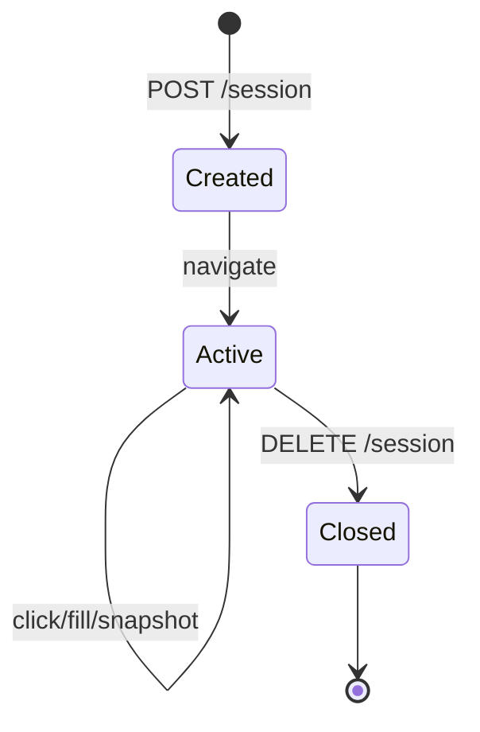

**BrowserBridge** — отдельный сервис для безопасного управления Chromium агентами. API совместим с tools `browser_navigate`, `browser_click`, `browser_snapshot`, `browser_fill`.

## Установка

Из корня монорепозитория Datagent:

```bash
pnpm --filter @datagent/browserbridge install
pnpm --filter @datagent/browserbridge exec playwright install chromium
```

Переменные:

```env
BROWSERBRIDGE_PORT=9247
BROWSERBRIDGE_HEADLESS=true
BROWSERBRIDGE_MAX_SESSIONS=5
CHROMIUM_EXECUTABLE_PATH=  # опционально, системный Chrome
```

## Запуск локального сервиса

```bash
pnpm --filter @datagent/browserbridge dev
```

Проверка health:

```bash
curl -s http://127.0.0.1:9247/health | jq
# { "status": "ok", "sessions": 0, "chromium": "connected" }
```

В `.env` API укажите:

```env
BROWSERBRIDGE_URL=http://127.0.0.1:9247
```

## Создание сессии

```bash
SESSION=$(curl -s -X POST http://127.0.0.1:9247/session \
  -H "Content-Type: application/json" \
  -d '{"runId":"test-run-001","viewport":{"width":1280,"height":720}}' | jq -r '.sessionId')
echo $SESSION
# sess_7f3a9c2b
```

## Тест `browser_*` tools

Через internal endpoint API (эмуляция Runner):

```bash
curl -X POST http://localhost:3100/internal/tools/invoke \
  -H "Content-Type: application/json" \
  -H "X-Admin-Token: ${ADMIN_TOKEN}" \
  -d '{
    "tool": "browser_navigate",
    "arguments": {
      "sessionId": "'"$SESSION"'",
      "url": "https://example.com"
    }
  }'
```

Снапшот DOM:

```bash
curl -X POST http://127.0.0.1:9247/session/${SESSION}/snapshot \
  -H "Content-Type: application/json" \
  -d '{"format":"aria"}' | jq '.nodes | length'
```

## Диаграмма жизненного цикла сессии



## Продакшен

- Запускайте BrowserBridge на отдельной VM с 2+ GB RAM.
- Ограничьте egress firewall только доверенными доменами (`BROWSERBRIDGE_ALLOWLIST`).
- Не экспонируйте порт `9247` в публичный интернет без mTLS.
