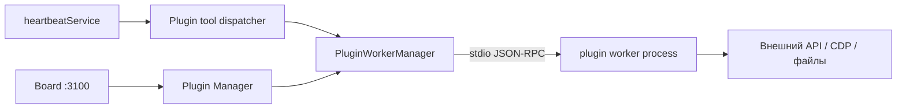

Плагины Datagent расширяют платформу **без правок** `server/`: отдельный worker-процесс, JSON-RPC 2.0 по stdio, доступ к issues, secrets, jobs и **agent tools**. Это не то же самое, что **LLM-адаптер** (`gigachat_local`, `opencode_local` в `packages/adapters/*`) — адаптеры подключают модель и CLI, а плагины дают интеграции, UI-слоты и tools вроде `browser_navigate`. Выполнение run идёт через **heartbeat** на server `:3100`; plugin host вызывает tools через **PluginWorkerManager** и tool dispatcher, а не через отдельный «Runner» или `apps/api`.

## Типы расширений

| Тип | Где в репо | Назначение |
| --- | --- | --- |
| **Plugin** | `packages/plugins/*`, npm-пакет из каталога | Worker + опционально UI; tools, webhooks, jobs, bridge |
| **LLM adapter** | `packages/adapters/*` | Модель и runtime агента (OpenCode upstream) — см. [LLM-адаптеры](../concepts/llm-adapters.md) |
| **BrowserBridge** | `packages/plugins/plugin-browserbridge` + `packages/browserbridge-local` | 10 tools `browser_*` — см. [Настройка BrowserBridge](./browserbridge-setup.md) |
| **Внешний connector** | npm через Plugin Manager | Например Telegram — см. [Telegram](../integrations/telegram.md) (не шаблон SDK в монорепо) |

Производственный пример bridge **без** agent tools в manifest: [Bitrix24](../integrations/bitrix24.md) (`datagent.bitrix24`, polling imbot, issues).

## Архитектура (host ↔ worker)



Один установленный плагин → один child process (`server/src/services/plugin-worker-manager.ts`). Падение worker изолирует сбой; host перезапускает процесс с exponential backoff (до 10 падений за окно). Отдельных env `PLUGIN_MAX_MEMORY_MB` / `PLUGIN_TOOL_TIMEOUT_MS` в `server/src/config.ts` **нет** — таймауты RPC и tool задаются в коде host/SDK (например default RPC 30 с, browser policy `maxActionTimeoutMs`).

## Структура плагина в монорепо

Референсы: `packages/plugins/bitrix24/`, `packages/plugins/plugin-browserbridge/`, `packages/plugins/examples/plugin-hello-world-example/`.

```
packages/plugins/my-demo-plugin/
  package.json          # datagentPlugin (metadata) → dist/manifest.js
  esbuild.config.mjs    # или rollup — пресеты @datagent/plugin-sdk/bundlers
  src/
    manifest.ts         # DatagentPluginManifestV1 (TypeScript, не JSON)
    worker.ts           # definePlugin + runWorker
    index.ts            # re-export manifest (опционально)
    ui/                 # опционально: React-слоты
      index.tsx
  tests/                # createTestHarness из @datagent/plugin-sdk/testing
  dist/                 # после pnpm build
```

Ключ плагина в registry: `manifest.id` (например `datagent.bitrix24`, `datagent.browserbridge`). Алиасы legacy id → `packages/shared/src/constants/plugin-keys.ts` (`datagent-browserbridge` → `datagent.browserbridge`).

## Scaffold

```bash
npx @datagent/create-datagent-plugin @my-org/datagent-demo-greeter \
  --template connector \
  --display-name "Demo Greeter Plugin"
```

Внутри checkout Datagent пакет может использовать `@datagent/plugin-sdk` как `workspace:*`. Сборка и watch:

```bash
cd my-demo-plugin
pnpm install
pnpm build
pnpm dev          # watch worker + manifest + ui
pnpm dev:ui       # UI preview (@datagent/plugin-sdk/dev-server)
pnpm test
```

Не обязательно класть исходники в `packages/plugins/` — для продакшена предпочтителен **npm-пакет** и установка через Plugin Manager.

## Manifest (`src/manifest.ts`)

Обязательные поля (тип `DatagentPluginManifestV1` из `@datagent/plugin-sdk`):

| Поле | Пример | Назначение |
| --- | --- | --- |
| `id` | `datagent.demo-greeter` | Стабильный id (namespace tools) |
| `apiVersion` | `1` | Версия схемы manifest |
| `version` | `0.1.0` | Semver пакета |
| `displayName`, `description`, `author`, `categories` | — | UI Plugin Manager |
| `capabilities` | `["agent.tools.register", "http.outbound"]` | Должны покрывать используемые `ctx.*` API |
| `entrypoints.worker` | `./dist/worker.js` | Точка входа worker |
| `entrypoints.ui` | `./dist/ui` | Если есть UI bundle |
| `tools[]` | см. ниже | Декларация agent tools (schema для Board / dispatcher) |
| `jobs[]`, `webhooks[]`, `database`, `apiRoutes`, `ui.slots` | по необходимости | Bitrix24: jobs + apiRoutes, **без** `tools` |

**Bridge-only** (Bitrix24): capabilities для issues, jobs, `http.outbound`, `database.namespace.*` — секции `tools` нет.

**Tools** (BrowserBridge): в manifest перечислены `browser_navigate`, …; в `setup` дополнительно `ctx.tools.register(...)`.

## Worker (`src/worker.ts`)

Точка входа — `definePlugin` + **`runWorker(plugin, import.meta.url)`** (иначе RPC host не стартует).

```typescript
import { definePlugin, runWorker } from "@datagent/plugin-sdk";

const plugin = definePlugin({
  async setup(ctx) {
    ctx.tools.register(
      "greet",
      {
        displayName: "Greet",
        description: "Учебный tool (demo-greeter)",
        parametersSchema: {
          type: "object",
          properties: { name: { type: "string" } },
          required: ["name"],
        },
      },
      async (params, runCtx) => {
        const name = String((params as { name?: string }).name ?? "мир");
        await ctx.activity.log({
          companyId: runCtx.companyId,
          message: "demo_greet",
          entityType: "heartbeat_run",
          entityId: runCtx.runId,
        });
        return { content: `Привет, ${name}!`, data: { ok: true } };
      },
    );
  },

  async onHealth() {
    return { status: "ok", message: "demo-greeter worker running" };
  },
});

export default plugin;
runWorker(plugin, import.meta.url);
```

Host services (issues, secrets, approvals, `browserbridge.*`, …) проксируются в `ctx` из `server/src/services/plugin-host-services.ts` — только если capability объявлена в manifest.

Имена tools в Board: **`{manifest.id}:{toolName}`** (разделитель `:`), например `datagent.demo-greeter:greet`. Dispatcher: `server/src/services/plugin-tool-dispatcher.ts`, публичный API `GET /api/plugins/tools`, `POST /api/plugins/tools/execute` (для отладки, не путь `internal/tools/invoke`).

Учебный manifest для того же tool:

```typescript
import type { DatagentPluginManifestV1 } from "@datagent/plugin-sdk";

const manifest: DatagentPluginManifestV1 = {
  id: "datagent.demo-greeter",
  apiVersion: 1,
  version: "0.1.0",
  displayName: "Demo Greeter (tutorial)",
  description: "Учебный плагин — один tool greet; не production.",
  author: "Datagent",
  categories: ["automation"],
  capabilities: ["agent.tools.register", "activity.log.write"],
  entrypoints: { worker: "./dist/worker.js" },
  tools: [
    {
      name: "greet",
      displayName: "Greet",
      description: "Вернуть приветствие по имени",
      parametersSchema: {
        type: "object",
        properties: { name: { type: "string" } },
        required: ["name"],
      },
    },
  ],
};

export default manifest;
```

Контракт tool на реальном плагине (иллюстрация, не копируйте id): `datagent.browserbridge:browser_navigate` с параметрами `url`, `waitUntil` — см. `packages/plugins/plugin-browserbridge/src/manifest.ts`.

## UI (опционально)

- Слоты в `manifest.ui.slots` (`settingsPage`, `dashboardWidget`, `toolbarButton`, …).
- Компоненты в `src/ui/index.tsx`, hooks: `@datagent/plugin-sdk/ui` (`usePluginData`, `usePluginAction`).
- Сборка UI: `scripts/build-ui.mjs` + esbuild/rollup presets из `@datagent/plugin-sdk/bundlers`.
- Bitrix24: `ui/index.tsx`, страница портала; BrowserBridge — toolbar на issue.

Hot-reload UI в dev: `datagent-plugin-dev-server` (bin из SDK) — host может проксировать static UI (`server/src/routes/plugin-ui-static.ts`). **Перезагрузка worker-кода** без restart server в production не документирована; после `pnpm build` обычно restart worker через Plugin Settings или lifecycle.

## Установка в Datagent

1. Собрать плагин:

```bash
pnpm --filter @datagent/plugin-bitrix24 build
# учебный локальный путь:
pnpm --filter @datagent/my-demo-plugin build
```

2. Установить на instance:

```bash
pnpm datagent plugin install ./packages/plugins/plugin-browserbridge
# или npm-пакет из каталога (имя см. в registry / Plugin Manager):
pnpm datagent plugin install <npm-package-name>
```

REST (`http://localhost:3100`):

```bash
curl -X POST http://127.0.0.1:3100/api/plugins/install \
  -H "Content-Type: application/json" \
  -d "{\"packageName\":\"./packages/plugins/plugin-browserbridge\"}"
```

3. **Plugin Manager**: Board → **Instance → Settings → Plugins** (`/instance/settings/plugins`) → включить плагин для instance / company.

4. **Настройки**: `/instance/settings/plugins/{pluginId}` — `instanceConfigSchema` / company config, поля `format: "secret-ref"` (как `telegramBotTokenRef` в тестах secrets handler). Секреты — company secrets, не корневой `.env` (в `.env.example` нет `PLUGIN_*` и нет `config/plugins.yaml`).

5. Webhook (если в manifest есть `webhooks` + `webhooks.receive`):

`POST /api/plugins/:pluginId/webhooks/:endpointKey` — см. `server/src/routes/plugins.ts`.

Файл `config/plugins.yaml` и команда `plugins:reload` в репозитории **отсутствуют**.

## Подключить tool к агенту

Board → **Agent** → Tools → включите namespaced tool (например `datagent.demo-greeter:greet` или `datagent.browserbridge:browser_navigate`). Агент вызывает tool на **heartbeat**; адаптер OpenCode получает tool definitions из host, не из прямого HTTP к Local Service.

Тест run (Playground): промпт, который явно просит вызвать tool.

## Изоляция и надёжность

- Child process на плагин, stdio JSON-RPC 2.0 (`@datagent/plugin-sdk/protocol`).
- Crash → backoff restart; лимит consecutive crashes в `plugin-worker-manager.ts`.
- `onShutdown` в worker (BrowserBridge останавливает embedded local service).
- Company-scoped enable и config; plugin secrets allowlist в `plugin-secrets-handler.ts`.

## Отладка

| Действие | Где |
| --- | --- |
| Логи worker | Plugin Settings → dashboard / logs; stderr child → host logger |
| Health | `GET /api/plugins/:pluginId/health`, `onHealth()` в worker |
| Test config | `POST /api/plugins/:pluginId/config/test` → `onValidateConfig` |
| Unit/integration | `@datagent/plugin-sdk/testing` — `createTestHarness`; образец: `plugin-browserbridge/src/worker.integration.test.ts` |
| Список tools | `GET /api/plugins/tools?pluginId=...` |
| Выполнить tool вручную | `POST /api/plugins/tools/execute` с телом `{ "tool": "datagent.browserbridge:browser_navigate", "arguments": { ... }, "runContext": { ... } }` |
| Instance smoke | `pnpm datagent doctor` (общий, не plugin-specific) |

## Публикация

- **Внутри монорепо:** `packages/plugins/<name>`, `private: true`, установка локальным путём.
- **npm:** опубликованный пакет; discovery по `package.json` → `datagentPlugin.manifest` (см. `plugin-loader.ts`). Пути: `dist/manifest.js`, `dist/worker.js`, `dist/ui/`.
- Версия `manifest.version` должна быть совместима с host (`minimumHostVersion` при необходимости).

## SDK-пакет (техническое имя)

| Артефакт | Имя |
| --- | --- |
| npm SDK | `@datagent/plugin-sdk` |
| Scaffold CLI | `@datagent/create-datagent-plugin` |
| Спека | `doc/plugins/PLUGIN_SPEC.md` в репозитории Datagent |

## Связанные разделы

- [Архитектура платформы](../concepts/agent-architecture.md) — heartbeat, PluginWorkerManager, plugins.
- [Быстрый старт](../getting-started/quickstart) — `pnpm dev`, `:3100`.
- [Установка](../getting-started/installation.md) — монорепо workspaces.
- [Bitrix24 Bridge](../integrations/bitrix24.md) — jobs, apiRoutes, без CRM tools.
- [Настройка BrowserBridge](./browserbridge-setup.md) — manifest tools + worker.
