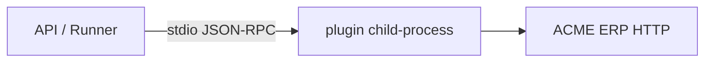

Плагины расширяют Datagent собственными tools без изменения ядра. SDK запускает ваш код в **child-process** и общается по stdio (JSON-RPC 2.0).

## Структура плагина

```
plugins/acme-erp/
  package.json
  plugin.manifest.json
  src/index.ts
```

`plugin.manifest.json`:

```json
{
  "id": "acme-erp",
  "version": "1.0.0",
  "tools": [
    {
      "name": "acme_get_order",
      "description": "Получить заказ по номеру",
      "inputSchema": {
        "type": "object",
        "properties": {
          "orderId": { "type": "string", "pattern": "^ORD-[0-9]{6}$" }
        },
        "required": ["orderId"]
      }
    }
  ]
}
```

## Реализация tool

`src/index.ts`:

```typescript
import { createPluginHost, defineTool } from '@datagent/plugin-sdk';

defineTool('acme_get_order', async ({ orderId }) => {
  const res = await fetch(`https://erp.acme.local/api/orders/${orderId}`, {
    headers: { Authorization: `Bearer ${process.env.ACME_ERP_TOKEN}` },
  });
  if (!res.ok) throw new Error(`ERP ${res.status}`);
  return await res.json();
});

createPluginHost().listen();
```

## Регистрация в Datagent

`config/plugins.yaml`:

```yaml
plugins:
  - path: ./plugins/acme-erp
    env:
      ACME_ERP_TOKEN: ${ACME_ERP_TOKEN}
```

Перезагрузка:

```bash
pnpm --filter @datagent/api plugins:reload
```

## Изоляция child-process



- Падение плагина → tool error, run продолжается или завершается по политике.
- Лимит памяти: `PLUGIN_MAX_MEMORY_MB=256`.
- Таймаут вызова: `PLUGIN_TOOL_TIMEOUT_MS=30000`.

## Подключить tool к агенту

Board → Agent → Tools → включите `acme_get_order`.

Тест:

```text
Найди заказ ORD-004821 и перечисли позиции.
```

## Публикация

Упакуйте в npm workspace или Docker volume `/opt/datagent/plugins/acme-erp`. Версионируйте `plugin.manifest.json` — при несовместимости API отклонит загрузку.
