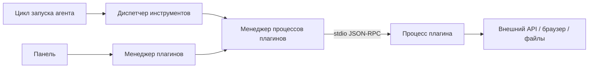

**Плагины** расширяют Datagent **без правок ядра сервера**: отдельный фоновый процесс, доступ к задачам, секретам и **инструментам агента** (браузер, файлы, мессенджеры). Это не то же самое, что **адаптер нейросети** (GigaChat, YandexGPT) — адаптер подключает модель, плагин — действия в мире.

В облаке плагины ставятся через **менеджер плагинов** на [app.datagent.ru](https://app.datagent.ru). Пример без написания кода — [Битрикс24](../integrations/bitrix24.md). Дальше определите тип расширения в таблице ниже.

:::note Для инженеров
Plugin SDK, обмен JSON-RPC по stdio, внутренний цикл heartbeat, `PluginWorkerManager` — детали в разделах ниже.
:::

## Типы расширений

Перед разработкой определите, что вы строите: интеграцию с внешним сервисом, инструмент для агента или адаптер нейросети. Выберите строку в таблице и переходите к соответствующему разделу.

| Тип | Где в репозитории | Назначение |
| --- | --- | --- |
| **Плагин** | `packages/plugins/*`, npm-пакет | Фоновый процесс + опционально UI; инструменты, webhook, фоновые задачи, мосты |
| **Адаптер LLM** | `packages/adapters/*` | Модель и среда выполнения агента — см. [LLM-адаптеры](../concepts/llm-adapters.md) |
| **Управление браузером** | `plugin-browserbridge` + `browserbridge-local` | Десять инструментов `browser_*` — см. [интеграцию](../integrations/browserbridge.md) |
| **Внешний коннектор** | npm через менеджер плагинов | Например Телеграм — см. [Телеграм](../integrations/telegram.md) |

Пример **моста без инструментов в манифесте**: [Битрикс24](../integrations/bitrix24.md) — опрос чат-бота, создание задач.

## Архитектура (сервер ↔ worker)

Сервер **не выполняет** код плагина внутри себя. Для каждого установленного плагина поднимается **отдельный процесс**; общение — по JSON-RPC через stdin/stdout. Когда агент вызывает инструмент, запрос проходит через диспетчер инструментов и менеджер процессов.



Один плагин → один дочерний процесс (`plugin-worker-manager.ts`). При падении процесса сервер перезапускает его с нарастающей паузой (до 10 сбоев за окно). Отдельных переменных `PLUGIN_MAX_MEMORY_MB` в конфиге сервера нет — таймауты задаются в коде host/SDK (типично RPC 30 с).

## Структура плагина в монорепозитории

Ориентиры: `packages/plugins/bitrix24/`, `plugin-browserbridge/`, `examples/plugin-hello-world-example/`.

```
packages/plugins/my-demo-plugin/
  package.json          # метаданные datagentPlugin → dist/manifest.js
  esbuild.config.mjs    # сборка через пресеты @datagent/plugin-sdk/bundlers
  src/
    manifest.ts         # манифест DatagentPluginManifestV1 (TypeScript)
    worker.ts           # definePlugin + runWorker
    index.ts            # re-export (опционально)
    ui/                 # опционально: слоты React в панели
      index.tsx
  tests/                # createTestHarness из @datagent/plugin-sdk/testing
  dist/                 # после pnpm build
```

**Идентификатор** в реестре — поле `manifest.id` (например `datagent.bitrix24`). Устаревшие алиасы — в `packages/shared/src/constants/plugin-keys.ts`.

## Создание заготовки (scaffold)

Команда создаёт каркас npm-пакета с worker и манифестом:

```bash
npx @datagent/create-datagent-plugin @my-org/datagent-demo-greeter \
  --template connector \
  --display-name "Учебный плагин-приветствие"
```

Внутри checkout Datagent SDK подключается как `workspace:*`. Сборка и разработка:

```bash
cd my-demo-plugin
pnpm install
pnpm build
pnpm dev          # watch worker + manifest + ui
pnpm dev:ui       # предпросмотр UI (@datagent/plugin-sdk/dev-server)
pnpm test
```

Для продакшена удобнее **опубликованный npm-пакет** и установка через менеджер плагинов, а не копирование в `packages/plugins/`.

## Манифест (`src/manifest.ts`)

**Манифест** — паспорт плагина: что он умеет, какие инструменты объявляет, куда смотреть worker и UI. Тип: `DatagentPluginManifestV1` из `@datagent/plugin-sdk`.

| Поле | Пример | Назначение |
| --- | --- | --- |
| `id` | `datagent.demo-greeter` | Стабильный id (префикс имён инструментов) |
| `apiVersion` | `1` | Версия схемы манифеста |
| `version` | `0.1.0` | Версия пакета (semver) |
| `displayName`, `description`, `author`, `categories` | — | Отображение в менеджере плагинов |
| `capabilities` | `["agent.tools.register", "http.outbound"]` | Должны покрывать используемые API в worker |
| `entrypoints.worker` | `./dist/worker.js` | Точка входа процесса |
| `entrypoints.ui` | `./dist/ui` | Сборка UI, если есть |
| `tools[]` | см. ниже | Описание инструментов для панели и диспетчера |
| `jobs[]`, `webhooks[]`, `database`, `apiRoutes`, `ui.slots` | по необходимости | Фоновые задачи, webhook, маршруты API |

**Только мост** (как Битрикс24): capabilities для задач, jobs, исходящего HTTP, БД — секции `tools` может не быть.

**С инструментами** (как управление браузером): перечисление в `tools[]` и регистрация в `setup` через `ctx.tools.register(...)`.

## Worker (`src/worker.ts`)

**Worker** — код, который реально выполняется в отдельном процессе. Обязательно завершать файл вызовом `runWorker(plugin, import.meta.url)`, иначе сервер не установит связь по RPC.

```typescript
import { definePlugin, runWorker } from "@datagent/plugin-sdk";

const plugin = definePlugin({
  async setup(ctx) {
    ctx.tools.register(
      "greet",
      {
        displayName: "Приветствие",
        description: "Учебный инструмент (demo-greeter)",
        parametersSchema: {
          type: "object",
          properties: { name: { type: "string" } },
          required: ["name"],
        },
      },
      async (params, runCtx) => {
        const name = String((params as { name?: string }).name ?? "мир");
        await ctx.activity.log({
          companyId: runCtx.companyId,
          message: "demo_greet",
          entityType: "heartbeat_run",
          entityId: runCtx.runId,
        });
        return { content: `Привет, ${name}!`, data: { ok: true } };
      },
    );
  },

  async onHealth() {
    return { status: "ok", message: "demo-greeter worker running" };
  },
});

export default plugin;
runWorker(plugin, import.meta.url);
```

Сервисы host (задачи, секреты, согласования, браузер, …) доступны в `ctx` только если соответствующая **capability** объявлена в манифесте (`plugin-host-services.ts`).

**Имя инструмента в панели:** `{manifest.id}:{имя}`, например `datagent.demo-greeter:greet`. Список через API: `GET /api/plugins/tools`, отладка: `POST /api/plugins/tools/execute`.

Учебный фрагмент манифеста для того же инструмента:

```typescript
import type { DatagentPluginManifestV1 } from "@datagent/plugin-sdk";

const manifest: DatagentPluginManifestV1 = {
  id: "datagent.demo-greeter",
  apiVersion: 1,
  version: "0.1.0",
  displayName: "Учебное приветствие",
  description: "Один инструмент greet; не для продакшена.",
  author: "Datagent",
  categories: ["automation"],
  capabilities: ["agent.tools.register", "activity.log.write"],
  entrypoints: { worker: "./dist/worker.js" },
  tools: [
    {
      name: "greet",
      displayName: "Приветствие",
      description: "Вернуть приветствие по имени",
      parametersSchema: {
        type: "object",
        properties: { name: { type: "string" } },
        required: ["name"],
      },
    },
  ],
};

export default manifest;
```

Реальный пример параметров: `datagent.browserbridge:browser_navigate` (`url`, `waitUntil`) — см. `plugin-browserbridge/src/manifest.ts`.

## Интерфейс в панели (опционально)

Плагин может добавить **страницы настроек** или виджеты в панели:

- Слоты в `manifest.ui.slots` (`settingsPage`, `dashboardWidget`, `toolbarButton`, …).
- Компоненты в `src/ui/index.tsx`, хуки `@datagent/plugin-sdk/ui`.
- Сборка UI: `scripts/build-ui.mjs` + пресеты bundler из SDK.

В dev UI можно обновлять через `datagent-plugin-dev-server`. После `pnpm build` в продакшене worker обычно перезапускают через настройки плагина или lifecycle сервера.

## Установка в Datagent

**Шаг 1.** Соберите пакет:

```bash
pnpm --filter @datagent/plugin-bitrix24 build
# учебный локальный путь:
pnpm --filter @datagent/my-demo-plugin build
```

**Шаг 2.** Установите на инстанс (CLI или API):

```bash
pnpm datagent plugin install ./packages/plugins/plugin-browserbridge
# или имя npm-пакета из каталога:
pnpm datagent plugin install <npm-package-name>
```

```bash
curl -X POST http://127.0.0.1:3100/api/plugins/install \
  -H "Content-Type: application/json" \
  -d "{\"packageName\":\"./packages/plugins/plugin-browserbridge\"}"
```

**Шаг 3.** В панели: **Настройки инстанса → Плагины** (`/instance/settings/plugins`) — включить для компании.

**Шаг 4.** Настройки плагина: секреты через `secret-ref` (company secrets), не корневой `.env`.

**Шаг 5.** Webhook (если объявлен в манифесте): `POST /api/plugins/:pluginId/webhooks/:endpointKey`.

Файла `config/plugins.yaml` и команды `plugins:reload` в репозитории **нет**.

## Подключить инструмент к агенту

В панели: **Агент → Инструменты** — включите нужное имя (например `datagent.demo-greeter:greet`). При запуске агента адаптер нейросети получает описания инструментов от сервера, а не напрямую от локальных служб.

Проверка: промпт в playground, который явно просит вызвать инструмент.

## Изоляция и надёжность

- Отдельный OS-процесс на плагин, протокол JSON-RPC 2.0.
- Сбой процесса не роняет API-сервер; автоперезапуск с backoff.
- `onShutdown` в worker — корректная остановка (например встроенной службы браузера).
- Настройки и секреты привязаны к **компании**; allowlist секретов в `plugin-secrets-handler.ts`.

## Отладка

| Действие | Где |
| --- | --- |
| Логи worker | Настройки плагина → журнал; stderr дочернего процесса → лог сервера |
| Health | `GET /api/plugins/:pluginId/health`, метод `onHealth()` в worker |
| Проверка конфига | `POST /api/plugins/:pluginId/config/test` → `onValidateConfig` |
| Тесты | `@datagent/plugin-sdk/testing` — `createTestHarness` |
| Список инструментов | `GET /api/plugins/tools?pluginId=...` |
| Ручной вызов | `POST /api/plugins/tools/execute` с телом `{ "tool": "…", "arguments": { … }, "runContext": { … } }` |
| Общая диагностика | `pnpm datagent doctor` |

## Публикация

- **В монорепозитории:** `packages/plugins/<name>`, `private: true`, установка локальным путём.
- **В npm:** поле `datagentPlugin.manifest` в `package.json`; артефакты `dist/manifest.js`, `dist/worker.js`, `dist/ui/`.
- Поле `manifest.version` и при необходимости `minimumHostVersion` должны быть совместимы с версией сервера.

## Пакеты SDK

| Артефакт | Имя npm |
| --- | --- |
| SDK | `@datagent/plugin-sdk` |
| Генератор заготовки | `@datagent/create-datagent-plugin` |
| Спецификация | `doc/plugins/PLUGIN_SPEC.md` в репозитории Datagent |

## Связанные разделы

- [Архитектура платформы](../concepts/agent-architecture.md)
- [Быстрый старт в облаке](../cloud/getting-started)
- [Обзор API](../api-reference/overview.md) — установка и инструменты плагинов
- [Битрикс24](../integrations/bitrix24.md) — jobs и apiRoutes без CRM-инструментов
- [Управление браузером](../integrations/browserbridge.md) · [установка](../browser/setup.md)
